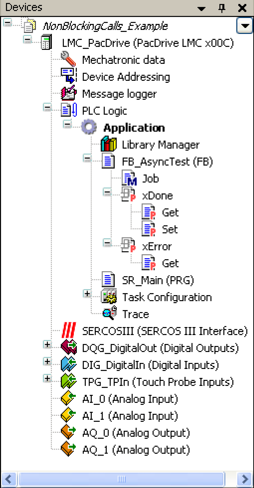

# Program Example

Program Example

Overview

This chapter contains a program example with an example code that is used for executing an asynchronous method.

Program example FB\_AsyncTest

If you want to use the [asynchronous mechanism](Presentation_of_the_Library-7.htm#XREF_D_SE_0087826_1) to asynchronously execute a code section or to create own function blocks and to asynchronously call-up a method in an additional task, you have to implement a function block that implements the IF\_Async interface.

You can implement this by either using the function blocks you have programmed, as described in this program example, or by using the function blocks of the PD\_PacDriveLib library listed [here](Presentation_of_the_Library-10.htm#XREF_D_SE_0087818_1).

The code that is to be executed asynchronously has to be written into the Job() method. An instance of the function block implementing IF\_Async has to be transferred to G\_ifAsyncMgr.Start(i\_ifAsync:=).

In the present example, FB\_AsyncTest implements the IF\_Async interface. The FB\_AsyncTest is a specially created sample function block providing the code to be asynchro­nously executed.

For fbAsnycTest: FB\_AsyncTest a correct call-up would be as follows:

G\_ifAsyncMgr. Start (i\_ifAsyncInst := fbAsyncTest);

A StateMachine has to be created and it must be waited in this state until the xDone property of the FB\_AsyncTest function block equals TRUE.

The Job() method contains the code to be asynchronously executed, e.g. read or write values on the SERCOS service channel. The xDone property is set depending on which code section in the Job() method is executed or not.

FB\_AsyncTest

Declaration

FUNCTION\_BLOCK FB\_AsyncTest IMPLEMENTS PDL.IF\_Async  
VAR   
   etDiag : GD.ET\_Diag;   
   etDiagExt : PDL.ET\_DiagExt;   
   xBusy : BOOL;   
   xInitDone : BOOL;   
   xDone\_loc : BOOL;   
   xError\_loc : BOOL;   
END\_VAR

Program

// This FB initializes the extra task and takes care, that your time consuming function gets called from this task    
IF PDL.G\_ifAsyncMgr <> 0 THEN   
   PDL.G\_ifAsyncMgr.Init(q\_xBusy=> xBusy, q\_xDone=> xInitDone ,   
    q\_etDiag=> etDiag , q\_etDiagExt=> etDiagExt );   
   IF etDiag <> GD.ET\_Diag.Ok THEN   
      xError\_loc:= TRUE;  // Error Reaction see Online Help for possible diag codes  
   ELSIF xInitDone THEN   
         PDL.G\_ifAsyncMgr.Start(i\_ifAsync:= THIS^, q\_etDiag=> etDiag ,   
          q\_etDiagExt=> etDiagExt);   
         IF etDiag <> GD.ET\_Diag.Ok THEN   
            xError\_loc:= TRUE;  // Error Reaction see Online Help for possible diag codes  
         END\_IF   
   END\_IF   
END\_IF

FB\_AsyncTest - Job method and its properties

Declaration

METHOD Job : BOOL

Program

// Function which needs time and would block the main task  
// This function is now executed in a extra low priority task (31)  
PDL.FC\_WaitTime(i\_rWTime:= 1000);  // here is your code  
PDL.FC\_WaitTime(i\_rWTime:= 500);  // here is your code  
PDL.FC\_WaitTime(i\_rWTime:= 250);  // here is your code

Properties FB\_AsyncTest.xDone, FB\_AsyncTest.xDone.Get and FB\_AsyncTest.xDone.Set

FB\_AsyncTest.xDone

PROPERTY xDone : BOOL

FB\_AsyncTest.xDone.Get

xDone:= xDone\_loc;

FB\_AsyncTest.xDone.Set

xDone\_loc:= xDone;

Properties FB\_AsyncTest.xError and FB\_AsyncTest.xError.Get

FB\_AsyncTest.xError

PROPERTY PUBLIC xError : BOOL

FB\_AsyncTest.xError.Get

xError:= xError\_loc;

SR\_Main (PRG)

Declaration

PROGRAM SR\_Main   
VAR   
   fbAsyncTest: FB\_AsyncTest;   
   diState: DINT;   
   xStart: BOOL;   
END\_VAR

Program

CASE diState OF   
   10:  // Application wait for start    
      IF xStart THEN   
         diState:= 20;   
      END\_IF   
   20:  // operation  
       ;   
   100:  // Error State  
       ;   
ELSE   
   fbAsyncTest();  // This FB initializes the extra task and takes care, that your time consuming function gets called from this task  
   IF fbAsyncTest.xDone THEN // Signals that it is done  
      diState:= 10;  // now you can continue your application as usual  
   ELSIF fbAsyncTest.xError THEN  // Signals an error  
      diState:= 100;  // Sets application in Error State  
   END\_IF   
END\_CASE

EIO0000002658.00

© 2018 Schneider Electric. All rights reserved.