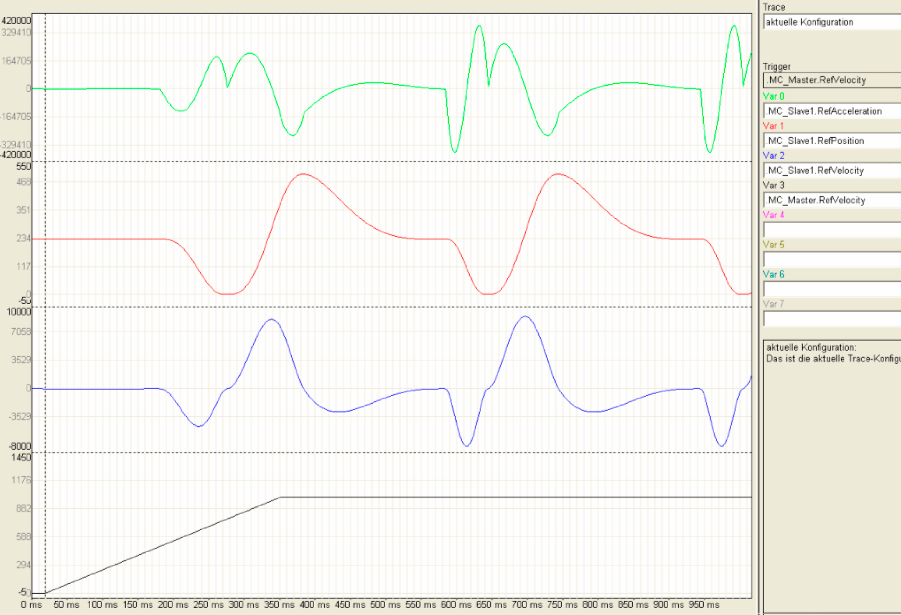
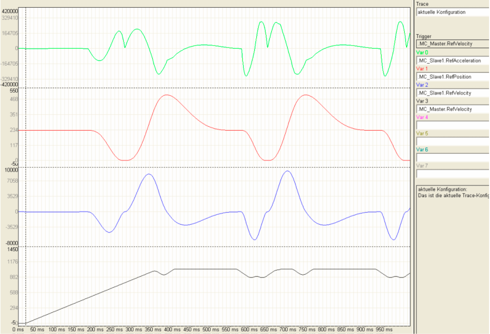

# Intelligent Line Shaft ILS

Intelligent Line Shaft ILS

Intelligent Line Shaft ILS

Electronic Line Shaft - ELS

Electronical MainShaft

The virtual master axis (Virtual Master) supplies the axis module with data of the electronic Line Shaft. The axis module generates the cam disk setpoint value or the individual axis using the motion function MultiCam. A large number of synchronized individual axis generate the motion process of the packing process.

In practice, it is often the case that the velocity and acceleration of an axis that are coupled with the Line Shaft have to be limited. The reasons are, for example, speed and torque limits of the drive, retention force on a product, etc.

There were two possibilities for this purpose:

oThe curve left areas where the velocity and acceleration limits were breached and re-synchronized when the critical sector had been left.

oThe slow velocity of the Line Shaft must be selected so that the limits are not breached.

Leaving the curve has the disadvantage that the synchrony to the Line Shaft (Virtual Master) will be lost. This is a risk for the packing process, especially when several slave axis are coordinated by this Line Shaft (master axis).

The slow velocity of the Line Shaft has the disadvantage that (when applicable) a single critical location in the process determines the velocity for the complete packing process. This can usually not be accepted.

The solution to this problem was the development of the Intelligent Line Shaft.

Intelligent Line Shaft - ILS

With the ILS, the master axis no longer rotates with a fixed continuous velocity. During the cycle run, the master axis can run a velocity profile that considers partial weak points of individual slave axis. This maintains the synchronism to the Line Shaft. Furthermore, a high velocity of the Line Shaft can be selected as it will be decelerated "automatically" when necessary. If the critical motion phase of the slave axis has been completed, the master axis accelerates again automatically.

Intelligent Line Shaft

With the intelligent Line Shaft, the virtual master axis (Virtual Master) must receive information for the velocity and acceleration of the individual axis. The master axis looks ahead if the individual axis has a exceeded a defined limit value for the speed or the acceleration. It decelerates the master velocity before the critical motion phase early enough depending on the extent of the limit value expected to be exceeded.

The velocity and accelerating of the individual axis cannot be exceeded in the sequence of the respective limit value any more. Outside the critical motion phase, the virtual master axis increases its velocity to a value above the maximum velocity - up to the limit by the next "weak" link. The success: A new effective velocity above the maximum velocity without exceeding the defined maximum velocity or acceleration of the individual axis.

The sequence offers space for different optimization objectives. If only the velocity is the main focus, depending on the application, a velocity increase between 10 and 30 % can be implemented by "mitigating" the weakest link in the mechatronic chain. The objective could also be to increase the operating life of the machine or to reduce the forces acting upon the packing material or packing goods at a continuous velocity. In all cases, there is a possibility of achieving the optimization by limiting the maximum velocity and / or the maximum acceleration.

The advantages of the method are obvious. Their practical realizable use, a question of their implementation. In individual cases, the machine specific programming of the required algorithm can develop itself to an extensive and complicated matter.

Implementation as IEC 61131-3 POU

The ILS optimization approach has been encapsulated in a software module that can be configured and conforms to IEC 61131-3, so that the complexity of ILS is no longer perceived by the user. The software module can be used across all of the machines. Up to ten slave axis can be optimized via a machine cycle, on the maximum acceleration as well as the velocity. The effort for implemen­tation is minimal: The block with implemented software function that can be obtained free of charge can be integrated in the program on the basis of the PacDrive template within an hour.

The basis for the realization as a standardized software function and the quick implementation is a universal software module where axis motions of all types can be generated using the programming concept. The so-called ´Axis Module´ comprises the three default modes, Homing (Reference run), Manual (Manual mode) and Automatic (Automatic mode). In Automatic mode, amongst others, the basic function Endless Feed and Multicam are available that, when combined, ensure for the continuous implementation of motion profiles of the individual axis.

The functionality of the virtual master is implemented in the technological function "EndlessFeed". Using the technological function "MultiCam", the axis module generates the cam disk setpoint value of the individual axis from the specified position value of the virtual master. The ILS software module is based on this basic function. They allow the default from maximum values for acceleration and velocity for one axis, control the feedback of an axis to the virtual master axis and the pre-calculation for the coming machine cycle.

The implementation of the function as a universal POU in a programming concept using general standardized software functions has another advantage on top of that: ILS is not only suitable for optimizing machines currently being developed but can also be used for a subsequent optimization of existing machines.

Advantages:

oHigher cycle time of the machine from up to 30 percent without making changes to the mechanical components or drives.

oCost savings (possible smaller drive is sufficient -> torque limits are limited, when applicable, no external braking resistor module necessary)

oHigher operating life of the machine due to the mechanical components being conserved.

oSuitable for subsequent optimizing of existing machines as well as for optimizing new developments.

oCan be integrated in existing machine programs on the basis of the PacDrive template within the typical hourly effort.

oUp to ten slave axis can be optimized on the maximum acceleration as well as the velocity.

oCan be obtained free of charge for PacDrive users.

The function blocks for the realization of the Intelligent Line Shaft can be found in the library PacDriveLib.

The procedure for replacing the electronic Line Shaft with the Intelligent Line Shaft can be found under Configuration & Programming > Intelligent Line Shaft ILS.

Examples

The trace recording of an application with the Electronical Line Shaft is shown in the following illustration. The velocity (MC\_Slave1.RefVelocity) and acceleration (MC\_Slave1.RefAcceleration) of the slave axes result depending on the master velocity (MC\_Master.RefVelocity).

Electronical Line Shaft: Acceleration and velocity sequence of a slave axis depending on the master axes velocity.

Using the Intelligent Line Shaft, acceleration of the slave axis (MC\_Slave1.RefAcceleration) can be limited. For this, the master velocity (MC\_Master.RefVelocity) is reduced on the critical places of the motion ([Cam profile](../Function_Blocks_I_to_Q/Function_Blocks_I_to_Q-14.htm#XREF_D_SE_0087313_1)).

Intelligent Line Shaft: Acceleration and velocity sequence of a previous slave axis with acceleration limits through adapted master axes velocity.

It is also possible to limit the velocity (MC\_Slave1.RefVelocity) of the slave axes. Here the master velocity (MC\_Master.RefVelocity) is also reduced on the critical position of the motion (Curveprofile).

Intelligent Line Shaft: Acceleration and velocity sequence of the previous slave axis with velocity limits through adapted master axes velocity.

The Intelligent Line Shaft can observe several limits. The following trace recording indicates these limits:

onegative velocity of the slave axis 1 (MC\_Slave1.RefVelocity),

opositive acceleration of the slave axis 2 (MC\_Slave2.RefAcceleration),

opositive velocity of the slave axis 3 (MC\_Slave3.RefVelocity) and

onegative acceleration of the slave axis 3 (MC\_Slave3.RefAcceleration).

Intelligent Line Shaft: Acceleration and velocity sequence of several slave axes with acceleration and velocity limits through adapted master axes velocity.

EIO0000002658.00

© 2018 Schneider Electric. All rights reserved.