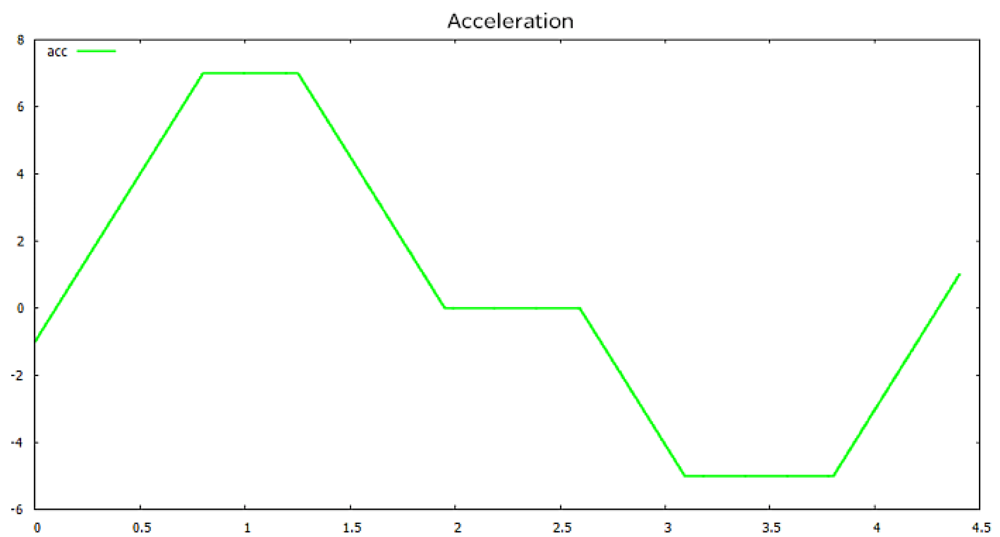

# ET_AccTrapezoidOrientations

ET\_AccTrapezoidOrientations

ET\_AccTrapezoidOrientations - General Information

Overview

|  |  |
| --- | --- |
| Type: | Enumeration type |
| Available as of: | V1.5.3.0 |
| Versions: | Current version |

Description

Enumeration type to specify the acceleration phases, which are characterised by the sign of the target accelerations.

As the positioning consists of two acceleration phases, there are the four possible orientations.

Enumeration Elements

| Name | Value | Description |
| --- | --- | --- |
| BothPositive | 0 | Both acceleration phases target a positive acceleration. |
| NegativePositive | 1 | The initial acceleration targets a negative, the last a positive acceleration. |
| PositiveNegative | 2 | The initial acceleration targets a positive, the last a negative acceleration. |
| BothNegative | 3 | Both acceleration phases target a negative acceleration. |

EIO0000002658.00

© 2018 Schneider Electric. All rights reserved.