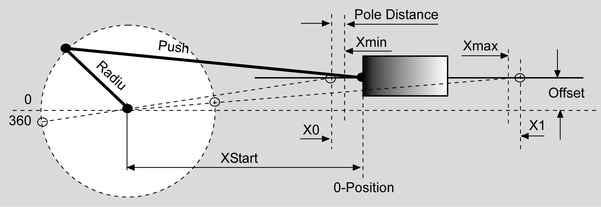
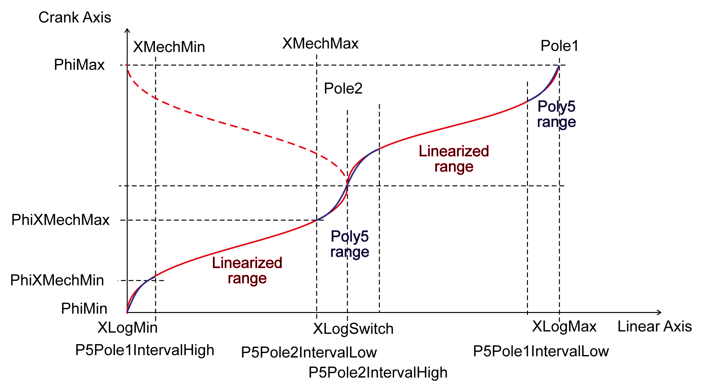
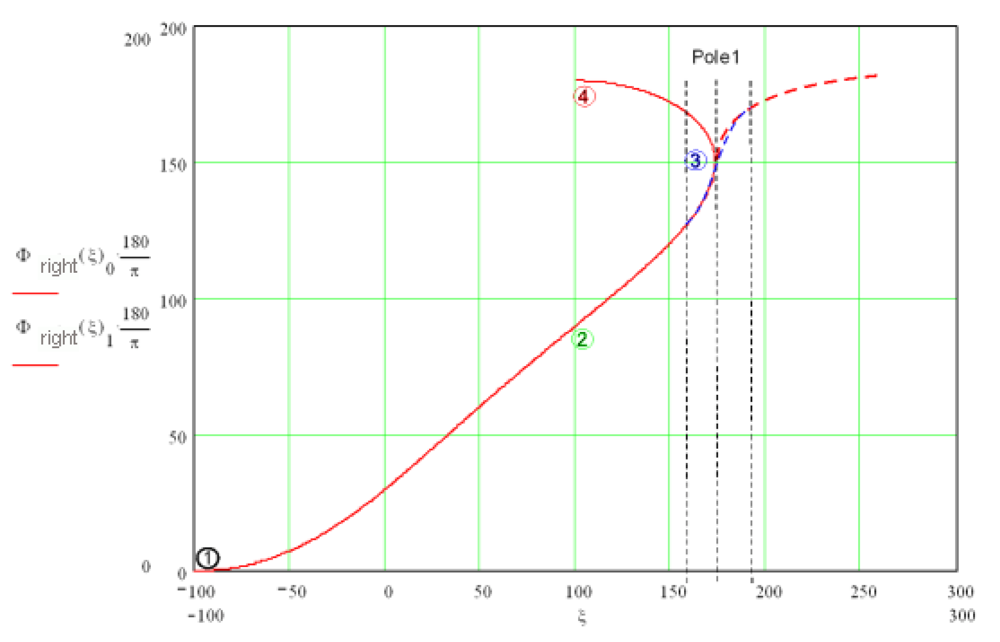
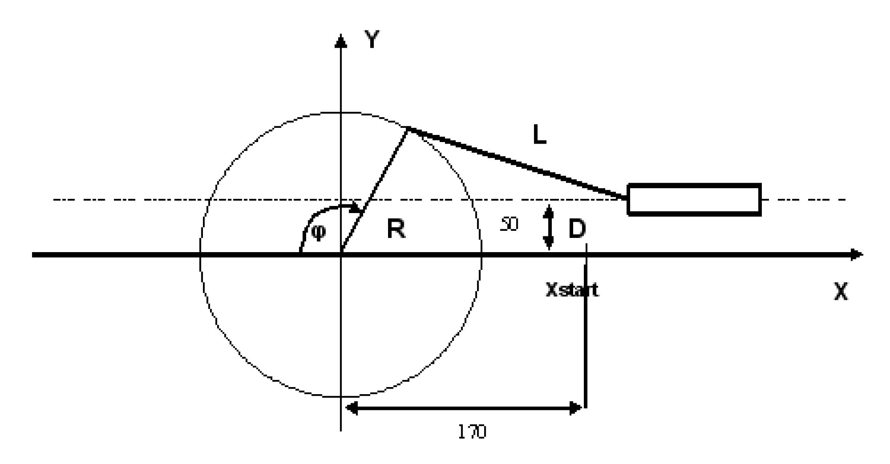
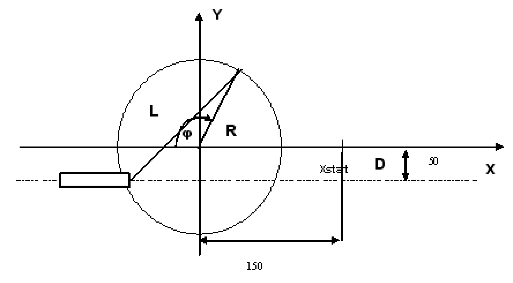
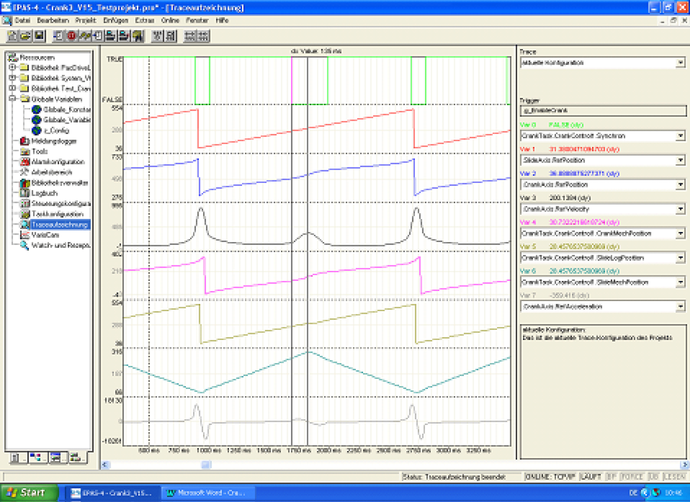
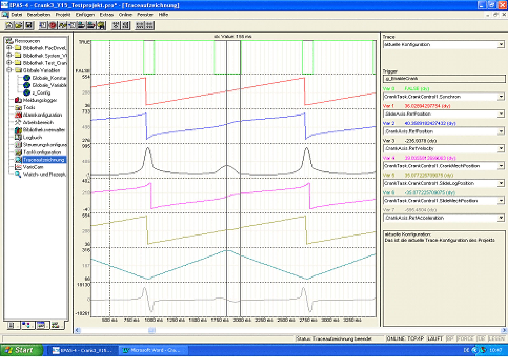
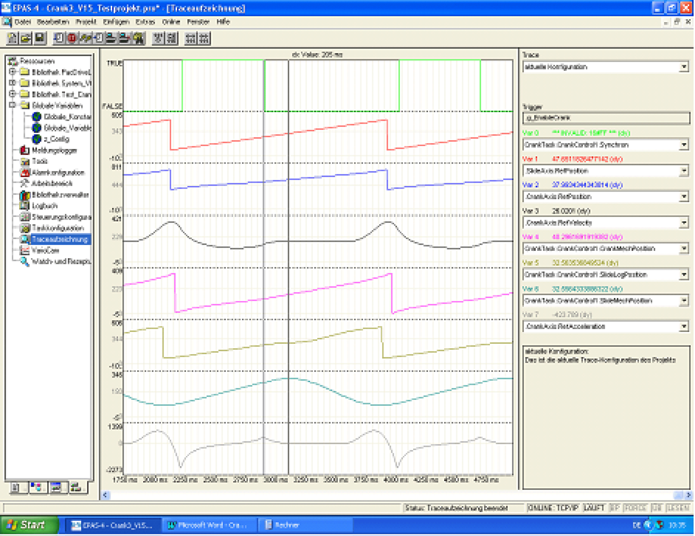
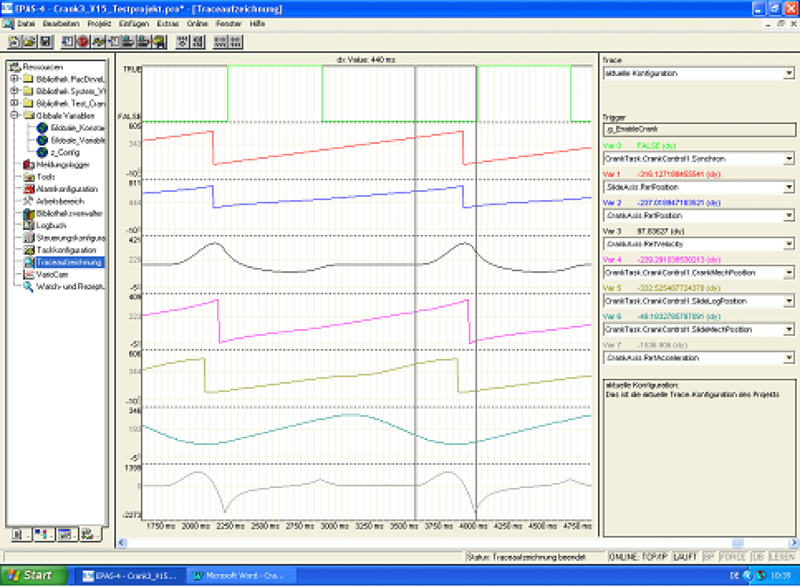

# FB_Crank

FB\_Crank

FB\_Crank - General Information

Overview

|  |  |
| --- | --- |
| Type: | Function block |
| Available as of: | V1.0.3.0 |
| Inherits from: | - |
| Implements: | - |
| Versions: | Current version |

Task

Realization of a push crank

Description

The function block provides the following functionalities:

oAll variants of cranks can be handled. This also includes cranks which, because of the aspect ratios of R, L, and D, cannot complete a complete revolution and those for which the push rod is on the "left" side (represented with a dashed line).

oFree configuration of the interpolation intervals around the slide's reversing points and the use of variable straight segments when interpolation regions overlap.

Plant principle for FB\_Crank

Through this, the slide's linear motion is transformed into one rotation of the crank. The slide's movement can thus take place without consideration of the non-linearity of the drive.

Requirement:

The mechanics must be constructed in such a manner that the crank can complete its rotation (360° rotations) even if the complete path is not used.

Due to the drive's finite dynamic, the slide's path is not completely linearized. A distance PoleDistance is kept to the maximum values.

Both the upper part of the crank, lrPhiMin to lrPhiMax, and the lower part are linearized. General polynomials of the fifth degree are integrated between the linearized parts. This allows for operation beyond the linearized range. The crank function block allows all positions to be exceeded without limit in each direction.

The linear path is counted positively for one crank rotation. Even when the slide moves backwards in the lower range of the crank, the counting method is positive.

The period for the linear axis is 2 \* (X1 – X0). X1 is the right maximum position of the slide, and X0 is the left. The period for the crank is 360°.

Method of counting for the crank transformation

The crank position goes from 0° to 360°. The slide position goes from 0 mm to 100 mm, and then not backwards, but continues to 200 mm. Then, both the position of the crank and that of the slide start again at 0.

Linearization of the complete crank rotation (forward and reverse). A poly5com is used at the poles of the crank. The calculation requires about 10 ms; the cycle time monitoring function is set to 50 ms for the calculation.

Sketch of the system principle

NOTE: The above X-Y coordinate system may be oriented in the area as desired. Only the following needs to be taken into account: If it is viewed from above, the angle is measured clockwise against the negative X direction, as shown. The parameter "Motor Direction of the Crank Axis" must be set so that, during clockwise rotation, its position (when viewed from this perspective) gets larger.

Plant principle for FB Crank

A slide is positioned by a crank using a servo drive.

Block diagram for FB\_Crank

Interface

| Input | Data type | Description |
| --- | --- | --- |
| i\_xEnable | BOOL | A rising edge FALSE -> TRUE activates the POU, a falling edge TRUE -> FALSE deactivates the POU.  A deactivated POU does not execute any actions.  With a rising edge, the data of the structure [ST\_CrankData](../Structures/Structures-9.htm#XREF_D_SE_0087724_1) is read in and converted into the law of motion. These pre-calculations are very time-consuming. For this, the monitoring times for the cycle time monitoring function are temporarily increased. Thus, activating several of these POUs in the same task cycle should be avoided  With the falling edge, all resources which the POU had engaged are released. |
| i\_xStart | BOOL | Connects the logical encoder given by i\_lencEncoder with the virtual slide axis (i\_ifDriveSlide) and starts the crank transformation. Changes of the input data are not incorporated at the edges of this input. |
| i\_ifDriveCrank | IF\_Drive | Input for the crank axis to be controlled. |
| i\_ifDriveSlide | IF\_Drive | Input for a virtual slide axis which defines the motion for the real slide axis. |
| i\_xHomed | BOOL | Before the function block starts processing, either the crank axis or the slide axis must have been homed, i.e. have a defined position within the permissive processing range (lrPhiLogMin ... lrPhiLogMax for the crank axis and lrXLogMin ... lrXLogMax for the linear axis). The position of the non-referenced axis is calculated from this and set by the POU. This input must be set before the i\_xStart input is set, after one of the axes has been homed. The POU then works in the normal transformation mode. If the i\_xHomed input has not been set upon the setting of the start input, the function block transmits the defined linear motion 1:1 to the crank axis. |
| i\_diStartMode | DINT | Homing modes:  o0 = The sensor is located on the crank axis.  Upon referencing, the position of the crank axis must thus be set externally to the corresponding value. The associated position of the linear axis is set by the POU upon setting the start input.  o1 = The sensor is located on the linear axis.  The position of the linear axis must thus be set to the corresponding value externally upon referencing. The associated position of the crank axis is set by the POU upon setting the start input.  o2 = The position of the linear axis is set at its minimal value and the position of the crank axis is set at its corresponding angle.  o3 = In this homing mode, the 1:1 transformation mentioned above for the input i\_xHomed is used for the reference travel. As already explained, if the input i\_xHomed = FALSE upon the setting of the i\_xStart input, the POU transmits the defined linear motion 1:1 to the crank axis. This transformation can be used for reference travel: If the system has reached its home position, the position of the virtual linear axis must be set to the corresponding value of the current position. Then, the input i\_xHomed must be set to TRUE. After that, the crank POU back ends the 1:1 transformation curve, uses the linear position to calculate the associated position of the crank axis, and moves this axis to the calculated value. The function block now has to be restarted (rising edge at the input i\_xStart). At the same time, input i\_xHomed = TRUE must remain. The POU calculates and then sets the associated linear position and is ready for operation.  It is important to set the crank position because the crank may move in the time between the reference movement and the restart of the POU. The linear position is then no longer valid. |

| Output | Data type | Description |
| --- | --- | --- |
| q\_xActive | BOOL | TRUE: The POU is active and has to be executed further.  FALSE: The POU is inactive. |
| q\_xReady | BOOL | TRUE: The POU is ready to operate and can accept user commands.  FALSE: The POU is not ready to accept user commands. |
| q\_etDiag | [GD.ET\_Diag](../../../../../../api/crossBook?lang=en-US&virtualBookName=PD.Lib.GlobalDiagnostic&topicID=D_SE_0076228_1) | General library-independent statement on the diagnostic.  A value not equal to ET\_Diag.Ok corresponds to an diagnostic message. |
| q\_etDiagExt | [ET\_DiagExt](../Enumerations/Enumerations-5.htm#XREF_D_SE_0087213_1) | POU-specific output on the diagnostic.  q\_etDiag = ET\_Diag.Ok -> Status message  q\_etDiag <> ET\_Diag.Ok -> Diagnostic message |
| q\_sMsg | STRING[80] | Event-triggered message which gives more detailed information on the diagnostic state. |
| q\_xSynchron | BOOL | This output is set when the crank is in a range where no interpolation is taking place. When this output is set, the linear position coincides with the preset position. |
| q\_lrSlideLogPosition | LREAL | Actual logical position of the linear axis. |
| q\_lrSlideMechPosition | LREAL | Actual mechanical position of the linear axis. Unit: Length units |
| q\_lrCrankLogPosition | LREAL | Actual logical position of the crank axis. |
| q\_lrCrankMechPosition | LREAL | Actual mechanical position of the crank axis. Unit: Degree |
| q\_lrUserCrankMechPosition | LREAL | User-defined mechanical position of the crank axis. Derived from q\_lrCrankMechPosition by adding an offset and multiplication with a rotation direction (see iq\_stCrankData.lrUserMechPosOffset and iq\_stCrankData.lrUserMechPosDirection). Unit: Degree |

| Input/Output | Data type | Description |
| --- | --- | --- |
| iq\_lencEncoder | L\_ENC | Input for a logical encoder which must be completely at the disposal of the crank function block. Upon setting the input Start, it is bound to the slide axis i\_ifDriveSlide and is needed for the cam commands used by the function block. |
| iq\_stCrankData | [ST\_CrankData](../Structures/Structures-9.htm#XREF_D_SE_0087724_1) | Structure which contains all crank data as well as all calculation results from the Crank3 POU. |

Examples

olrRadius: 100 mm

olrPushRod: 300 mm

olrOffset: 0

olrXStart: 0 mm

This results in the above positioning progression, depending on whether the pushrod lies to the left (red) or the right (blue). The dashed lines are the "logical positions". These are a reflection of the "mechanical position" beyond the 2nd pole position. This is necessary in order to obtain an unambiguous mapping of the slide position to the crank position.

The range in which the crank is linearized can be determined using the parameters lrP5Pole1IntervalLow, lrP5Pole1IntervalHigh, lrP5Pole2IntervalLow and lrP5Pole2IntervalHigh. The gaps in the linearized ranges at the pole positions are connected via 'general polynomials of the fifth degree'.

Mechanic systems with limited rotational range.

Example1: Very short crank rod (lrPushRod)

olrRadius = 100

olrPushRod = 50

olrOffset = 0

olrXStart = 0

Here, there are two possible processing ranges for the crank.

Again, the dashed red line is the logical position, which is reflected at Pol1. The logical movement range of the slide is thus from approx. 87 to 213 mm and -87 to -13. The logical angle of the crank is thus in the range of 150 to 210 degrees and -30 to +30 degrees. The transition at the pole point is moved through by means of a "general polynomial of the 5th degree".

Example2: Relatively short crank rod (lrPushRod) and high lrOffset

olrRadius = 100

olrPushRod = 100

olrOffset = 100

olrXStart = 0

oCrank pushrod right

-> one processing range and limited rotation

Again, the dashed red line is the logical position, which is reflected at Pol1. The logical movement range of the slide is thus from approx. 87 to 213 mm and -87 to -13. The logical angle of the crank is thus in the range of 150 to 210 degrees and -30 to +30 degrees. The transition at the pole point is moved through by means of a 'general polynomial of the 5th degree'.

Programming example:

The parameters for Crank3 must be set before the POU is activated.

G\_stCrankData.lrRadius := 100;   
G\_stCrankData.lrPushRod := 300;   
G\_stCrankData.lrXStart := 200;   
G\_stCrankData.lrOffset := 0;   
G\_stCrankData.lrP5Pole1IntervalLow := 10;   
G\_stCrankData.lrP5Pole1IntervalHigh := 20;   
G\_stCrankData.lrP5Pole2IntervalLow := 20;   
G\_stCrankData.lrP5Pole2IntervalHigh := 10;   
G\_stCrankData.xCrankLeft := FALSE;   
G\_stCrankData.xRange := FALSE;

xCrankLeft = FALSE means that the crank rod is on the right.

XRange = FALSE means that when there are two processing ranges, range2 is used.

Sample configuring

In the following figures:

oR = 100mm

oL = 200mm

G\_stCrankData.lrRadius := 100;   
G\_stCrankData.lrPushRod := 200;   
G\_stCrankData.lrXStart := 170;   
G\_stCrankData.lrOffset := 50;   
G\_stCrankData.xCrankLeft := FALSE;

G\_stCrankData.lrRadius := 100;   
G\_stCrankData.lrPushRod := 200;   
G\_stCrankData.lrXStart := 120;   
G\_stCrankData.lrOffset := -50;   
G\_stCrankData.xCrankLeft := FALSE;

G\_stCrankData.lrRadius := 100;   
G\_stCrankData.lrPushRod := 200;   
G\_stCrankData.lrXStart := -120;   
G\_stCrankData.lrOffset := 50;   
G\_stCrankData.xCrankLeft := TRUE;

G\_stCrankData.lrRadius := 100;   
G\_stCrankData.lrPushRod := 200;   
G\_stCrankData.lrXStart := 150;   
G\_stCrankData.lrOffset := -50;   
G\_stCrankData.xCrankLeft := TRUE;

Example for the parameters lrP5Pole1IntervalLow, lrP5Pole1IntervalHigh, lrP5Pole2IntervalLow, lrP5Pole2IntervalHigh, lrP5RangeLow, lrP5RangeHigh

In the following example:

G\_stCrankData.lrRadius := 100;   
G\_stCrankData.lrPushRod := 200;   
G\_stCrankData.lrXStart := 0;   
G\_stCrankData.lrOffset := 50;   
G\_stCrankData.xCrankLeft := FALSE;

In this case, the crank can rotate without restrictions (thus, G\_stCrankData.xEndlessCrank = TRUE) and the following results for the range of the logical position

lrXLogMin = 86.6..., lrXLogSwitch = 295.8..., lrXLogMax = 505.0...

and for the logical angle

lrPhiLogMin = 330, lrPhiLogSwitch = 530.4..., lrPhiLogMax = 690

Furthermore, G\_stCrankData.xXLogDirPos = TRUE, e.g. lrXLogMin is equivalent to lrPhiLogMin and lrXLogMax is equivalent to lrPhiLogMax. If

G\_stCrankData.lrP5Pole1IntervalLow = 10   
G\_stCrankData.lrP5Pole1IntervalHigh = 20   
G\_stCrankData.lrP5Pole2IntervalLow = 30   
G\_stCrankData.lrP5Pole2IntervalHigh = 40

Then the following progression results. The ranges which are interpolated by means of 'general polynomials of the fifth degree' are marked with a cursor. The red trace represents the logical position of the linear axis, the blue trace represents the logical angle of the crank axis. As described further above, pole 1 is at lrPhiLogMin, pole 2 is at lrPhiLogSwitch.

Range which corresponds to lrP5Pole1IntervalHigh

Range which corresponds to lrP5Pole2IntervalLow

Range which corresponds to lrP5Pole2IntervalHigh

Range which corresponds to lrP5Pole1IntervalLow

The interpolation intervals for the poles were chosen here so that no overlapping occurred. Thus, the parameters lrP5RangeLow, lrP5RangeHigh were not active.

Now, lrP5Pole2IntervalHigh and lrP5Pole1IntervalLow were chosen large enough so that an overlapping occurred in the range lrXLogSwitch ... lrXLogMax. Because IrXLogMax - IrXLogSwitch = 209.2..., this is the case when

G\_stCrankData.lrP5Pole2IntervalHigh = 150   
G\_stCrankData.lrP5Pole1IntervalLow = 150

selected. This range will then be interpolated with three sections: Poly5 – Straight – Poly5. The length of the Poly5 sections is defined by the parameters lrP5RangeLow, lrP5RangeHigh. The choice

G\_stCrankData.lrP5RangeLow = 50   
G\_stCrankData.lrP5RangeHigh = 100

yields the following:

lrP5RangeLow

lrP5RangeHigh

Diagnostic Messages

| q\_etDiag | q\_etDiagExt | Enumeration value | Description |
| --- | --- | --- | --- |
| OK | [Disabled](#XREF_D_SE_0087258_9) | 9 | The POU is disabled. |
| OK | [Initializing](#XREF_D_SE_0087258_12) | 4 | The POU is being initialized. |
| OK | [WaitForStart](#XREF_D_SE_0087258_31) | 5 | Waiting for starting command. |
| OK | [WaitUntilDisabled](#XREF_D_SE_0087258_32) | 8 | Waiting until the POU is deactivated. |
| OK | [Working](#XREF_D_SE_0087258_33) | 99 | The POU is active. |
| DriveConditionInvalid | [DriveNotReady](#XREF_D_SE_0087258_11) | 10 | The drive is not ready for motion commands. |
| HomingFailed | [CrankPositionRange](#XREF_D_SE_0087258_7) | 251 | The position of DriveCrank is outside the valid range. |
| HomingFailed | [SlidePositionRange](#XREF_D_SE_0087258_25) | 252 | The position of DriveSlide is outside the valid range. |
| InputParameterInvalid | [CrankTravelRangeTooSmall](#XREF_D_SE_0087258_8) | 247 | The DriveCrank motion range is too small. |
| InputParameterInvalid | [DriveInvalid](#XREF_D_SE_0087258_10) | 3 | The connected drive is invalid. |
| InputParameterInvalid | [MechanicalDataIncompatible](#XREF_D_SE_0087258_13) | 246 | The mechanical data are invalid. |
| InputParameterInvalid | [P5Pole1IntervalHighRange](#XREF_D_SE_0087258_14) | 131 | P5Pole1IntervalHigh is outside the valid range. |
| InputParameterInvalid | [P5Pole1IntervalLowRange](#XREF_D_SE_0087258_15) | 248 | P5Pole1IntervalLow is outside the valid range. |
| InputParameterInvalid | [P5Pole2IntervalHighRange](#XREF_D_SE_0087258_16) | 133 | P5Pole2IntervalHigh is outside the valid range. |
| InputParameterInvalid | [P5Pole2IntervalLowRange](#XREF_D_SE_0087258_17) | 132 | P5Pole2IntervalLow is outside the valid range. |
| InputParameterInvalid | [P5PoleDistanceTooBig](#XREF_D_SE_0087258_18) | 249 | P5PoleDistance is too large. |
| InputParameterInvalid | [P5RangeHighRange](#XREF_D_SE_0087258_19) | 137 | P5RangeHigh is outside the valid range. |
| InputParameterInvalid | [P5RangeLowRange](#XREF_D_SE_0087258_20) | 147 | P5RangeLow is outside the valid range. |
| InputParameterInvalid | [P5RangeSumRange](#XREF_D_SE_0087258_21) | 55 | The sum of P5Range is outside the valid range. |
| InputParameterInvalid | [PushRodRange](#XREF_D_SE_0087258_23) | 64 | PushRod is outside the valid range. |
| InputParameterInvalid | [RadiusRange](#XREF_D_SE_0087258_24) | 21 | Radius is outside the valid range. |
| InputParameterInvalid | [UnknownStartMode](#XREF_D_SE_0087258_29) | 253 | The StartMode is indeterminable. |
| UnexpectedProgramBehavior | [ProfileAlreadyInUse](#XREF_D_SE_0087258_22) | 116 | The profile is already in use. |
| UnexpectedProgramBehavior | [UnableToCreateMotionProfiles](#XREF_D_SE_0087258_26) | 250 | No motion profiles could be created. |
| UnexpectedProgramBehavior | [UnableToStartCam](#XREF_D_SE_0087258_27) | 254 | The cam could not be started. |
| UnexpectedProgramBehavior | [UnexpectedFeedback](#XREF_D_SE_0087258_28) | 1 | An unintended detected error occurred during execution. |
| UnexpectedProgramBehavior | [UnknownState](#XREF_D_SE_0087258_30) | 2 | The POU is in an undefined state. |

CrankPositionRange

|  |  |
| --- | --- |
| Enumeration name: | CrankPositionRange |
| Enumeration value: | 251 |
| Description: | The position of DriveCrank is outside the valid range. |

| Issue | Cause | Solution |
| --- | --- | --- |
| - | for i\_diMode = 0 or i\_diMode = 3 (initiator on the crank), in the case of iq\_stCrankDate.xEndlessCrank = FALSE (the crank axis cannot execute a complete rotation due to marginal mechanical parameters), the RefPosition of the crank axis is outside the valid range | for the RefPosition of i\_ifDriveCrank, the following must hold: iq\_stCrankData.lrPhiLogMin <= i\_ifDriveCrank RefPosition <= iq\_stCrankData.lrPhiLogMax. |

CrankTravelRangeTooSmall

|  |  |
| --- | --- |
| Enumeration name: | CrankTravelRangeTooSmall |
| Enumeration value: | 247 |
| Description: | The DriveCrank motion range is too small. |

| Issue | Cause | Solution |
| --- | --- | --- |
| - | The crank axis' range of possible motions is too small. | The following must hold: iq\_stCrankData.lrPhiLogMax - iq\_stCrankData.lrPhiLogMin >= 1  Verify iq\_stCrankData.lrRadius, iq\_stCrankData.lrPushRod and iq\_stCrankData.lrOffset. |

Disabled

|  |  |
| --- | --- |
| Enumeration name: | Disabled |
| Enumeration value: | 9 |
| Description: | The POU is disabled. |

The function block is disabled and executes no actions whatsoever. i\_xEnable and q\_xActive are set to FALSE

DriveInvalid

|  |  |
| --- | --- |
| Enumeration name: | DriveInvalid |
| Enumeration value: | 3 |
| Description: | The connected drive is invalid. |

| Issue | Cause | Solution |
| --- | --- | --- |
| - | At the inputs i\_ifDriveCrank or i\_ifDriveSlide, no drive has been applied. | At the inputs i\_ifDriveCrank and i\_ifDriveSlide, valid drives must be transferred. |
| - | The connected drive does not support all required functionalities. | Establish which functionalities are not supported by the drive by means of output q\_sMsg.  Use a drive which supports all required functionalities. |

DriveNotReady

|  |  |
| --- | --- |
| Enumeration name: | DriveNotReady |
| Enumeration value: | 10 |
| Description: | The drive is not ready for motion commands. |

| Issue | Cause | Solution |
| --- | --- | --- |
| - | The axis is not in position control. | Verify the state of the axis. |

Initializing

|  |  |
| --- | --- |
| Enumeration name: | Initializing |
| Enumeration value: | 4 |
| Description: | The POU is being initialized. |

The function block is being initialized and thus is not yet ready to receive commands at its inputs.

The function block will signalize that it is ready for operation with the signal q\_xReady = TRUE.

MechanicalDataIncompatible

|  |  |
| --- | --- |
| Enumeration name: | MechanicalDataIncompatible |
| Enumeration value: | 246 |
| Description: | The mechanical data are invalid. |

| Issue | Cause | Solution |
| --- | --- | --- |
| - | The relation of the mechanical data is invalid. | The mechanical data must be chosen such that the following formula is fulfilled:  (iq\_stCrankData.lrOffset - iq\_stCrankData.lrPushRod) / iq\_stCrankData.lrRadius < 1.0  The mechanical data must be chosen such that the following formula is fulfilled:  (iq\_stCrankData.lrOffset + iq\_stCrankData.lrPushRod) / iq\_stCrankData.lrRadius > -1.0 |

P5Pole1IntervalHighRange

|  |  |
| --- | --- |
| Enumeration name: | P5Pole1IntervalHighRange |
| Enumeration value: | 131 |
| Description: | P5Pole1IntervalHigh is outside the valid range. |

| Issue | Cause | Solution |
| --- | --- | --- |
| - | At the input iq\_stCrankData.lrP5Pole1IntervalHigh, an invalid value has been applied. | At the input iq\_stCrankData.lrP5Pole1IntervalHigh, a value greater than 0 must be transferred. |

P5Pole1IntervalLowRange

|  |  |
| --- | --- |
| Enumeration name: | P5Pole1IntervalLowRange |
| Enumeration value: | 248 |
| Description: | P5Pole1IntervalLow is outside the valid range. |

| Issue | Cause | Solution |
| --- | --- | --- |
| - | At the input iq\_stCrankData.lrP5Pole1IntervalLow, an invalid value has been applied. | At the input iq\_stCrankData.lrP5Pole1IntervalLow, a value greater than 0 must be transferred. |

P5Pole2IntervalHighRange

|  |  |
| --- | --- |
| Enumeration name: | P5Pole2IntervalHighRange |
| Enumeration value: | 133 |
| Description: | P5Pole2IntervalHigh is outside the valid range. |

| Issue | Cause | Solution |
| --- | --- | --- |
| - | At the input iq\_stCrankData.lrP5Pole2IntervalHigh, an invalid value has been applied. | At the input iq\_stCrankData.lrP5Pole2IntervalHigh, a value greater than 0 must be transferred. |

P5Pole2IntervalLowRange

|  |  |
| --- | --- |
| Enumeration name: | P5Pole2IntervalLowRange |
| Enumeration value: | 132 |
| Description: | P5Pole2IntervalLow is outside the valid range. |

| Issue | Cause | Solution |
| --- | --- | --- |
| - | At the input iq\_stCrankData.lrP5Pole2IntervalLow, an invalid value has been applied. | At the input iq\_stCrankData.lrP5Pole2IntervalLow, a value greater than 0 must be transferred. |

P5PoleDistanceTooBig

|  |  |
| --- | --- |
| Enumeration name: | P5PoleDistanceTooBig |
| Enumeration value: | 249 |
| Description: | P5PoleDistance is too large. |

| Issue | Cause | Solution |
| --- | --- | --- |
| - | The polynomial intervals overlap in all cases. | The inputs iq\_stCrankData.lrP5Pole1IntervalLow, iq\_stCrankData.lrP5Pole1IntervalHigh, iq\_stCrankData.lrP5Pole2IntervalLow and iq\_stCrankData.lrP5Pole2IntervalHigh must be chosen such that the ranges for the polynomial intervals only overlap once at most in the range from SlideLogPos min to SlideLogPos max. |

P5RangeHighRange

|  |  |
| --- | --- |
| Enumeration name: | P5RangeHighRange |
| Enumeration value: | 137 |
| Description: | P5RangeHigh is outside the valid range. |

| Issue | Cause | Solution |
| --- | --- | --- |
| - | The overlapping of the polynomial intervals was selected such, so that the X part of a polynomial becomes 0. | The inputs iq\_stCrankData.lrP5Pole1IntervalLow, iq\_stCrankData.lrP5Pole1IntervalHigh, iq\_stCrankData.lrP5Pole2IntervalLow and iq\_stCrankData.lrP5Pole2IntervalHigh must be selected such, so that not the entire interval range for iq\_stCrankData.lrP5Pole1IntervalHigh and iq\_stCrankData.lrP5Pole2IntervalHigh is forced into a straight line due to overlapping. |

P5RangeLowRange

|  |  |
| --- | --- |
| Enumeration name: | P5RangeLowRange |
| Enumeration value: | 147 |
| Description: | P5RangeLow is outside the valid range. |

| Issue | Cause | Solution |
| --- | --- | --- |
| - | The overlapping of the polynomial intervals was selected such, so that the X part of a polynomial becomes 0. | The inputs iq\_stCrankData.lrP5Pole1IntervalLow, iq\_stCrankData.lrP5Pole1IntervalHigh, iq\_stCrankData.lrP5Pole2IntervalLow and iq\_stCrankData.lrP5Pole2IntervalHigh must be selected such, so that not the entire interval range for iq\_stCrankData.lrP5Pole1IntervalLow and iq\_stCrankData.lrP5Pole2IntervalLow is forced into a straight line due to overlapping. |

P5RangeSumRange

|  |  |
| --- | --- |
| Enumeration name: | P5RangeSumRange |
| Enumeration value: | 55 |
| Description: | The sum of P5Range is outside the valid range. |

| Issue | Cause | Solution |
| --- | --- | --- |
| - | The overlapping of the polynomial intervals was selected such, so that the X part of a polynomial becomes 0. | The inputs iq\_stCrankData.lrP5Pole1IntervalLow, iq\_stCrankData.lrP5Pole1IntervalHigh, iq\_stCrankData.lrP5Pole2IntervalLow and iq\_stCrankData.lrP5Pole2IntervalHigh must be chosen such that the overlapping of two polynomial ranges does not exceed the distance from SlideLogPos min to SlideLogPos switch or from SlideLogPos max to SlideLogPos switch. This means, that the overlapping extends over the next pole of the crank. |

ProfileAlreadyInUse

|  |  |
| --- | --- |
| Enumeration name: | ProfileAlreadyInUse |
| Enumeration value: | 116 |
| Description: | The profile is already in use. |

| Issue | Cause | Solution |
| --- | --- | --- |
| - | The motion profile is already in use. | Verify the motion data. |

PushRodRange

|  |  |
| --- | --- |
| Enumeration name: | PushRodRange |
| Enumeration value: | 64 |
| Description: | PushRod is outside the valid range. |

| Issue | Cause | Solution |
| --- | --- | --- |
| - | At the input iq\_stCrankData.lrPushRod, a negative value has been applied. | At the input iq\_stCrankData.lrPushRod, a value greater than 0 must be transferred. |

RadiusRange

|  |  |
| --- | --- |
| Enumeration name: | RadiusRange |
| Enumeration value: | 21 |
| Description: | Radius is outside the valid range. |

| Issue | Cause | Solution |
| --- | --- | --- |
| - | At the input iq\_stCrankData.lrRadius, a negative value has been applied. | At the input iq\_stCrankData.lrRadius, a value greater than 0 must be transferred. |

SlidePositionRange

|  |  |
| --- | --- |
| Enumeration name: | SlidePositionRange |
| Enumeration value: | 252 |
| Description: | The position of DriveSlide is outside the valid range. |

| Issue | Cause | Solution |
| --- | --- | --- |
| - | i\_diStartMode is set to 1,  iq\_stCrankData.xEndlessCrank is set to FALSE and  the position of the axis i\_ifDriveSlide is outside the interval [iq\_stCrankData.lrXLogMin, iq\_stCrankData.lrXLogMax] | Ensure that the position of i\_ifDriveSlide continues to be smaller than or equal to iq\_stCrankData.lrXLogMax and greater than or equal to iq\_stCrankData.lrXLogMin.  Verify the limits of the push rod iq\_stCrankData.lrXLogMin and iq\_stCrankData.lrXLogMax  Select a different operation mode for iq\_stCrankData.xEndlessCrank or i\_diStartMode. |
| - | i\_diStartMode is set to 3,  the position of the axis i\_ifDriveSlide is outside the interval [iq\_stCrankData.lrXLogMin, iq\_stCrankData.lrXLogMax] | Ensure that the position of i\_ifDriveSlide continues to be smaller than or equal to iq\_stCrankData.lrXLogMax and greater than or equal to iq\_stCrankData.lrXLogMin.  Verify the limits of the push rod iq\_stCrankData.lrXLogMin and iq\_stCrankData.lrXLogMax  Select a different operation mode for i\_diStartMode. |

UnableToCreateMotionProfiles

|  |  |
| --- | --- |
| Enumeration name: | UnableToCreateMotionProfiles |
| Enumeration value: | 250 |
| Description: | No motion profiles could be created. |

| Issue | Cause | Solution |
| --- | --- | --- |
| - | No motion profiles for the axis could be loaded. | Ensure that not too many profiles have been loaded and that profiles which are no longer in use are deleted. |

UnableToStartCam

|  |  |
| --- | --- |
| Enumeration name: | UnableToStartCam |
| Enumeration value: | 254 |
| Description: | The cam could not be started. |

| Issue | Cause | Solution |
| --- | --- | --- |
| - | It was not possible to initiate the motion command of the axis. | Verify the motion parameters iq\_stCrankData.lrXLogMin, iq\_stCrankData.lrPhiLogMin, iq\_stCrankData.lrXLogMin and iq\_stCrankData.lrXLogMax.  Ensure that the SERCOS is in phase 4. |

UnexpectedFeedback

|  |  |
| --- | --- |
| Enumeration name: | UnexpectedFeedback |
| Enumeration value: | 1 |
| Description: | An unintended detected error occurred during execution. |

| Issue | Cause | Solution |
| --- | --- | --- |
| - | An error occurred in the internal execution. | Please inform the support team about this error. |

UnknownStartMode

|  |  |
| --- | --- |
| Enumeration name: | UnknownStartMode |
| Enumeration value: | 253 |
| Description: | The StartMode is indeterminable. |

| Issue | Cause | Solution |
| --- | --- | --- |
| - | At the input i\_diStartMode, an invalid value has been applied. | At the input i\_diStartMode, values between 0 and 3 must be applied. |

UnknownState

|  |  |
| --- | --- |
| Enumeration name: | UnknownState |
| Enumeration value: | 2 |
| Description: | The POU is in an undefined state. |

| Issue | Cause | Solution |
| --- | --- | --- |
| - | An error occurred in the internal execution. | Please inform the support team about this error. |

WaitForStart

|  |  |
| --- | --- |
| Enumeration name: | WaitForStart |
| Enumeration value: | 5 |
| Description: | Waiting for starting command. |

The function block has completed its initialization and is waiting for a positive edge at the input i\_xStart before continuing the processing.

WaitUntilDisabled

|  |  |
| --- | --- |
| Enumeration name: | WaitUntilDisabled |
| Enumeration value: | 8 |
| Description: | Waiting until the POU is deactivated. |

The function block is disabled. All internal states are reset and connected resources (e.g. axes) are transferred to a safe state. The function block has to be called up continuously until it reports q\_xActive = FALSE.

Working

|  |  |
| --- | --- |
| Enumeration name: | Working |
| Enumeration value: | 99 |
| Description: | The POU is active. |

The function block is executing the crank transformation.

EIO0000002658.00

© 2018 Schneider Electric. All rights reserved.