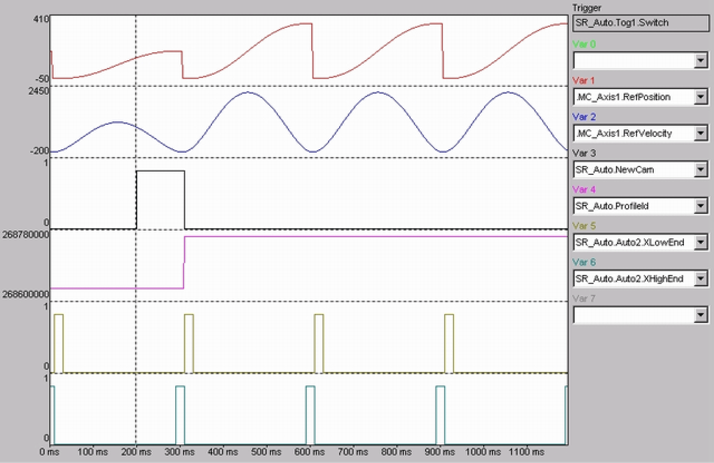

# FB_MultiCam - General Information

FB\_MultiCam - General Information

Overview

|  |  |
| --- | --- |
| Type: | Function block |
| Available as of: | V1.0.3.0 |
| Inherits from: | - |
| Implements: | - |

Task

Perform the curve-based motion sequence.

Description

Function block for motion tasks that can be defined by presetting the motion processes in segments. The description of the motion sequence is stored in a structure (type [ST\_MultiCam](../Structures/Structures-32.htm#XREF_D_SE_0087770_1)). It comprises the number of motion points (diNumberOfCamPoints maximum 32), and an array of points (type [ST\_CamPoint](../Structures/Structures-5.htm#XREF_D_SE_0087716_1)). By changing the existing structure, it is possible to switch various motion sequences to event-driven (for example, start cycle, continuous cycle, stop cycle, etc.).

Cold Start

Cold start means starting at the beginning of the motion sequence.

A cold start is executed with input i\_xStart = TRUE and input i\_xWsSelect = FALSE. There are various options (input variables i\_etCsModeSlave and i\_etCsModeMaster) for the cold start.

Analytical profile application

The analytical profiles of the PacDrive controller (simple sine, inclined sine, modified sine, modified acceleration trapezoid or the polynomial of the fifth degree) can be used as Rest-Rest, Rest-Velocity and Velocity-Rest profiles.

User profile application

In addition, any user profiles can be used. The profiles must be available as “<Name>.pp3 and can then be loaded in a normal manner.

NOTE: Used user profiles must be available on the flash disk. When replacing the flash disk, make sure that all profile data are copied.

NewCam

This abort is triggered using the input Iq\_xNewCam. Setting the iq\_xNewCam signalizes that a new profile is to be used in the next cycle. The function block resets the input iq\_xNewCam at the start of the new profile.

NewCam

NOTE: If the signal iq\_xNewCam is set too late, the cam switchover is not executed at the subsequent cycle but at the one after that.

If the signal is set by an asynchronous program task, the cycle time of the task must still be added to the time in which the FB is called.

The input iq\_xNewCam is only evaluated at the end of the current cam.

Example:

Program cycle time = 5 ms, SERCOS CycleTime = 2 ms, then TXend must be >= 7 ms.

InstantNewCam

If the current profile shall be interrupted to run another profile instead, this can be carried out at the master position i\_lrInstantXLimMax. For this purpose, a new structure ST\_MultiCam must be loaded. Also, the position, slope and curvature of both profiles must be equal for i\_lrInstantXLimMax and the input iq\_xInstantNewCam must be set. The function block resets the input iq\_xInstantNewCam at the start of the new profile.

|  |
| --- |
| NOTICE |
| SETPOINT JUMPS |
| oThe iq\_xInstantNewCam signal must be set before reaching the master encoder position i\_lrInstantXLimMax.  oPosition, gradient and curvature of the old and new profiles must match at the master encoder position i\_lrInstantXLimMax. |
| Failure to follow these instructions can result in equipment damage. |

InstantNewCam

Interface

| Input | Data type | Description |
| --- | --- | --- |
| i\_xEnable | BOOL | A rising edge FALSE -> TRUE activates the POU, a falling edge TRUE -> FALSE deactivates the POU.  A deactivated POU does not execute any actions. |
| i\_ifDrive | IF\_Drive | Input for the axis that shall be controlled. |
| i\_xStart | BOOL | Starts the drive motion  With i\_xStart = FALSE, the running cycle is stopped at the end. If the end slope of the final motion section is not zero, progress is stopped with i\_lrWsAcc.  Further parameters relevant for stopping (e.g. xStopPositionSelect), can be found in iq\_stExt. |
| i\_xWsSelect | BOOL | A "warm start" is executed with input i\_xStart = TRUE and input i\_xWsSelect = TRUE. "Warm start" means that it starts in the middle of a motion sequence (e.g., after an emergency stop). The FB orients itself to the master position and moves to the curve position. As soon as the drive position is back at the cam position, the output q\_xSynActive is set. This signal can be used to start the master encoder.  The master encoder must be at a standstill during "warm start".  If the master encoder or axis position is outside of its period during "Warm start", it will be brought into the period (Position = Position MOD Period). |
| i\_etCsModeSlave | [ET\_MultiCamCsModeSlave](../Enumerations/Enumerations-14.htm#XREF_D_SE_0087231_1) | Cold start mode of the slave axis |
| i\_etCsModeMaster | [ET\_MultiCamCsModeMaster](../Enumerations/Enumerations-13.htm#XREF_D_SE_0087229_1) | Cold start mode of the master encoder. |
| i\_etWsMode | [ET\_MultiCamWsMode](../Enumerations/Enumerations-15.htm#XREF_D_SE_0087233_1) | Warm start mode |
| i\_lrWsWindow | LREAL | Warm start window (slave axis +/-) |
| i\_lrWsVel | LREAL | Velocity for moving to the warm start position (slave position) in units/s. |
| i\_lrWsAcc | LREAL | Acceleration for moving to the warm start position (slave position) in units/s2. |
| i\_lrWsJerk | LREAL | Jerk for moving to the warm start position (slave position) in units/s3. |
| i\_xWsStart | BOOL | The input starts the motion upon the warm start if i\_xWsStart = TRUE. |
| i\_diTXEnd | DINT | Determines the setting of the outputs q\_xXHighEnd and q\_xXLowEnd.  TXEnd is a time specification in ms. TXEnd determines the last possible takeover of the iq\_xNewCam signal.  TXEnd is limited to 1.5 \* program cycle time.  TXEnd is extended internally by one program cycle in order to ensure that q\_xXHighEnd comes at least TXEnd before the end.  This is only effective if the parameter iq\_stExt.lrXEndWidth = 0. |
| i\_lrInstantXLimMax | LREAL | Abort position of the current motion profile and taking over the new motion profile with iq\_xInstantNewCam. |

| Output | Data type | Description |
| --- | --- | --- |
| q\_xActive | BOOL | TRUE: The POU is active and has to be executed further.  FALSE: The POU is inactive. |
| q\_xReady | BOOL | TRUE: The POU is ready to operate and can accept user commands.  FALSE: The POU is not ready to accept user commands. |
| q\_etDiag | [GD.ET\_Diag](../../../../../../api/crossBook?lang=en-US&virtualBookName=PD.Lib.GlobalDiagnostic&topicID=D_SE_0076228_1) | General library-independent statement on the diagnostic.  A value not equal to ET\_Diag.Ok corresponds to an diagnostic message. |
| q\_etDiagExt | [ET\_DiagExt](../Enumerations/Enumerations-5.htm#XREF_D_SE_0087213_1) | POU-specific output on the diagnostic.  q\_etDiag = ET\_Diag.Ok -> Status message  q\_etDiag <> ET\_Diag.Ok -> Diagnostic message |
| q\_sMsg | STRING[80] | Event-triggered message which gives more detailed information on the diagnostic state. |
| q\_xInWsWindow | BOOL | The output indicates whether the slave axis is inside the defined warm start window i\_lrWsWindow.  q\_xInWsWindow is only set in i\_etWsMode 2, 3, 12 and 13 if the slave position (axis) is inside the window around the cam position. Only the current period is affected. The window is not valid for the previous or the subsequent period.  The output q\_xInWsWindow is only reset with the output q\_xSynActive. |
| q\_xSynActive | BOOL | TRUE: The master axis and the slave axis run synchronously (curve is active). |
| q\_lrPositionX | LREAL | Output of the position X. (Master position) |
| q\_lrPositionY | LREAL | Output of the position Y. (Slave position) |
| q\_xXLowEnd | BOOL | XlowEnd signals the lower end of the curve.  If iq\_stExt.lrXEndWidth = 0 then the output i\_diTXEnd msec is set before the lower end of the curve.  If iq\_stExt.lrXEndWidth > 0 then the output i\_diTXEnd units is set before the lower end of the curve. |
| q\_xXHighEnd | BOOL | XHighEnd signals the upper end of the curve.  If iq\_stExt.lrXEndWidth = 0 then the output i\_diTXEnd msec is set before the upper end of the curve.  If iq\_stExt.lrXEndWidth > 0 then the output i\_diTXEnd units is set before the upper end of the curve. |
| q\_stActualCamData | [ST\_ActualCamData](../Structures/Structures-2.htm#XREF_D_SE_0087710_1) | Active travel profile data.  The output returns the data of the running profile. This can be helpful when wanting to abort the running profile in order to add another profile. The data are collected in a stActualCamData structure and can be used directly as input data for the function block FB\_ProfilPoint(). |

| Input/Output | Data type | Description |
| --- | --- | --- |
| iq\_lencMaster | L\_ENC | Input for the logical encoder which defines the master motion. |
| iq\_stExt | [ST\_MultiCamExt](../Structures/Structures-33.htm#XREF_D_SE_0087772_1) | Contains the parameters for options. |
| iq\_xNewCam | BOOL | Starts a new motion profile based on the current motion profile  xNewCamDirectAccept = TRUE: The synchronization of the iq\_xNewCam signal with q\_xXLowEnd and q\_xXHighEnd is canceled. iq\_xNewCam is accepted immediately. The iq\_xNewCam signal can therefore come later. It now is enough to set iq\_xNewCam one program cycle + one SERCOS cycle before the end of the cam. |
| iq\_xInstantNewCam | BOOL | Cancels the current motion profile with i\_lrInstantXLimMax and starts a new motion profile. |
| iq\_stMultiCamData | [ST\_MultiCam](../Structures/Structures-32.htm#XREF_D_SE_0087770_1) | Information on the course of the cam. |

Diagnostic Messages

| q\_etDiag | q\_etDiagExt | Enumeration value | Description |
| --- | --- | --- | --- |
| OK | [Disabled](#XREF_D_SE_0087313_10) | 9 | The POU is disabled. |
| OK | [Initializing](#XREF_D_SE_0087313_14) | 4 | The POU is being initialized. |
| OK | [ShowCamPosition](#XREF_D_SE_0087313_25) | 151 | The cam position is displayed. |
| OK | [WaitForNewCam](#XREF_D_SE_0087313_34) | 155 | Waiting for the next cam command. |
| OK | [WaitForStart](#XREF_D_SE_0087313_35) | 5 | Waiting for starting command. |
| OK | [WaitForWsStart](#XREF_D_SE_0087313_36) | 148 | Waiting for a WsStart signal. |
| OK | [WaitUntilCamFinished](#XREF_D_SE_0087313_37) | 157 | Waiting until cam is finished. |
| OK | [WaitUntilCamPositionReached](#XREF_D_SE_0087313_38) | 160 | Waiting until cam position is reached. |
| OK | [WaitUntilCamStarted](#XREF_D_SE_0087313_39) | 152 | Waiting until cam is started. |
| OK | [WaitUntilDisabled](#XREF_D_SE_0087313_40) | 8 | Waiting until the POU is deactivated. |
| OK | [WaitUntilFirstCamStarted](#XREF_D_SE_0087313_41) | 154 | Waiting until the first cam has started. |
| OK | [WaitUntilStartPositionReached](#XREF_D_SE_0087313_42) | 149 | Waiting until start position has been reached. |
| OK | [WaitUntilStopped](#XREF_D_SE_0087313_43) | 159 | Waiting until the drive has stopped. |
| OK | [WaitUntilStopPositionReached](#XREF_D_SE_0087313_44) | 156 | Waiting until stop position has been reached. |
| DriveConditionInvalid | [DriveNotReady](#XREF_D_SE_0087313_12) | 10 | The drive is not ready for motion commands. |
| InputParameterInvalid | [AccRange](#XREF_D_SE_0087313_7) | 12 | Acc is outside the valid range. |
| InputParameterInvalid | [BoundaryConditionInvalid](#XREF_D_SE_0087313_8) | 125 | The boundary conditions are invalid. |
| InputParameterInvalid | [DecRange](#XREF_D_SE_0087313_9) | 13 | Dec is outside the valid range. |
| InputParameterInvalid | [DriveInvalid](#XREF_D_SE_0087313_11) | 3 | The connected drive is invalid. |
| InputParameterInvalid | [JerkRange](#XREF_D_SE_0087313_15) | 14 | Jerk is outside the valid range. |
| InputParameterInvalid | [LencInvalid](#XREF_D_SE_0087313_16) | 162 | The connected logical encoder is invalid. |
| InputParameterInvalid | [NumberOfCamPointsRange](#XREF_D_SE_0087313_18) | 121 | NumberOfCamPoints is outside the valid range. |
| InputParameterInvalid | [RangeK](#XREF_D_SE_0087313_22) | 129 | K is outside the valid range. |
| InputParameterInvalid | [RangeM](#XREF_D_SE_0087313_23) | 130 | M is outside the valid range. |
| InputParameterInvalid | [UnknownCamType](#XREF_D_SE_0087313_27) | 126 | The cam type is indeterminable. |
| InputParameterInvalid | [UnknownCsModeMaster](#XREF_D_SE_0087313_28) | 164 | CsModeMaster is indeterminable. |
| InputParameterInvalid | [UnknownCsModeSlave](#XREF_D_SE_0087313_29) | 181 | CsModeSlave is indeterminable. |
| InputParameterInvalid | [UnknownWsMode](#XREF_D_SE_0087313_31) | 153 | The WSMode is indeterminable. |
| InputParameterInvalid | [VelRange](#XREF_D_SE_0087313_33) | 11 | Vel is outside the valid range. |
| InputParameterInvalid | [XFactorTooSmall](#XREF_D_SE_0087313_45) | 122 | XFactor is too small. |
| InputParameterInvalid | [YEqualCheckFailed](#XREF_D_SE_0087313_46) | 158 | YEqualCheck was unsuccessful. |
| SercosConditionInvalid | [SercosNotInPhaseFour](#XREF_D_SE_0087313_24) | 19 | The Sercos bus is not in phase 4. |
| UnexpectedProgramBehavior | [ProfileAlreadyInUse](#XREF_D_SE_0087313_19) | 116 | The profile is already in use. |
| UnexpectedProgramBehavior | [ProfileMemoryFull](#XREF_D_SE_0087313_20) | 127 | The memory for tables from system profiles is full. |
| UnexpectedProgramBehavior | [ProfileTableFull](#XREF_D_SE_0087313_21) | 123 | The system profile table is full. |
| UnexpectedProgramBehavior | [UnexpectedFeedback](#XREF_D_SE_0087313_26) | 1 | An unintended detected error occurred during execution. |
| UnexpectedProgramBehavior | [UnknownState](#XREF_D_SE_0087313_30) | 2 | The POU is in an undefined state. |
| WarmStartConditionInvalid | [DrivePositionOutOfWsWindow](#XREF_D_SE_0087313_13) | 150 | The position of the drive is outside of WsWindow. |
| WarmStartConditionInvalid | [MasterMoved](#XREF_D_SE_0087313_17) | 161 | The master has moved. |
| WarmStartConditionInvalid | [UserCamHasBeenDeleted](#XREF_D_SE_0087313_32) | 326 | A user-defined Cam profile has been deleted. |

AccRange

|  |  |
| --- | --- |
| Enumeration name: | AccRange |
| Enumeration value: | 12 |
| Description: | Acc is outside the valid range. |

| Issue | Cause | Solution |
| --- | --- | --- |
| - | At the input i\_lrWsAcc, an invalid value has been transferred. | The following must hold: 0 < i\_lrWsAcc < drive parameter MaxAcc  For the valid value range for i\_lrWsAcc, see output q\_sMsg |
| - | If iq\_stExt.xStartPositionSelect = TRUE: At the iq\_stExt.lrStartAcceleration, an invalid value has been transferred. | The following must hold: 0 < iq\_stExt.lrStartAcceleration < parameter MaxAcc of the drive  For the valid value range for iq\_stExt.lrStartAcceleration, see output q\_sMsg |
| - | If iq\_stExt.xStopPositionSelect = TRUE: At the iq\_stExt.lrStopAcceleration, an invalid value has been transferred. | The following must hold: 0 < iq\_stExt.lrStopAcceleration < parameter MaxAcc of the drive  For the valid value range for iq\_stExt.lrStopAcceleration, see output q\_sMsg |

BoundaryConditionInvalid

|  |  |
| --- | --- |
| Enumeration name: | BoundaryConditionInvalid |
| Enumeration value: | 125 |
| Description: | The boundary conditions are invalid. |

| Issue | Cause | Solution |
| --- | --- | --- |
| - | When defining the motion profile in iq\_stMultiCamData, the set boundary conditions cannot be complied with. | Verify the definition of the motion profile and particularly the boundary conditions of the sub-segments.  As an alternative, select different profiles for the sub-segments to be able to comply with all desired boundary conditions. |

DecRange

|  |  |
| --- | --- |
| Enumeration name: | DecRange |
| Enumeration value: | 13 |
| Description: | Dec is outside the valid range. |

| Issue | Cause | Solution |
| --- | --- | --- |
| - | If iq\_stExt.xStartPositionSelect = TRUE: At the iq\_stExt.lrStartDeceleration, an invalid value has been transferred. | The following must hold: 0 < iq\_stExt.lrStartDeceleration < parameter MaxAcc of the drive  For the valid value range for iq\_stExt.lrStartDeceleration, see output q\_sMsg |
| - | If iq\_stExt.xStopPositionSelect = TRUE: At the iq\_stExt.lrStopDeceleration, an invalid value has been transferred. | The following must hold: 0 < iq\_stExt.lrStopDeceleration < parameter MaxAcc of the drive  For the valid value range for iq\_stExt.lrStopDeceleration, see output q\_sMsg |

Disabled

|  |  |
| --- | --- |
| Enumeration name: | Disabled |
| Enumeration value: | 9 |
| Description: | The POU is disabled. |

The function block is disabled and executes no actions whatsoever. i\_xEnable and q\_xActive are set to FALSE

DriveInvalid

|  |  |
| --- | --- |
| Enumeration name: | DriveInvalid |
| Enumeration value: | 3 |
| Description: | The connected drive is invalid. |

| Issue | Cause | Solution |
| --- | --- | --- |
| - | At the input i\_ifDrive, no drive was applied. | At the input i\_ifDrive, a valid drive must be transferred. |
| - | The connected drive does not support all required functionalities. | Establish which functionalities are not supported by the drive by means of output q\_sMsg.  Use a drive which supports all required functionalities. |

DriveNotReady

|  |  |
| --- | --- |
| Enumeration name: | DriveNotReady |
| Enumeration value: | 10 |
| Description: | The drive is not ready for motion commands. |

| Issue | Cause | Solution |
| --- | --- | --- |
| - | The axis is not in position control. | Verify the state of the axis. |

DrivePositionOutOfWsWindow

|  |  |
| --- | --- |
| Enumeration name: | DrivePositionOutOfWsWindow |
| Enumeration value: | 150 |
| Description: | The position of the drive is outside of WsWindow. |

| Issue | Cause | Solution |
| --- | --- | --- |
| - | The axis has been moved beyond i\_WsWindow while switched off. | Move the axis back into the warm start window.  Extend the limits of the warm start window.  Perform a cold start. |

Initializing

|  |  |
| --- | --- |
| Enumeration name: | Initializing |
| Enumeration value: | 4 |
| Description: | The POU is being initialized. |

The function block is being initialized and thus is not yet ready to receive commands at its inputs.

The function block will signalize that it is ready for operation with the signal q\_xReady = TRUE.

JerkRange

|  |  |
| --- | --- |
| Enumeration name: | JerkRange |
| Enumeration value: | 14 |
| Description: | Jerk is outside the valid range. |

| Issue | Cause | Solution |
| --- | --- | --- |
| - | At the input i\_lrWsJerk, an invalid value has been applied. | At the input i\_lrWsJerk, a value greater than 0 and smaller than or equal to [Gc\_lrMaxJerk](../Global_Elements/Global_Elements-2.htm#XREF_D_SE_0087806_1) must be transferred. |
| - | The input iq\_stExt.xStartPositionSelect has been set to TRUE and at the input iq\_stExt.lrStartJerk, an invalid value has been transferred. | At the input iq\_stExt.lrStartJerk, a value greater than 0 and smaller than or equal to [Gc\_lrMaxJerk](../Global_Elements/Global_Elements-2.htm#XREF_D_SE_0087806_1) must be transferred.  Do not move to a start position by setting iq\_stExt.xStartPositionSelect to FALSE. |
| - | The input iq\_stExt.xStopPositionSelect has been set to TRUE and at the input iq\_stExt.lrStopJerk, an invalid value has been transferred. | At the input iq\_stExt.lrStopJerk, a value greater than 0 and smaller than or equal to [Gc\_lrMaxJerk](../Global_Elements/Global_Elements-2.htm#XREF_D_SE_0087806_1) must be transferred.  Do not move to a stop position by setting iq\_stExt.xStopPositionSelect to FALSE. |

LencInvalid

|  |  |
| --- | --- |
| Enumeration name: | LencInvalid |
| Enumeration value: | 162 |
| Description: | The connected logical encoder is invalid. |

| Issue | Cause | Solution |
| --- | --- | --- |
| - | At the input iq\_lencEncoder, no encoder has been applied. | At the input iq\_lencEncoder, a separate logical encoder must be transferred. |

MasterMoved

|  |  |
| --- | --- |
| Enumeration name: | MasterMoved |
| Enumeration value: | 161 |
| Description: | The master has moved. |

| Issue | Cause | Solution |
| --- | --- | --- |
| - | The master has moved during the warm start. | Ensure that the master does not move during the warm start motion. |

NumberOfCamPointsRange

|  |  |
| --- | --- |
| Enumeration name: | NumberOfCamPointsRange |
| Enumeration value: | 121 |
| Description: | NumberOfCamPoints is outside the valid range. |

| Issue | Cause | Solution |
| --- | --- | --- |
| - | At the input iq\_stMultiCamData.diNumberOfCamPoints, an invalid value has been transferred. | At the input iq\_stMultiCamData.diNumberOfCamPoints, a value greater than 0 and smaller than or equal to SystemInterface.MAX\_NO\_OF\_SEG + 1 must be transferred. |

ProfileAlreadyInUse

|  |  |
| --- | --- |
| Enumeration name: | ProfileAlreadyInUse |
| Enumeration value: | 116 |
| Description: | The profile is already in use. |

| Issue | Cause | Solution |
| --- | --- | --- |
| - | The motion profile is already in use. | Verify the motion data. |

ProfileMemoryFull

|  |  |
| --- | --- |
| Enumeration name: | ProfileMemoryFull |
| Enumeration value: | 127 |
| Description: | The memory for tables from system profiles is full. |

| Issue | Cause | Solution |
| --- | --- | --- |
| - | The system profile memory is full. | Delete any profiles that are no longer needed using the [SystemInterface.FC\_ProfileDelete](../../../../../../api/crossBook?lang=en-US&virtualBookName=PD.Lib.SystemInterface&topicID=D_SE_0085261_1) function |

ProfileTableFull

|  |  |
| --- | --- |
| Enumeration name: | ProfileTableFull |
| Enumeration value: | 123 |
| Description: | The system profile table is full. |

| Issue | Cause | Solution |
| --- | --- | --- |
| - | The maximum number of system profiles has been exceeded. | Delete any profiles that are no longer needed using the [SystemInterface.FC\_ProfileDelete](../../../../../../api/crossBook?lang=en-US&virtualBookName=PD.Lib.SystemInterface&topicID=D_SE_0085261_1) function |

RangeK

|  |  |
| --- | --- |
| Enumeration name: | RangeK |
| Enumeration value: | 129 |
| Description: | K is outside the valid range. |

| Issue | Cause | Solution |
| --- | --- | --- |
| - | At the input iq\_stMultiCamData.astCamPoint[ ].lrK, an invalid value has been applied. | Verify the values for iq\_stMultiCamData.astCamPoint[ ].lrK |

RangeM

|  |  |
| --- | --- |
| Enumeration name: | RangeM |
| Enumeration value: | 130 |
| Description: | M is outside the valid range. |

| Issue | Cause | Solution |
| --- | --- | --- |
| - | At the input iq\_stMultiCamData.astCamPoint[ ].lrM, an invalid value has been applied. | Verify the values for iq\_stMultiCamData.astCamPoint[ ].lrM |

SercosNotInPhaseFour

|  |  |
| --- | --- |
| Enumeration name: | SercosNotInPhaseFour |
| Enumeration value: | 19 |
| Description: | The Sercos bus is not in phase 4. |

| Issue | Cause | Solution |
| --- | --- | --- |
| - | The parameter State of the SERCOS bus is not 4. | Set the SERCOS bus parameter PhaseSet to 4.  Verify the SERCOS bus for errors. |

ShowCamPosition

|  |  |
| --- | --- |
| Enumeration name: | ShowCamPosition |
| Enumeration value: | 151 |
| Description: | The cam position is displayed. |

At output q\_lrPositionY, the cam position is displayed.

UnexpectedFeedback

|  |  |
| --- | --- |
| Enumeration name: | UnexpectedFeedback |
| Enumeration value: | 1 |
| Description: | An unintended detected error occurred during execution. |

| Issue | Cause | Solution |
| --- | --- | --- |
| - | An error occurred in the internal execution. | Please inform the support team about this error. |

UnknownCamType

|  |  |
| --- | --- |
| Enumeration name: | UnknownCamType |
| Enumeration value: | 126 |
| Description: | The cam type is indeterminable. |

| Issue | Cause | Solution |
| --- | --- | --- |
| - | The cam type of a point iq\_stMultiCamData.astCamPoint is assigned with an invalid cam profile. | The cam types etCamType of all used cam points at the input iq\_stMultiCamData.astCamPoint must be assigned with an element of the enumeration [ET\_CamType](../Enumerations/Enumerations-4.htm#XREF_D_SE_0087211_1). |

UnknownCsModeMaster

|  |  |
| --- | --- |
| Enumeration name: | UnknownCsModeMaster |
| Enumeration value: | 164 |
| Description: | CsModeMaster is indeterminable. |

| Issue | Cause | Solution |
| --- | --- | --- |
| - | At the input i\_etCsModeMaster, an invalid value has been transferred. | At the input i\_etCsModeMaster, an element of the enumeration [ET\_MultiCamCsModeMaster](../Enumerations/Enumerations-13.htm#XREF_D_SE_0087229_1) must be transferred. |

UnknownCsModeSlave

|  |  |
| --- | --- |
| Enumeration name: | UnknownCsModeSlave |
| Enumeration value: | 181 |
| Description: | CsModeSlave is indeterminable. |

| Issue | Cause | Solution |
| --- | --- | --- |
| - | At the input i\_etCsModeSlave, an invalid value has been transferred. | At the input i\_etCsModeSlave, an element of the enumeration [ET\_MultiCamCsModeSlave](../Enumerations/Enumerations-14.htm#XREF_D_SE_0087231_1) must be transferred. |

UnknownState

|  |  |
| --- | --- |
| Enumeration name: | UnknownState |
| Enumeration value: | 2 |
| Description: | The POU is in an undefined state. |

| Issue | Cause | Solution |
| --- | --- | --- |
| - | An error occurred in the internal execution. | Please inform the support team about this error. |

UnknownWsMode

|  |  |
| --- | --- |
| Enumeration name: | UnknownWsMode |
| Enumeration value: | 153 |
| Description: | The WSMode is indeterminable. |

| Issue | Cause | Solution |
| --- | --- | --- |
| - | At the input i\_etWSMode, an invalid value has been applied. | At the input i\_etWSMode, elements of the enumeration [ET\_MultiCamWsMode](../Enumerations/Enumerations-15.htm#XREF_D_SE_0087233_1) must be applied. |

UserCamHasBeenDeleted

|  |  |
| --- | --- |
| Enumeration name: | UserCamHasBeenDeleted |
| Enumeration value: | 326 |
| Description: | A user-defined Cam profile has been deleted. |

| Issue | Cause | Solution |
| --- | --- | --- |
| - | An active Cam profile has been deleted by calling [SystemInterface.FC\_ProfileDelete()](../../../../../../api/crossBook?lang=en-US&virtualBookName=PD.Lib.SystemInterface&topicID=D_SE_0085261_1). | Verify that Cam profiles are available when being executed. |

VelRange

|  |  |
| --- | --- |
| Enumeration name: | VelRange |
| Enumeration value: | 11 |
| Description: | Vel is outside the valid range. |

| Issue | Cause | Solution |
| --- | --- | --- |
| - | The axis cannot reach the warm start velocity. | Apply a value to i\_lrWsVel which is smaller than the axis parameter MaxVel. |
| - | The axis cannot reach the velocity of the start motion. | Apply a value to iq\_stExt.lrStartVelocity which is smaller than the axis parameter MaxVel.  Set iq\_stExt.xStartPositionSelect to FALSE so that no start motion is executed. |
| - | The axis cannot reach the velocity of the stop motion. | Apply a value to iq\_stExt.lrStopVelocity which is smaller than the axis parameter MaxVel.  Set iq\_stExt.xStopPositionSelect to FALSE so that no stop motion is executed. |

WaitForNewCam

|  |  |
| --- | --- |
| Enumeration name: | WaitForNewCam |
| Enumeration value: | 155 |
| Description: | Waiting for the next cam command. |

The cams are moved according to their task sequence.

WaitForStart

|  |  |
| --- | --- |
| Enumeration name: | WaitForStart |
| Enumeration value: | 5 |
| Description: | Waiting for starting command. |

The function block has completed its initialization and is waiting for a positive edge at the input i\_xStart before continuing the processing.

WaitForWsStart

|  |  |
| --- | --- |
| Enumeration name: | WaitForWsStart |
| Enumeration value: | 148 |
| Description: | Waiting for a WsStart signal. |

After a signal at the input i\_xWsStart, the warm start motion is started.

WaitUntilCamFinished

|  |  |
| --- | --- |
| Enumeration name: | WaitUntilCamFinished |
| Enumeration value: | 157 |
| Description: | Waiting until cam is finished. |

The axis moves on until the end of the current cam is reached.

WaitUntilCamPositionReached

|  |  |
| --- | --- |
| Enumeration name: | WaitUntilCamPositionReached |
| Enumeration value: | 160 |
| Description: | Waiting until cam position is reached. |

The axis is moved to its position on the cam.

WaitUntilCamStarted

|  |  |
| --- | --- |
| Enumeration name: | WaitUntilCamStarted |
| Enumeration value: | 152 |
| Description: | Waiting until cam is started. |

The function block waits for the cam to be moved.

WaitUntilDisabled

|  |  |
| --- | --- |
| Enumeration name: | WaitUntilDisabled |
| Enumeration value: | 8 |
| Description: | Waiting until the POU is deactivated. |

The function block is disabled. All internal states are reset and connected resources (e.g. axes) are transferred to a safe state. The function block has to be called up continuously until it reports q\_xActive = FALSE.

WaitUntilFirstCamStarted

|  |  |
| --- | --- |
| Enumeration name: | WaitUntilFirstCamStarted |
| Enumeration value: | 154 |
| Description: | Waiting until the first cam has started. |

The function block waits for the first cam to be started.

WaitUntilStartPositionReached

|  |  |
| --- | --- |
| Enumeration name: | WaitUntilStartPositionReached |
| Enumeration value: | 149 |
| Description: | Waiting until start position has been reached. |

The axis is moved to its start position.

WaitUntilStopped

|  |  |
| --- | --- |
| Enumeration name: | WaitUntilStopped |
| Enumeration value: | 159 |
| Description: | Waiting until the drive has stopped. |

The axis is stopped.

WaitUntilStopPositionReached

|  |  |
| --- | --- |
| Enumeration name: | WaitUntilStopPositionReached |
| Enumeration value: | 156 |
| Description: | Waiting until stop position has been reached. |

The axis is moved to its stop position and comes to a halt there.

XFactorTooSmall

|  |  |
| --- | --- |
| Enumeration name: | XFactorTooSmall |
| Enumeration value: | 122 |
| Description: | XFactor is too small. |

| Issue | Cause | Solution |
| --- | --- | --- |
| - | Two successive cam points iq\_stMultiCamData.astCamPoint[ ].lrX have a distance of less than 0.1 units. | Verify the definition of the cam and, if necessary, remove cam profiles that are too short. |

YEqualCheckFailed

|  |  |
| --- | --- |
| Enumeration name: | YEqualCheckFailed |
| Enumeration value: | 158 |
| Description: | YEqualCheck was unsuccessful. |

| Issue | Cause | Solution |
| --- | --- | --- |
| - | If iq\_stExt.xYEqualCheck = TRUE: The verification on whether the new cam directly follows the old cam was unsuccessful. | Configure the new cam such that its start deviates by less than 0.0001 units from the end of the old cam.  Deactivate the verification by setting iq\_stExt.xYEqualCheck = FALSE. |

Methods

| Name | Description |
| --- | --- |
| [RegisterLoggerPoint](Function_Blocks_I_to_Q-15.htm#XREF_D_SE_0087314_1) | The method registers the internal logger point in the Application Logger. |

EIO0000002658.00

© 2018 Schneider Electric. All rights reserved.