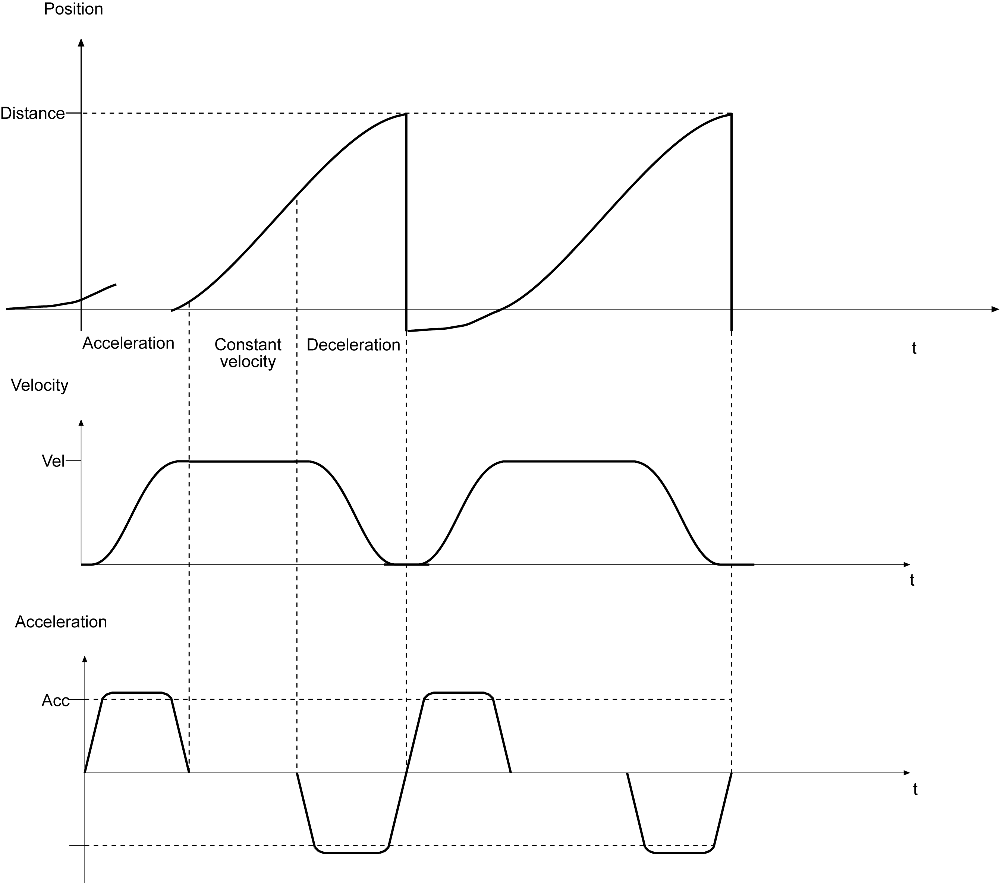
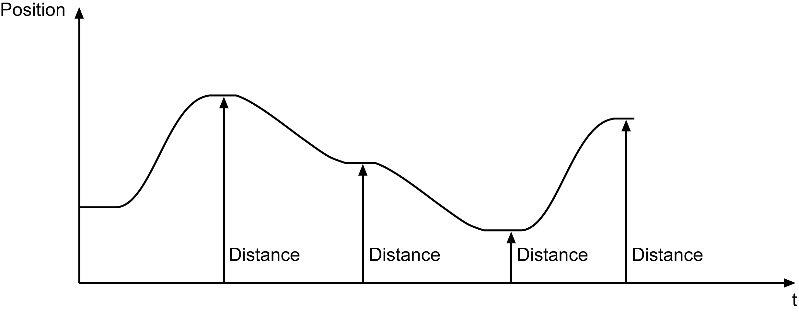

# FB_VarioPosJerk - General Information

FB\_VarioPosJerk - General Information

Overview

|  |  |
| --- | --- |
| Type: | Function block |
| Available as of: | V1.0.3.0 |
| Inherits from: | - |
| Implements: | - |
| Versions: | Current version |

Task

Axis positioning

Description

A motion (positioning) to a position is possible using the function block. In doing so, the axis with a defined velocity and acceleration/deceleration is moved. The velocity profile of the motion development is trapezoidal as a default.

Function block FB\_VarioPosJerk / i\_etPosMode = 0 (endless)

Function block FB\_VarioPosJerk / i\_etPosMode = 1 (relative)

Function block FB\_VarioPosJerk / i\_etPosMode = 3 (absolute)

Interface

| Input | Data type | Description |
| --- | --- | --- |
| i\_xEnable | BOOL | A rising edge FALSE -> TRUE activates the POU, a falling edge TRUE -> FALSE deactivates the POU.  A deactivated POU does not execute any actions. |
| i\_ifDrive | IF\_Drive | Input for the axis that shall be controlled. |
| i\_xStart | BOOL | FALSE -> TRUE: Start of the motion according to set parameters.  A rising edge at the input i\_xStart during an active positioning interrupts the running motion and starts a new motion without stopping (floating). That is, parameter changes during motion are adopted with the first rising edge at the input i\_xStart. All parameters (i\_lrTarget, i\_lrVel, i\_lrAcc, i\_lrDec, i\_lrJerk) can be changed for the new positioning. |
| i\_xStop | BOOL | TRUE: Stops a running positioning with the deceleration i\_lrDec. |
| i\_lrTarget | LREAL | Travel distance or targets of the motion in units are dependent on i\_etPosMode. |
| i\_lrVel | LREAL | Velocity (change of position) in units/s. |
| i\_lrAcc | LREAL | Acceleration (change of velocity) in units/s2. |
| i\_lrDec | LREAL | Deceleration (change of velocity) in units/s2. |
| i\_lrJerk | LREAL | Jerk (change of acceleration/deceleration) in units/s3. |
| i\_etPosMode | [ET\_PosMode](../../../../../../api/crossBook?lang=en-US&virtualBookName=PD.Lib.SystemInterface&topicID=D_SE_0084933_1) | There are the following modes for positioning:  oEndless  The position counter is set to zero before positioning. Then it is positioned to the specified value in i\_lrTarget.  oRelative  Positioning is performed relative to the position counter. That is, the position counter is not reset before positioning.  oAbsolute  Positioning is absolute. The position counter is not reset before positioning. |

| Output | Data type | Description |
| --- | --- | --- |
| q\_xActive | BOOL | TRUE: The POU is active and has to be executed further.  FALSE: The POU is inactive. |
| q\_xReady | BOOL | TRUE: The POU is ready to operate and can accept user commands.  FALSE: The function block is not ready to accept user commands. |
| q\_etDiag | [GD.ET\_Diag](../../../../../../api/crossBook?lang=en-US&virtualBookName=PD.Lib.GlobalDiagnostic&topicID=D_SE_0076228_1) | General library-independent statement on the diagnostic.  A value not equal to ET\_Diag.Ok corresponds to an diagnostic message. |
| q\_etDiagExt | [ET\_DiagExt](../Enumerations/Enumerations-5.htm#XREF_D_SE_0087213_1) | POU-specific output on the diagnostic.  q\_etDiag = ET\_Diag.Ok -> Status message  q\_etDiag <> ET\_Diag.Ok -> Diagnostic message |
| q\_sMsg | STRING[80] | Event-triggered message which gives more detailed information on the diagnostic state. |
| q\_xMotionInstructionActive | BOOL | TRUE: The axis is processing a motion command. The output is also set if the motion command defines that the axis is at stand still. |
| q\_xInPosition | BOOL | TRUE: The axis is at target. If the positioning is interrupted, then the q\_xInPosition is not set until the original target is approached. |
| q\_lrPosition | LREAL | Position (RefPosition) of the axis. |

Diagnostic Messages

| q\_etDiag | q\_etDiagExt | Enumeration value | Description |
| --- | --- | --- | --- |
| OK | [Disabled](#XREF_D_SE_0087376_9) | 9 | The POU is disabled. |
| OK | [Initializing](#XREF_D_SE_0087376_12) | 4 | The POU is being initialized. |
| OK | [Positioning](#XREF_D_SE_0087376_14) | 6 | Positioning is being executed. |
| OK | [Stopping](#XREF_D_SE_0087376_17) | 7 | Active motion commands are stopped. |
| OK | [WaitForStart](#XREF_D_SE_0087376_21) | 5 | Waiting for starting command. |
| OK | [WaitUntilDisabled](#XREF_D_SE_0087376_22) | 8 | Waiting until the POU is deactivated. |
| DriveConditionInvalid | [DriveNotReady](#XREF_D_SE_0087376_11) | 10 | The drive is not ready for motion commands. |
| DriveConditionInvalid | [SercosNotInPhaseFour](#XREF_D_SE_0087376_16) | 19 | The Sercos bus is not in phase 4. |
| InputParameterInvalid | [AccRange](#XREF_D_SE_0087376_7) | 12 | Acc is outside the valid range. |
| InputParameterInvalid | [DecRange](#XREF_D_SE_0087376_8) | 13 | Dec is outside the valid range. |
| InputParameterInvalid | [DriveInvalid](#XREF_D_SE_0087376_10) | 3 | The connected drive is invalid. |
| InputParameterInvalid | [JerkRange](#XREF_D_SE_0087376_13) | 14 | Jerk is outside the valid range. |
| InputParameterInvalid | [PosModeRange](#XREF_D_SE_0087376_15) | 322 | PosMode is out of range |
| InputParameterInvalid | [VelRange](#XREF_D_SE_0087376_20) | 11 | Vel is outside the valid range. |
| UnexpectedProgramBehavior | [UnexpectedFeedback](#XREF_D_SE_0087376_18) | 1 | An unintended detected error occurred during execution. |
| UnexpectedProgramBehavior | [UnknownState](#XREF_D_SE_0087376_19) | 2 | The POU is in an undefined state. |

AccRange

|  |  |
| --- | --- |
| Enumeration name: | AccRange |
| Enumeration value: | 12 |
| Description: | Acc is outside the valid range. |

| Issue | Cause | Solution |
| --- | --- | --- |
| - | At the input i\_lrAcc, an invalid value has been transferred. | The following must hold: 0 < i\_lrAcc < drive parameter MaxAcc  For the valid value range for i\_lrAcc, see output q\_sMsg |

DecRange

|  |  |
| --- | --- |
| Enumeration name: | DecRange |
| Enumeration value: | 13 |
| Description: | Dec is outside the valid range. |

| Issue | Cause | Solution |
| --- | --- | --- |
| - | At the input i\_lrDec, an invalid value has been transferred. | The following must hold: 0 < i\_lrDec < drive parameter MaxAcc  For the valid value range for i\_lrDec, see output q\_sMsg |

Disabled

|  |  |
| --- | --- |
| Enumeration name: | Disabled |
| Enumeration value: | 9 |
| Description: | The POU is disabled. |

The function block is disabled and executes no actions whatsoever. i\_xEnable and q\_xActive are set to FALSE

DriveInvalid

|  |  |
| --- | --- |
| Enumeration name: | DriveInvalid |
| Enumeration value: | 3 |
| Description: | The connected drive is invalid. |

| Issue | Cause | Solution |
| --- | --- | --- |
| - | At the input i\_ifDrive, no drive was applied. | At the input i\_ifDrive, a valid drive must be transferred. |
| - | The connected drive does not support all required functionalities. | Establish which functionalities are not supported by the drive by means of output q\_sMsg.  Use a drive which supports all required functionalities. |

DriveNotReady

|  |  |
| --- | --- |
| Enumeration name: | DriveNotReady |
| Enumeration value: | 10 |
| Description: | The drive is not ready for motion commands. |

| Issue | Cause | Solution |
| --- | --- | --- |
| - | The axis is not in position control. | Verify the state of the axis. |
| - | The parameter State of the SERCOS bus is not 4. | Set the SERCOS bus parameter PhaseSet to 4.  Verify the SERCOS bus for errors. |

Initializing

|  |  |
| --- | --- |
| Enumeration name: | Initializing |
| Enumeration value: | 4 |
| Description: | The POU is being initialized. |

The function block is being initialized and thus is not yet ready to receive commands at its inputs.

The function block will signalize that it is ready for operation with the signal q\_xReady = TRUE.

JerkRange

|  |  |
| --- | --- |
| Enumeration name: | JerkRange |
| Enumeration value: | 14 |
| Description: | Jerk is outside the valid range. |

| Issue | Cause | Solution |
| --- | --- | --- |
| - | At the input i\_lrJerk, an invalid value has been applied. | At the input i\_lrJerk, a value greater than 0 and smaller than or equal to [Gc\_lrMaxJerk](../Global_Elements/Global_Elements-2.htm#XREF_D_SE_0087806_1) must be transferred. |

Positioning

|  |  |
| --- | --- |
| Enumeration name: | Positioning |
| Enumeration value: | 6 |
| Description: | Positioning is being executed. |

Positioning is being executed.

PosModeRange

|  |  |
| --- | --- |
| Enumeration name: | PosModeRange |
| Enumeration value: | 322 |
| Description: | PosMode is out of range |

| Issue | Cause | Solution |
| --- | --- | --- |
| - | The operating mode Positioning has been selected and the i\_etPosMode parameter of the ST\_Positioning structure was allocated with an invalid value. | For i\_etPosMode, one of the values SystemInterface.ET\_PosMode.Absolute, SystemInterface.ET\_PosMode.Relative or SystemInterface.ET\_PosModeEndless has to be given. The pos mode SystemInterface.ET\_PosMode.Increment or other values are forbitten. |

SercosNotInPhaseFour

|  |  |
| --- | --- |
| Enumeration name: | SercosNotInPhaseFour |
| Enumeration value: | 19 |
| Description: | The Sercos bus is not in phase 4. |

| Issue | Cause | Solution |
| --- | --- | --- |
| - | The parameter State of the SERCOS bus is not 4. | Set the SERCOS bus parameter PhaseSet to 4.  Verify the SERCOS bus for errors. |

Stopping

|  |  |
| --- | --- |
| Enumeration name: | Stopping |
| Enumeration value: | 7 |
| Description: | Active motion commands are stopped. |

The axis is stopped.

UnexpectedFeedback

|  |  |
| --- | --- |
| Enumeration name: | UnexpectedFeedback |
| Enumeration value: | 1 |
| Description: | An unintended detected error occurred during execution. |

| Issue | Cause | Solution |
| --- | --- | --- |
| - | An error occurred in the internal execution. | Please inform the support team about this error. |

UnknownState

|  |  |
| --- | --- |
| Enumeration name: | UnknownState |
| Enumeration value: | 2 |
| Description: | The POU is in an undefined state. |

| Issue | Cause | Solution |
| --- | --- | --- |
| - | An error occurred in the internal execution. | Please inform the support team about this error. |

VelRange

|  |  |
| --- | --- |
| Enumeration name: | VelRange |
| Enumeration value: | 11 |
| Description: | Vel is outside the valid range. |

| Issue | Cause | Solution |
| --- | --- | --- |
| - | At the input i\_lrVel, an invalid value has been transferred. | For i\_lrVel, a value greater than 0 and smaller than the axis parameter MaxVel must be specified. |

WaitForStart

|  |  |
| --- | --- |
| Enumeration name: | WaitForStart |
| Enumeration value: | 5 |
| Description: | Waiting for starting command. |

The function block has completed its initialization and is waiting for a positive edge at the input i\_xStart before continuing the processing.

WaitUntilDisabled

|  |  |
| --- | --- |
| Enumeration name: | WaitUntilDisabled |
| Enumeration value: | 8 |
| Description: | Waiting until the POU is deactivated. |

The function block is disabled. All internal states are reset and connected resources (e.g. axes) are transferred to a safe state. The function block has to be called up continuously until it reports q\_xActive = FALSE.

Methods

| Name | Description |
| --- | --- |
| [RegisterLoggerPoint](Function_Blocks_R_to_Z-33.htm#XREF_D_SE_0087377_1) | Registering the logger points of the POU in the Application Logger |

EIO0000002658.00

© 2018 Schneider Electric. All rights reserved.