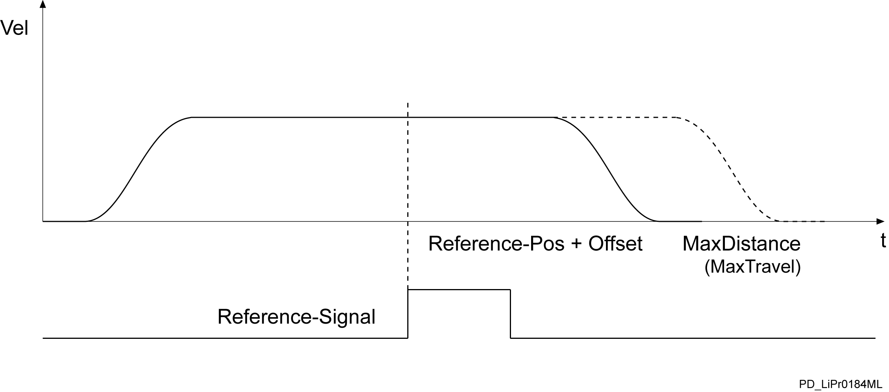

# FB_VarioPosTp

FB\_VarioPosTp

FB\_VarioPosTp - General Information

Overview

|  |  |
| --- | --- |
| Type: | Function block |
| Available as of: | V1.0.3.0 |
| Inherits from: | - |
| Implements: | - |
| Versions: | Current version |

Task

Carry out positioning motion with correction of the target position using a reference signal.

Description

A motion (positioning) to a position is possible using the function block. In doing so, the axis with a defined velocity and acceleration/deceleration is moved. The velocity profile of the motion development is trapezoidal as a default.

Velocity profile of the FB\_VarioPosTp function block.

Function block FB\_VarioPosTP / i\_etPosMode = 0 (endless)

Function block FB\_VarioPosTP / i\_etPosMode = 1 (relative)

Function block FB\_VarioPosTP / i\_etPosMode = 3 (absolute)

Interface

| Input | Data type | Description |
| --- | --- | --- |
| i\_xEnable | BOOL | A rising edge FALSE -> TRUE activates the POU, a falling edge TRUE -> FALSE deactivates the POU.  A deactivated POU does not execute any actions. |
| i\_ifDrive | IF\_Drive | Input for the axis that shall be controlled. |
| i\_ifTouchProbe | IF\_TouchProbe | Digital measure input of the PacDrive system, into which the reference signal is fed. |
| i\_xPosEdge | BOOL | TRUE: Positive edge of the input signal i\_ifTouchProbe  FALSE: Negative edge of the input signal i\_ifTouchProbe |
| i\_xStart | BOOL | FALSE -> TRUE: Start of the motion according to set parameters. |
| i\_xStop | BOOL | FALSE -> TRUE: Stops a running positioning with the deceleration i\_lrDec. |
| i\_lrMaxDistance | LREAL | Travel distance or targets of the motion in units are a function of i\_etPosMode if no valid reference signal i\_ifTouchProbe is detected. |
| i\_etPosMode | [ET\_PosMode](../../../../../../api/crossBook?lang=en-US&virtualBookName=PD.Lib.SystemInterface&topicID=D_SE_0084933_1) | There are the following modes for positioning:  oEndless  The position counter is set to zero before positioning. Then, positioning to the value specified in i\_lrMaxDistance is executed.  oRelative  Positioning is performed relative to the position counter. That is, the position counter is not reset before positioning.  oAbsolute  Positioning is absolute. The position counter is not reset before positioning. |
| i\_lrOffset | LREAL | Offset between reference signal and target position. |
| i\_lrLowLimit | LREAL | Lower limit of the position relative to the start position at which the reference signal is valid. |
| i\_lrHighLimit | LREAL | Upper limit of the position relative to the start position at which the reference signal is valid. |
| i\_lrVel | LREAL | Velocity (change of position) in units/s. |
| i\_lrAcc | LREAL | Acceleration (change of velocity) in units/s2. |
| i\_lrDec | LREAL | Deceleration (change of velocity) in units/s2. |
| i\_lrJerk | LREAL | Jerk (change of acceleration/deceleration) in units/s3. |

| Output | Data type | Description |
| --- | --- | --- |
| q\_xActive | BOOL | TRUE: The POU is active and has to be executed further.  FALSE: The POU is inactive. |
| q\_xReady | BOOL | TRUE: The POU is ready to operate and can accept user commands.  FALSE: The POU is not ready to accept user commands. |
| q\_etDiag | [GD.ET\_Diag](../../../../../../api/crossBook?lang=en-US&virtualBookName=PD.Lib.GlobalDiagnostic&topicID=D_SE_0076228_1) | General library-independent statement on the diagnostic.  A value not equal to ET\_Diag.Ok corresponds to an diagnostic message. |
| q\_etDiagExt | [ET\_DiagExt](../Enumerations/Enumerations-5.htm#XREF_D_SE_0087213_1) | POU-specific output on the diagnostic.  q\_etDiag = ET\_Diag.Ok -> Status message  q\_etDiag <> ET\_Diag.Ok -> Diagnostic message |
| q\_sMsg | STRING[80] | Event-triggered message which gives more detailed information on the diagnostic state. |
| q\_xMotionInstructionActive | BOOL | TRUE: The axis is processing a motion command. The output is also set if the motion command defines that the axis is at stand still. |
| q\_xInPosition | BOOL | TRUE: The axis is at the target (i\_lrMaxDistance or corrected position reached via the reference signal). If positioning is interrupted, q\_xInPosition is only set when the original target is approached. |
| q\_xTPOk | BOOL | TRUE: q\_xInPosition and valid reference signal detected at i\_ifTouchProbe. |
| q\_lrPosition | LREAL | Position (RefPosition) of the axis. |
| q\_lrTPPosition | LREAL | Position of the axis during recognition of the valid reference signal. |

Diagnostic Messages

| q\_etDiag | q\_etDiagExt | Enumeration value | Description |
| --- | --- | --- | --- |
| OK | [Disabled](#XREF_D_SE_0087379_9) | 9 | The POU is disabled. |
| OK | [Initializing](#XREF_D_SE_0087379_12) | 4 | The POU is being initialized. |
| OK | [WaitForStart](#XREF_D_SE_0087379_21) | 5 | Waiting for starting command. |
| OK | [WaitForStopRelease](#XREF_D_SE_0087379_22) | 238 | Waiting for the stop command to be taken back. |
| OK | [WaitForTouchProbeSignal](#XREF_D_SE_0087379_23) | 167 | Waiting for Touchprobe signal. |
| OK | [WaitUntilDisabled](#XREF_D_SE_0087379_24) | 8 | Waiting until the POU is deactivated. |
| OK | [WaitUntilOffsetReached](#XREF_D_SE_0087379_25) | 225 | Waiting until the offset position has been reached. |
| OK | [WaitUntilPositioningStarted](#XREF_D_SE_0087379_26) | 245 | Waiting until positioning has been started. |
| OK | [WaitUntilStopped](#XREF_D_SE_0087379_27) | 159 | Waiting until the drive has stopped. |
| DriveConditionInvalid | [DriveNotReady](#XREF_D_SE_0087379_11) | 10 | The drive is not ready for motion commands. |
| InputParameterInvalid | [AccRange](#XREF_D_SE_0087379_7) | 12 | Acc is outside the valid range. |
| InputParameterInvalid | [DecRange](#XREF_D_SE_0087379_8) | 13 | Dec is outside the valid range. |
| InputParameterInvalid | [DriveInvalid](#XREF_D_SE_0087379_10) | 3 | The connected drive is invalid. |
| InputParameterInvalid | [JerkRange](#XREF_D_SE_0087379_13) | 14 | Jerk is outside the valid range. |
| InputParameterInvalid | [TouchProbeInvalid](#XREF_D_SE_0087379_15) | 163 | The connected Touchprobe is invalid. |
| InputParameterInvalid | [TouchProbeNotActive](#XREF_D_SE_0087379_16) | 166 | The Touchprobe is not active. |
| InputParameterInvalid | [TouchProbeVirtual](#XREF_D_SE_0087379_17) | 165 | The connected Touchprobe is virtual. |
| InputParameterInvalid | [VelRange](#XREF_D_SE_0087379_20) | 11 | Vel is outside the valid range. |
| SercosConditionInvalid | [SercosNotInPhaseFour](#XREF_D_SE_0087379_14) | 19 | The Sercos bus is not in phase 4. |
| UnexpectedProgramBehavior | [UnexpectedFeedback](#XREF_D_SE_0087379_18) | 1 | An unintended detected error occurred during execution. |
| UnexpectedProgramBehavior | [UnknownState](#XREF_D_SE_0087379_19) | 2 | The POU is in an undefined state. |

AccRange

|  |  |
| --- | --- |
| Enumeration name: | AccRange |
| Enumeration value: | 12 |
| Description: | Acc is outside the valid range. |

| Issue | Cause | Solution |
| --- | --- | --- |
| - | At the input i\_lrAcc, an invalid value has been transferred. | The following must hold: 0 < i\_lrAcc < drive parameter MaxAcc  For the valid value range for i\_lrAcc, see output q\_sMsg |

DecRange

|  |  |
| --- | --- |
| Enumeration name: | DecRange |
| Enumeration value: | 13 |
| Description: | Dec is outside the valid range. |

| Issue | Cause | Solution |
| --- | --- | --- |
| - | At the input i\_lrDec, an invalid value has been transferred. | The following must hold: 0 < i\_lrDec < drive parameter MaxAcc  For the valid value range for i\_lrDec, see output q\_sMsg |

Disabled

|  |  |
| --- | --- |
| Enumeration name: | Disabled |
| Enumeration value: | 9 |
| Description: | The POU is disabled. |

The function block is disabled and executes no actions whatsoever. i\_xEnable and q\_xActive are set to FALSE

DriveInvalid

|  |  |
| --- | --- |
| Enumeration name: | DriveInvalid |
| Enumeration value: | 3 |
| Description: | The connected drive is invalid. |

| Issue | Cause | Solution |
| --- | --- | --- |
| - | At the input i\_ifDrive, no drive was applied. | At the input i\_ifDrive, a valid drive must be transferred. |
| - | The connected drive does not support all required functionalities. | Establish which functionalities are not supported by the drive by means of output q\_sMsg.  Use a drive which supports all required functionalities. |

DriveNotReady

|  |  |
| --- | --- |
| Enumeration name: | DriveNotReady |
| Enumeration value: | 10 |
| Description: | The drive is not ready for motion commands. |

| Issue | Cause | Solution |
| --- | --- | --- |
| - | The axis is not in position control. | Verify the state of the axis. |
| - | The parameter State of the SERCOS bus is not 4. | Set the SERCOS bus parameter PhaseSet to 4.  Verify the SERCOS bus for errors. |

Initializing

|  |  |
| --- | --- |
| Enumeration name: | Initializing |
| Enumeration value: | 4 |
| Description: | The POU is being initialized. |

The function block is being initialized and thus is not yet ready to receive commands at its inputs.

The function block will signalize that it is ready for operation with the signal q\_xReady = TRUE.

JerkRange

|  |  |
| --- | --- |
| Enumeration name: | JerkRange |
| Enumeration value: | 14 |
| Description: | Jerk is outside the valid range. |

| Issue | Cause | Solution |
| --- | --- | --- |
| - | At the input i\_lrJerk, an invalid value has been applied. | At the input i\_lrJerk, a value greater than 0 and smaller than or equal to [Gc\_lrMaxJerk](../Global_Elements/Global_Elements-2.htm#XREF_D_SE_0087806_1) must be transferred. |

SercosNotInPhaseFour

|  |  |
| --- | --- |
| Enumeration name: | SercosNotInPhaseFour |
| Enumeration value: | 19 |
| Description: | The Sercos bus is not in phase 4. |

| Issue | Cause | Solution |
| --- | --- | --- |
| - | The parameter State of the SERCOS bus is not 4. | Set the SERCOS bus parameter PhaseSet to 4.  Verify the SERCOS bus for errors. |

TouchProbeInvalid

|  |  |
| --- | --- |
| Enumeration name: | TouchProbeInvalid |
| Enumeration value: | 163 |
| Description: | The connected Touchprobe is invalid. |

| Issue | Cause | Solution |
| --- | --- | --- |
| - | The input i\_ifTouchProbe is not connected with a valid Touchprobe. | Ensure that a valid Touchprobe has been transferred at the input i\_ifTouchProbe. |

TouchProbeNotActive

|  |  |
| --- | --- |
| Enumeration name: | TouchProbeNotActive |
| Enumeration value: | 166 |
| Description: | The Touchprobe is not active. |

| Issue | Cause | Solution |
| --- | --- | --- |
| - | The Touchprobe functionality of the input on a Lexium62 is not enabled. | Ensure that the parameter IOx\_Mode of the input group (LXM62IO\_InOutTP) has been set to Touchprobe / 1. |

TouchProbeVirtual

|  |  |
| --- | --- |
| Enumeration name: | TouchProbeVirtual |
| Enumeration value: | 165 |
| Description: | The connected Touchprobe is virtual. |

| Issue | Cause | Solution |
| --- | --- | --- |
| - | The used touchprobe is not real. | Ensure that the Touchprobe does not belong to a virtual device. (e.g. virtual Lexium62) |

UnexpectedFeedback

|  |  |
| --- | --- |
| Enumeration name: | UnexpectedFeedback |
| Enumeration value: | 1 |
| Description: | An unintended detected error occurred during execution. |

| Issue | Cause | Solution |
| --- | --- | --- |
| - | An error occurred in the internal execution. | Please inform the support team about this error. |

UnknownState

|  |  |
| --- | --- |
| Enumeration name: | UnknownState |
| Enumeration value: | 2 |
| Description: | The POU is in an undefined state. |

| Issue | Cause | Solution |
| --- | --- | --- |
| - | An error occurred in the internal execution. | Please inform the support team about this error. |

VelRange

|  |  |
| --- | --- |
| Enumeration name: | VelRange |
| Enumeration value: | 11 |
| Description: | Vel is outside the valid range. |

| Issue | Cause | Solution |
| --- | --- | --- |
| - | At the input i\_lrVel, an invalid value has been applied. | Apply a value greater than 0 and smaller than the axis parameter MaxVel to i\_lrVel. |

WaitForStart

|  |  |
| --- | --- |
| Enumeration name: | WaitForStart |
| Enumeration value: | 5 |
| Description: | Waiting for starting command. |

The function block has completed its initialization and is waiting for a positive edge at the input i\_xStart before continuing the processing.

WaitForStopRelease

|  |  |
| --- | --- |
| Enumeration name: | WaitForStopRelease |
| Enumeration value: | 238 |
| Description: | Waiting for the stop command to be taken back. |

In order to proceed, the input i\_xStop must be FALSE.

WaitForTouchProbeSignal

|  |  |
| --- | --- |
| Enumeration name: | WaitForTouchProbeSignal |
| Enumeration value: | 167 |
| Description: | Waiting for Touchprobe signal. |

The Touchprobe signal is waited for while the axis is moved.

WaitUntilDisabled

|  |  |
| --- | --- |
| Enumeration name: | WaitUntilDisabled |
| Enumeration value: | 8 |
| Description: | Waiting until the POU is deactivated. |

The function block is disabled. All internal states are reset and connected resources (e.g. axes) are transferred to a safe state. The function block has to be called up continuously until it reports q\_xActive = FALSE.

WaitUntilOffsetReached

|  |  |
| --- | --- |
| Enumeration name: | WaitUntilOffsetReached |
| Enumeration value: | 225 |
| Description: | Waiting until the offset position has been reached. |

The Touchprobe signal has been detected. The axis is moved further by the offset value.

WaitUntilPositioningStarted

|  |  |
| --- | --- |
| Enumeration name: | WaitUntilPositioningStarted |
| Enumeration value: | 245 |
| Description: | Waiting until positioning has been started. |

The function block waits for the axis to start its positioning.

WaitUntilStopped

|  |  |
| --- | --- |
| Enumeration name: | WaitUntilStopped |
| Enumeration value: | 159 |
| Description: | Waiting until the drive has stopped. |

The axis is stopped.

EIO0000002658.00

© 2018 Schneider Electric. All rights reserved.