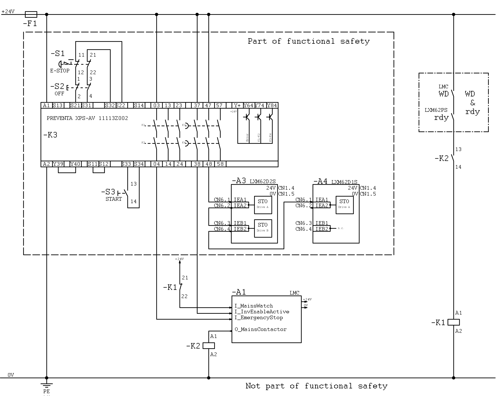
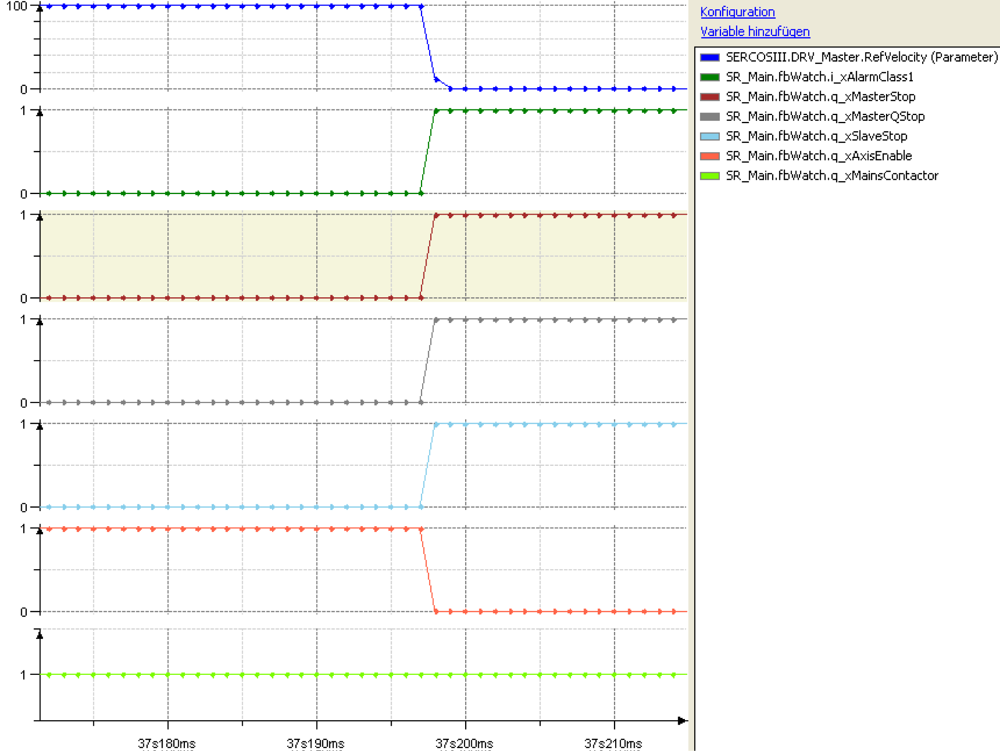
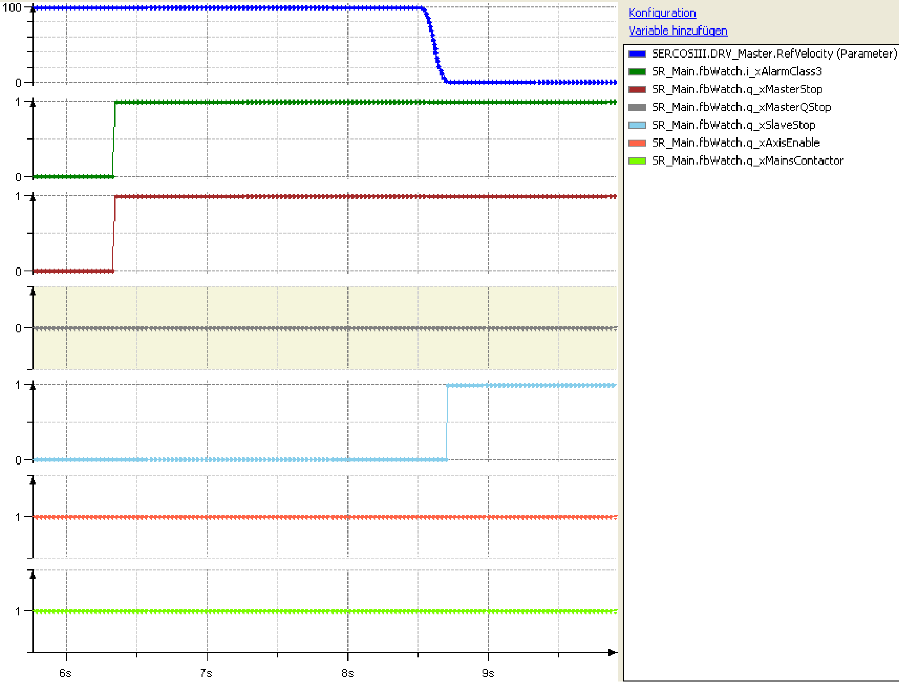

# Use of FB_Watch

Use of FB\_Watch

Machine Wiring

This safety circuit is in compliance with the circuit stipulated by the responsible German professional association [Berufsgenossenschaft]. The PacDrive Controller uses this to monitor the mains voltage. If the emergency stop switch is actuated, the controller stops the axes, without cutting the mains voltage, and switches an auxiliary relay (-K2). Via its contacts a switch-on condition is generated for the mains contactor (K1).

The PacDrive Controller receives the signal of a N/C contact at three digital inputs each. These signals are:

- the state of the mains contactor (here I\_MainsWatch),

- the state of the emergency stop switch (here I\_EmergencyStop) and

- the state of the emergency stop switch with time delay (here I\_InvEnableActive), which stops the drives.

An auxiliary relay -K2 switching the mains contactor (-K1) in connection with the watchdog signals of the controller and the ready signals of the drives is switched via a digital output of the PacDrive Controller (here O\_MainsContactor).

Programming

The I\_MainsWatch feedback signal of the mains contactor is linked to the i\_xMainsWatch input of the [FB\_Watch](Function_Blocks_R_to_Z-36.htm#XREF_D_SE_0087381_1) function block.

The digital O\_MainsContactor output is linked to the q\_xMainsContactor output of the [FB\_Watch](Function_Blocks_R_to_Z-36.htm#XREF_D_SE_0087381_1).

The I\_InvEnable input is checked with the InverterEnable signal of the axes by means of the [FB\_InverterEnableDiag](../Function_Blocks_I_to_Q/Function_Blocks_I_to_Q-2.htm#XREF_D_SE_0087299_1) function block. The result is transferred to the i\_xMainsOff input of the [FB\_Watch](Function_Blocks_R_to_Z-36.htm#XREF_D_SE_0087381_1).

The q\_xMasterStop, the q\_xMasterQStop and the q\_xSlaveStop outputs of the [FB\_Watch](Function_Blocks_R_to_Z-36.htm#XREF_D_SE_0087381_1) are linked to controller signals of the master and slave axes of the machine.

The machine can then be stopped via the i\_xAlarmClass1 up to the i\_xAlarmClass3 input of the [FB\_Watch](Function_Blocks_R_to_Z-36.htm#XREF_D_SE_0087381_1).

NOTE: The displayed program example only serves as a demonstration for the use of the FB\_Watch function block and is not suitable for the direct use in production machines. It does not contain a logic to acklowledge alarms nor to control the machine, as it is usual for physical machines.

Alarm Classes

The three following machine reactions can be realized via the i\_xAlarmClass1 up to the i\_xAlarmClass3 inputs.

Alarm class 1 has the highest priority, followed by class 2 and 3. This means that the execution of an alarm can be replaced by a higher priority alarm.

i\_xAlarmClass1:

oall axes are stopped in the best manner possible,

othe drives stop asynchronously to one another,

oq\_xAxisEnable is switched off,

owhen the safety wiring is used, the mains contactor is not de-energized.

i\_xAlarmClass2:

othe master axis is stopped immediately,

othe slave axes are stopped synchronously with the master axis

oq\_xAxisEnable is switched off,

owhen the safety wiring is used, the mains contactor is not de-energized.

i\_xAlarmClass3:

othe master axis is stopped at the end of the cycle,

othe slave axes are stopped synchronously with the master axis

oq\_xAxisEnable is not switched off,

owhen the safety wiring is used, the mains contactor is not de-energized.

EIO0000002658.00

© 2018 Schneider Electric. All rights reserved.