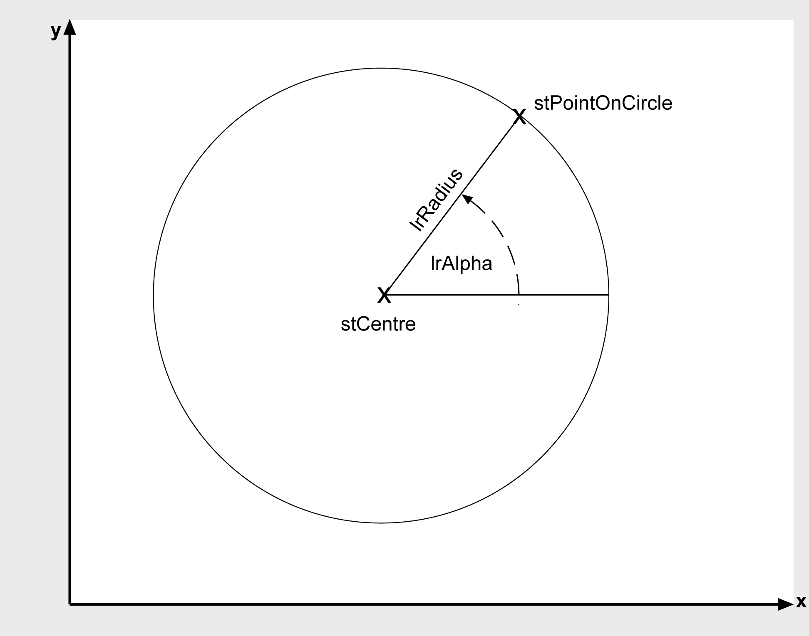

# FC_CalculatePointOnCircle2D

FC\_CalculatePointOnCircle2D

FC\_CalculatePointOnCircle2D - General Information

Overview

|  |  |
| --- | --- |
| Type: | Function |
| Available as of: | V1.0.3.0 |
| Versions: | Current version |

Task

Calculates a point on a given circle which has a specified direction angle.

Description

This function calculates the coordinates of the point on the circumference of the circle i\_stCircle, which has the direction angle i\_lrAngle. The direction angle is measured anti-clockwise in degrees. 0° corresponds to the positive X direction (see graphics below).

Interface

| Input | Data type | Description |
| --- | --- | --- |
| i\_stCircle | [ST\_Circle2D](../Structures/Structures-6.htm#XREF_D_SE_0087718_1) | Circle on whose circumference is located the point to be calculated. |
| i\_lrAngle | LREAL | Direction angle of the point (in degrees, anti-clockwise in relation to the positive X direction) |

| Output | Data type | Description |
| --- | --- | --- |
| q\_etDiag | [GD.ET\_Diag](../../../../../../api/crossBook?lang=en-US&virtualBookName=PD.Lib.GlobalDiagnostic&topicID=D_SE_0076228_1) | General library-independent statement on the diagnostic.  A value not equal to ET\_Diag.Ok corresponds to an diagnostic message. |
| q\_etDiagExt | [ET\_DiagExt](../Enumerations/Enumerations-5.htm#XREF_D_SE_0087213_1) | POU-specific output on the diagnostic.  q\_etDiag = ET\_Diag.Ok -> Status message  q\_etDiag <> ET\_Diag.Ok -> Diagnostic message |

Return Value

| Data type | Description |
| --- | --- |
| [ST\_Vector2D](../Structures/Structures-47.htm#XREF_D_SE_0087800_1) | Point on the circumference of the circle |

Diagnostic Messages

| q\_etDiag | q\_etDiagExt | Enumeration value | Description |
| --- | --- | --- | --- |
| OK | [Ok](#XREF_D_SE_0087419_8) | 0 | Ok |
| InputParameterInvalid | [RadiusRangeCircle](#XREF_D_SE_0087419_9) | 26 | The radius of the circle is outside the valid range. |

Ok

|  |  |
| --- | --- |
| Enumeration name: | Ok |
| Enumeration value: | 0 |
| Description: | Ok |

The intersections have been calculated successfully.

RadiusRangeCircle

|  |  |
| --- | --- |
| Enumeration name: | RadiusRangeCircle |
| Enumeration value: | 26 |
| Description: | The radius of the circle is outside the valid range. |

| Issue | Cause | Solution |
| --- | --- | --- |
| - | At the input i\_stCircle.lrRadius, a number <= 0 has been transferred. | The radius of the circle must be greater than zero. |

EIO0000002658.00

© 2018 Schneider Electric. All rights reserved.