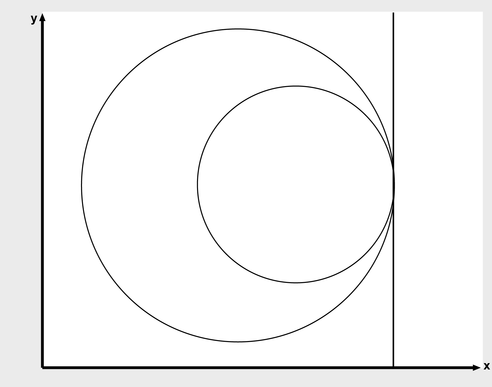
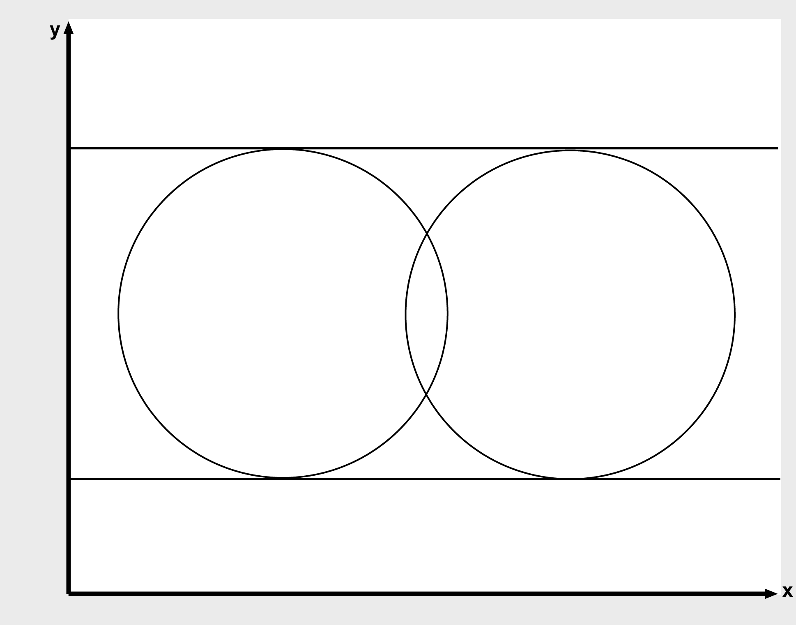
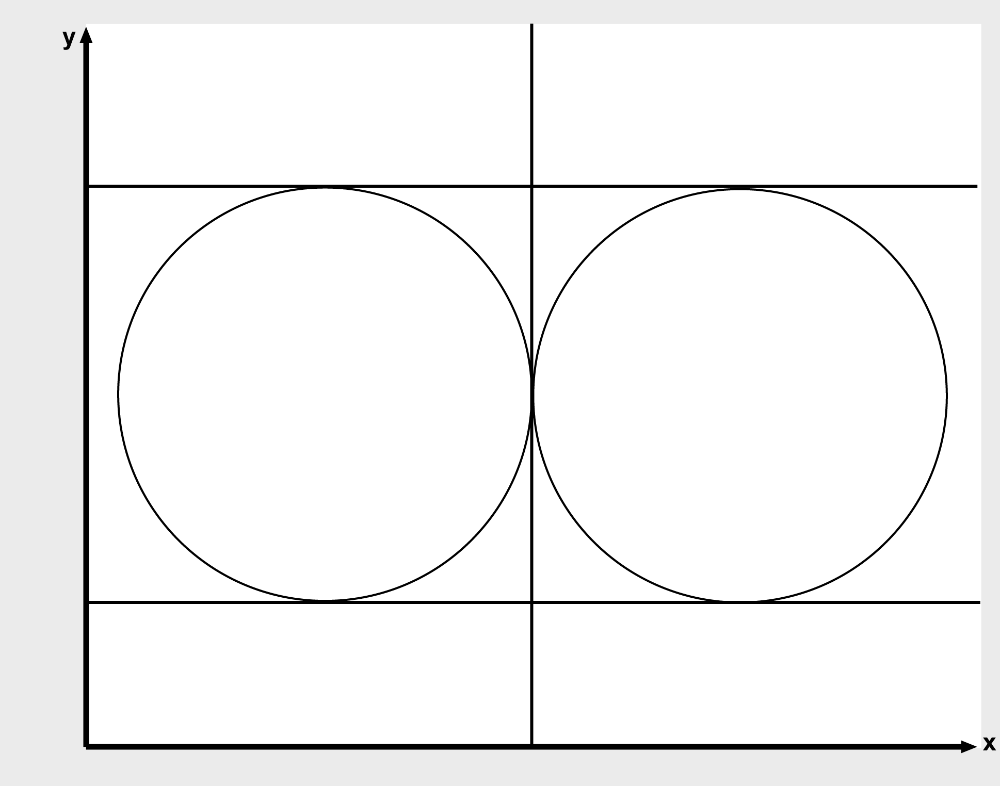

# FC_CommonTangentsOfTwoCircles2D

FC\_CommonTangentsOfTwoCircles2D

FC\_CommonTangentsOfTwoCircles2D - General Information

Overview

|  |  |
| --- | --- |
| Type: | Function |
| Available as of: | V1.0.3.0 |
| Versions: | Current version |

Task

Calculates the common tangents of two circles in the 2-dimensional space.

Description

Calculates the common tangents of the circles i\_stCircle1 and i\_stCircle2. There are several options here:

oThere exists no common tangent.

oThere exists one common tangent.

oThere exist two common tangents.

oThere are three common tangents.

oThere exist four common tangents.

oThere exists an infinite number of common tangents (the circles coincide).

The following figures illustrate the various different cases.

No common tangents

One common tangent

Two common tangents

Three common tangents

Four common tangents

Interface

| Input | Data type | Description |
| --- | --- | --- |
| i\_stCircle1 | [ST\_Circle2D](../Structures/Structures-6.htm#XREF_D_SE_0087718_1) | Circle 1 |
| i\_stCircle2 | [ST\_Circle2D](../Structures/Structures-6.htm#XREF_D_SE_0087718_1) | Circle 2 |

| Output | Data type | Description |
| --- | --- | --- |
| q\_etDiag | [GD.ET\_Diag](../../../../../../api/crossBook?lang=en-US&virtualBookName=PD.Lib.GlobalDiagnostic&topicID=D_SE_0076228_1) | General library-independent statement on the diagnostic.  A value not equal to ET\_Diag.Ok corresponds to an diagnostic message. |
| q\_etDiagExt | [ET\_DiagExt](../Enumerations/Enumerations-5.htm#XREF_D_SE_0087213_1) | POU-specific output on the diagnostic.  q\_etDiag = ET\_Diag.Ok -> Status message  q\_etDiag <> ET\_Diag.Ok -> Diagnostic message |
| q\_diNumberOfCommonTangents | DINT | Number of common tangents.  Possible values:  0: no common tangents  1...4: 1...4 common tangents  99: an infinite number of common tangents |
| q\_astTouchPointsCircle1 | ARRAY[1..4] OF [ST\_Vector2D](../Structures/Structures-47.htm#XREF_D_SE_0087800_1) | Contact points of the tangents on circle 1 |
| q\_astTouchPointsCircle2 | ARRAY[1..4] OF [ST\_Vector2D](../Structures/Structures-47.htm#XREF_D_SE_0087800_1) | Contact points of the tangents on circle 2 |

Diagnostic Messages

| q\_etDiag | q\_etDiagExt | Enumeration value | Description |
| --- | --- | --- | --- |
| OK | [Ok](#XREF_D_SE_0087451_7) | 0 | Ok |
| InputParameterInvalid | [RadiusRangeCircle1](#XREF_D_SE_0087451_8) | 27 | The radius of circle 1 is outside the valid range. |
| InputParameterInvalid | [RadiusRangeCircle2](#XREF_D_SE_0087451_9) | 28 | The radius of circle 2 is outside the valid range. |

Ok

|  |  |
| --- | --- |
| Enumeration name: | Ok |
| Enumeration value: | 0 |
| Description: | Ok |

The tangents have been calculated successfully.

RadiusRangeCircle1

|  |  |
| --- | --- |
| Enumeration name: | RadiusRangeCircle1 |
| Enumeration value: | 27 |
| Description: | The radius of circle 1 is outside the valid range. |

| Issue | Cause | Solution |
| --- | --- | --- |
| - | At the input i\_stCircle1.lrRadius, a number <= 0 has been transferred. | The radius of the circle must be greater than zero. |

RadiusRangeCircle2

|  |  |
| --- | --- |
| Enumeration name: | RadiusRangeCircle2 |
| Enumeration value: | 28 |
| Description: | The radius of circle 2 is outside the valid range. |

| Issue | Cause | Solution |
| --- | --- | --- |
| - | At the input i\_stCircle2.lrRadius, a number <= 0 has been transferred. | The radius of the circle must be greater than zero. |

EIO0000002658.00

© 2018 Schneider Electric. All rights reserved.