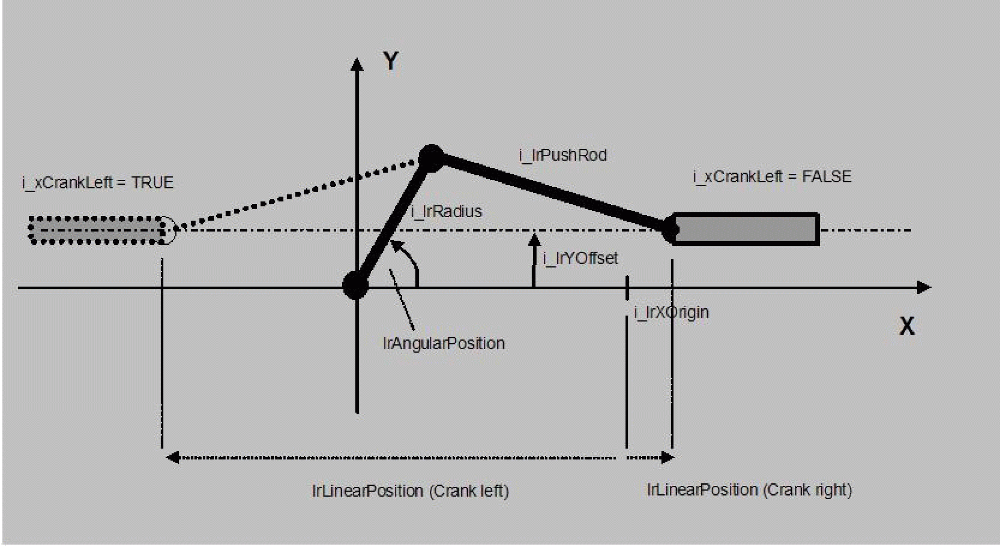

# FC_CrankReverseTransformation

FC\_CrankReverseTransformation

FC\_CrankReverseTransformation - General Information

Overview

|  |  |
| --- | --- |
| Type: | Function |
| Available as of: | V1.0.3.0 |
| Versions: | Current version |

Task

Reverse transformation of a push crank

Description

From the angle of a push crank, this function calculates its linear position (kinematic transfor­mation) and, from the torque engraved on the rotative side, the force resulting therefrom on the linear side (mechanical transformation). The meaning of the quantities involved can be taken from the following figure. The crank angle is measured in the mathematically positive sense (anti-clockwise), starting from the positive X direction.

It must be noted that the linear movement takes place within a limited range. Only linear positions within this range are mechanically reasonable. If a mechanically not reasonable linear position is specified, this function block issues the message q\_etDiag = InputParameterInvalid and q\_etDiagExt = LinearPositionRange. In addition it must be taken into account that there are two associated crank angles for most linear positions i.e. that the reverse transformation is not clear (see parameter i\_diSector). It is the task of the user to select the crank angle that is reasonable for the application.

NOTE: This function only serves for calculating the transformation of the crank. A transfer of position set values to axes does not take place. An advantage of this method is that the function can be combined with other mechanical calculation POUs without any problems.

Interface

| Input | Data type | Description |
| --- | --- | --- |
| i\_lrRadius | LREAL | Length of crank radius in accordance with the above figure. Value range: > 0.0 |
| i\_lrPushRod | LREAL | Length of the crank push rod in accordance with the above figure. Value range: > 0.0 |
| i\_lrYOffset | LREAL | Position of the linear movement plane in relation to the X axis.  Attention: This parameter is provided with a sign. If the plane is below the X axis, a negative value must be specified. |
| i\_lrXOrigin | LREAL | User-defined zero position of the linear position. If i\_lrXOrigin = 0.0, then the linear position is equal to the distance from the Y axis (= distance from the perpendicular through the crank fulcrum). However, in practice the zero point is to be positioned frequently in one of the two limit positions of the linear position, so that the linear position moves e.g. from 0.0 ... to Xmax. This can be effected by specifying a suitable value for i\_lrXOrigin (see figure above). |
| i\_xCrankLeft | BOOL | This indicates in which direction the push rod of the crank is pointing.  TRUE: Push rod shows in the negative X direction (towards the left in the figure)  FALSE: Push rod shows in the positive X direction (towards the right in the figure) |
| i\_diSector | DINT | Parameter for selecting the calculated crank angle. As already explained above, the reverse transformation generally has two solutions. If i\_diSector = 1, then the first solution is output; if i\_diSector = 2, then the second solution is output. |
| i\_lrLinearPosition | LREAL | Linear position of the crank |
| i\_lrForce | LREAL | Required force on the linear side |

| Output | Data type | Description |
| --- | --- | --- |
| q\_etDiag | [GD.ET\_Diag](../../../../../../api/crossBook?lang=en-US&virtualBookName=PD.Lib.GlobalDiagnostic&topicID=D_SE_0076228_1) | General library-independent statement on the diagnostic.  A value not equal to ET\_Diag.Ok corresponds to an diagnostic message. |
| q\_etDiagExt | [ET\_DiagExt](../Enumerations/Enumerations-5.htm#XREF_D_SE_0087213_1) | POU-specific output on the diagnostic.  q\_etDiag = ET\_Diag.Ok -> Status message  q\_etDiag <> ET\_Diag.Ok -> Diagnostic message |
| q\_lrAngularPosition | LREAL | Crank angle calculated from the specified linear position i\_lrLinearPosition (see i\_diSector) |
| q\_lrTorque | LREAL | Engraved torque required on the rotative side, in order to obtain the force i\_lrForce on the linear side. |

Diagnostic Messages

| q\_etDiag | q\_etDiagExt | Enumeration value | Description |
| --- | --- | --- | --- |
| OK | [Ok](#XREF_D_SE_0087455_8) | 0 | Ok |
| InputParameterInvalid | [LinearPositionRange](#XREF_D_SE_0087455_7) | 66 | LinearPosition is outside the valid range. |
| InputParameterInvalid | [PushRodRange](#XREF_D_SE_0087455_9) | 64 | PushRod is outside the valid range. |
| InputParameterInvalid | [RadiusRange](#XREF_D_SE_0087455_10) | 21 | Radius is outside the valid range. |

LinearPositionRange

|  |  |
| --- | --- |
| Enumeration name: | LinearPositionRange |
| Enumeration value: | 66 |
| Description: | LinearPosition is outside the valid range. |

| Issue | Cause | Solution |
| --- | --- | --- |
| - | The position applied at the input i\_lrLinearPosition cannot be reached. | Verify the value at i\_lrLinearPosition  Verify the specifications of the parameters i\_lrXOrigin, i\_lrYOffset and i\_lrRadius. |

Ok

|  |  |
| --- | --- |
| Enumeration name: | Ok |
| Enumeration value: | 0 |
| Description: | Ok |

The backward transformation has been completed successfully.

PushRodRange

|  |  |
| --- | --- |
| Enumeration name: | PushRodRange |
| Enumeration value: | 64 |
| Description: | PushRod is outside the valid range. |

| Issue | Cause | Solution |
| --- | --- | --- |
| - | At the input i\_lrPushRod, a negative value has been applied. | At the input i\_lrPushRod, a value greater than 0 must be transferred. |

RadiusRange

|  |  |
| --- | --- |
| Enumeration name: | RadiusRange |
| Enumeration value: | 21 |
| Description: | Radius is outside the valid range. |

| Issue | Cause | Solution |
| --- | --- | --- |
| - | At the input i\_lrRadius, a negative value has been applied. | At the input i\_lrRadius, a value greater than 0 must be transferred. |

EIO0000002658.00

© 2018 Schneider Electric. All rights reserved.