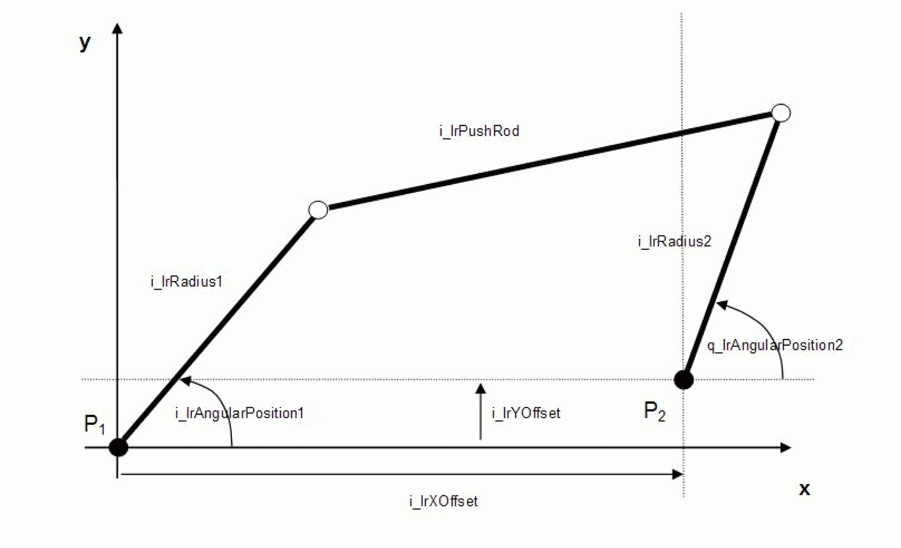

# FC_DoubleCrankTransformation

FC\_DoubleCrankTransformation

FC\_DoubleCrankTransformation - General Information

Overview

|  |  |
| --- | --- |
| Type: | Function |
| Available as of: | V1.0.3.0 |
| Versions: | Current version |

Task

Transformation of a double crank

Description

From the input-side angle of a double crank this function calculates the output-side angle (kinematic transformation) and from the input-side impressed torque, it calculates the resulting output-side torque (mechanical transformation). The meaning of the quantities involved can be taken from the following figure. The angles are measured in the mathematically positive sense (anti-clockwise), starting from the positive X direction. It must be noted here that in the case of some double cranks - due to the mechanical situation - not all input-side angles can be moved to. Moreover it must be taken into account that, as a rule, there are two associated output-side angles for one input-side angle i.e. that the reverse transformation is not clear (see parameter i\_diSector). It is the task of the user to select the angle that is reasonable for the application.

As the double crank is a symmetrical mechanism, no separate functions for forward and reverse transformation are required. The reverse transformation is obtained by the following change of the parameters: i\_lrRadius1 -> i\_lrRadius2, i\_lrRadius2 -> i\_lrRadius1, i\_lrXOffset -> - i\_lrXOffset, i\_lrYOffset -> - i\_lrYOffset.

NOTE: This function only serves for calculating the transformation of the crank. A transfer of position set values to axes does not take place. An advantage of this method is that the function can be combined with other mechanical calculation POUs without any problems.

Interface

| Input | Data type | Description |
| --- | --- | --- |
| i\_lrRadius1 | LREAL | Length of the input-side radius, value range: > 0.0 |
| i\_lrPushRod | LREAL | Length of the connecting push rod, value range: > 0.0 |
| i\_lrRadius2 | LREAL | Length of the output-side radius, value range: > 0.0 |
| i\_lrXOffset | LREAL | X-offset between input-side and output-side revolute joint. This value is provided with a sign. |
| i\_lrYOffset | LREAL | Y-offset between input-side and output-side revolute joint. This value is provided with a sign. |
| i\_diSector | DINT | As already explained above, the double crank transformation is not unique as a rule, that is, there exist two output-side angles which are associated with the input-side angle i\_lrAngularPosition1. If i\_diSector = 1, then the first of the two solutions is output to q\_lrAngularPosition2; if i\_diSector = 2, then the second solution is output. |
| i\_lrAngularPosition1 | LREAL | Angle specified on the input side |
| i\_lrTorque1 | LREAL | Torque specified on the input side |

| Output | Data type | Description |
| --- | --- | --- |
| q\_etDiag | [GD.ET\_Diag](../../../../../../api/crossBook?lang=en-US&virtualBookName=PD.Lib.GlobalDiagnostic&topicID=D_SE_0076228_1) | General library-independent statement on the diagnostic.  A value not equal to ET\_Diag.Ok corresponds to an diagnostic message. |
| q\_etDiagExt | [ET\_DiagExt](../Enumerations/Enumerations-5.htm#XREF_D_SE_0087213_1) | POU-specific output on the diagnostic.  q\_etDiag = ET\_Diag.Ok -> Status message  q\_etDiag <> ET\_Diag.Ok -> Diagnostic message |
| q\_lrAngularPosition2 | LREAL | Output-side angle calculated from i\_lrAngularPosition1. If several solutions exist, the parameter i\_diSector determines which will be output. |
| q\_lrTorque2 | LREAL | Output-side torque calculated from i\_lrTorque1. |

Diagnostic Messages

| q\_etDiag | q\_etDiagExt | Enumeration value | Description |
| --- | --- | --- | --- |
| OK | [Ok](#XREF_D_SE_0087485_8) | 0 | Ok |
| InputParameterInvalid | [AngularPosition1Range](#XREF_D_SE_0087485_7) | 68 | AngularPosition1 is outside the valid range |
| InputParameterInvalid | [PushRodRange](#XREF_D_SE_0087485_9) | 64 | PushRod is outside the valid range. |
| InputParameterInvalid | [Radius1Range](#XREF_D_SE_0087485_10) | 29 | Radius1 is outside the valid range. |
| InputParameterInvalid | [Radius2Range](#XREF_D_SE_0087485_11) | 30 | Radius2 is outside the valid range. |
| InputParameterInvalid | [XOffsetRange](#XREF_D_SE_0087485_12) | 67 | XOffset is outside the valid range. |
| InputParameterInvalid | [YOffsetRange](#XREF_D_SE_0087485_13) | 174 | YOffset is outside the valid range. |

AngularPosition1Range

|  |  |
| --- | --- |
| Enumeration name: | AngularPosition1Range |
| Enumeration value: | 68 |
| Description: | AngularPosition1 is outside the valid range |

| Issue | Cause | Solution |
| --- | --- | --- |
| - | The outputs q\_lrLinearPosition2 and q\_lrTorque2 cannot be calculated for the value defined for i\_lrAngularPosition1. | Verify i\_lrAngularPosition1  Verify all parameters that are part of the calculation: i\_lrRadius1, i\_lrPushRod, i\_lrRadius2, i\_lrXOffset, i\_lrYOffset, i\_diSector |

Ok

|  |  |
| --- | --- |
| Enumeration name: | Ok |
| Enumeration value: | 0 |
| Description: | Ok |

The transformation has been completed successfully.

PushRodRange

|  |  |
| --- | --- |
| Enumeration name: | PushRodRange |
| Enumeration value: | 64 |
| Description: | PushRod is outside the valid range. |

| Issue | Cause | Solution |
| --- | --- | --- |
| - | At the input i\_lrPushRod, a negative value has been applied. | At the input i\_lrPushRod, a value greater than 0 must be transferred. |

Radius1Range

|  |  |
| --- | --- |
| Enumeration name: | Radius1Range |
| Enumeration value: | 29 |
| Description: | Radius1 is outside the valid range. |

| Issue | Cause | Solution |
| --- | --- | --- |
| - | At the input i\_lrRadius1, a negative value has been applied. | At the input i\_lrRadius1, a value greater than 0 must be transferred. |

Radius2Range

|  |  |
| --- | --- |
| Enumeration name: | Radius2Range |
| Enumeration value: | 30 |
| Description: | Radius2 is outside the valid range. |

| Issue | Cause | Solution |
| --- | --- | --- |
| - | At the input i\_lrRadius2, a negative value has been applied. | At the input i\_lrRadius2, a value greater than 0 must be transferred. |

XOffsetRange

|  |  |
| --- | --- |
| Enumeration name: | XOffsetRange |
| Enumeration value: | 67 |
| Description: | XOffset is outside the valid range. |

| Issue | Cause | Solution |
| --- | --- | --- |
| - | At the input i\_lrXOffset, a number whose value is smaller than [Gc\_lrZeroTolerance](../Global_Elements/Global_Elements-2.htm#XREF_D_SE_0087806_1) has been applied. | i\_lrXOffset must not be 0. |

YOffsetRange

|  |  |
| --- | --- |
| Enumeration name: | YOffsetRange |
| Enumeration value: | 174 |
| Description: | YOffset is outside the valid range. |

| Issue | Cause | Solution |
| --- | --- | --- |
| - | At the input i\_lrYOffset, a number whose value is smaller than [Gc\_lrZeroTolerance](../Global_Elements/Global_Elements-2.htm#XREF_D_SE_0087806_1) has been applied. | i\_lrYOffset must not be 0. |

EIO0000002658.00

© 2018 Schneider Electric. All rights reserved.