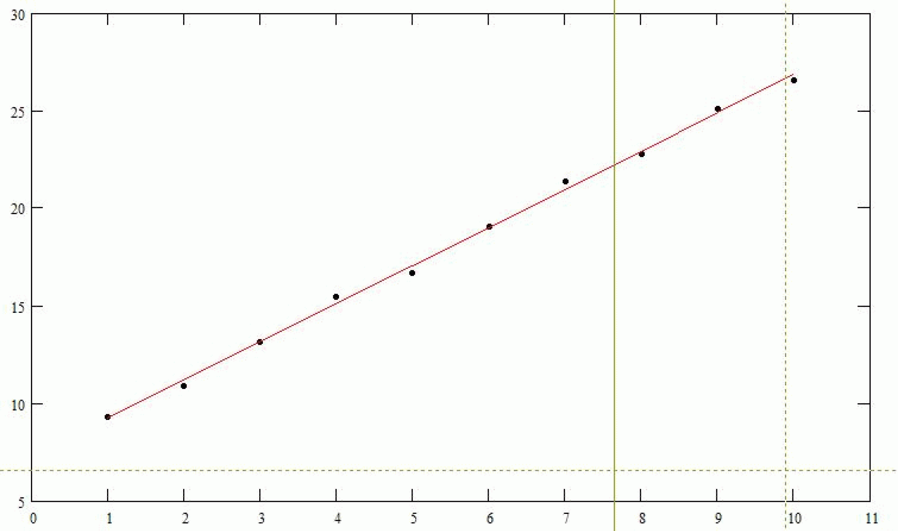

# FC_MultipleRegression

FC\_MultipleRegression

FC\_MultipleRegression - General Information

Overview

|  |  |
| --- | --- |
| Type: | Function |
| Available as of: | V1.0.3.0 |
| Versions: | Current version |

Task

For the given value pairs or value tuples, this function calculates the regression coefficients.

Description

It is the general task of the regression analysis to calculate from a set of measured values which a linear interrelationship is detected or suspected, those linear functions which best approximate these measured values. The best approximation is understood to be that linear function whose error square sum relative to the measured values is minimal. The proportionality factors which occur in these linear functions are designated as regression coefficients. If the measured values are value pairs

(xi , yi ) ; i = 1, ... , M

then the approximating linear function is designated a regression line. If it is (n+1)-Tuple (n > 1)

(x1i , x2i , ... , xni , yi ) ; i = 1, ... , M

then it is designated as a regression plane. Here, M designates the number of measurements.

The different identifier x and y can be traced back to the fact that in practice there are as a rule one dependent quantity (y) and one or several independent quantities (x).

It is thus the task of the linear regression to determine a linear function

y = L (x1 , x2 , ... , xn)

so that the error square sum

becomes minimal. Here, the function L has the form

L (x1 , x2 , ... , xn) = k0 + k1 \* x1 + ... + kn \* xn

The constants k0 , ... , kn are the above-mentioned regression coefficients which are to be calculated.

The following figure shows an example of a regression line:

As a measure for the scattering of the measured values around the determined regression function, the root mean square error (RMS) may be used. This is defined as

Interface

| Input | Data type | Description |
| --- | --- | --- |
| i\_diDimX | DINT | Number of the independent quantities xi (designated with n above).  Value range: >= 1 |
| i\_diDimY | DINT | Number of measurements / value tuples (designated with M above).  Value range: >= i\_diDimX + 1 |
| i\_plrXMatrix | POINTER TO LREAL | Pointer to the start of the storage area where the measured values for the independent variables are stored. This storage space must provide room for at least i\_diDimX \* i\_diDimY LREALs. |
| i\_plrYVector | POINTER TO LREAL | Pointer to the start of the storage area where the measured values for the dependent variables are stored. This storage space must provide room for at least i\_diDimY LREALs. |
| i\_plrCoefficients | POINTER TO LREAL | Pointer to the storage area where the POU is to store the calculated regression coefficients. This storage space must provide room for at least i\_diDimX + 1 LREALs. |

| Output | Data type | Description |
| --- | --- | --- |
| q\_etDiag | [GD.ET\_Diag](../../../../../../api/crossBook?lang=en-US&virtualBookName=PD.Lib.GlobalDiagnostic&topicID=D_SE_0076228_1) | General library-independent statement on the diagnostic.  A value not equal to ET\_Diag.Ok corresponds to an diagnostic message. |
| q\_etDiagExt | [ET\_DiagExt](../Enumerations/Enumerations-5.htm#XREF_D_SE_0087213_1) | POU-specific output on the diagnostic.  q\_etDiag = ET\_Diag.Ok -> Status message  q\_etDiag <> ET\_Diag.Ok -> Diagnostic message |
| q\_lrRMSError | LREAL | Root Mean Square Error (see above). Is a measure for how well the given measured values can be approximated linearly. The greater this value, the greater the scattering of the measured values around the regression line / plane. |

Examples

Example 1: Determining the moment of inertia of an indeterminable load from torque and angle acceleration

A motor drives a constant load whose moment of inertia is indeterminable and which is to be calculated. The following measured values were recorded:

|  |  |  |  |  |  |  |  |  |  |  |
| --- | --- | --- | --- | --- | --- | --- | --- | --- | --- | --- |
| Torque M [Nm] | 3.3 | 4.4 | 6.2 | 8.0 | 8.7 | 10.6 | 12.4 | 13.3 | 15.1 | 16.1 |
| Acceleration Acc [rad / s2] | 30.0 | 60.0 | 90.0 | 120.0 | 150.0 | 180.0 | 210.0 | 240.0 | 270.0 | 300.0 |

Code example:

VAR  
diDimX: DINT;   
diDimY: DINT;   
diJ: DINT;   
plrXMatrix: POINTER TO LREAL;   
plrYVector: POINTER TO LREAL;   
plrCoefficients: POINTER TO LREAL;   
etDiag: PD\_GlobalDiagnostic.ET\_Diag;   
etDiagExt: ET\_DiagExt;   
lrRMSError: LREAL;   
alrXMatrix: ARRAY[1..10] OF LREAL;   
alrYVector: ARRAY[1..10] OF LREAL;   
alrRegressionCoefficients: ARRAY[0..1] OF LREAL;   
alrTorqueValues: ARRAY[1..10] OF LREAL := [3.3, 4.4, 6.2, 8.0, 8.7, 10.6, 12.4, 13.3, 15.1, 16.1];   
alrAccValues: ARRAY[1..10] OF LREAL := [30.0, 60.0, 90.0, 120.0, 150.0, 180.0, 210.0, 240.0, 270.0, 300.0];  
END\_VAR  
  
(\* set dimensions \*)  
diDimX: = 1; (\* 1 independent variable (Acc) \*)  
diDimY: = 10; (\* 10 measurements \*)  
  
(\* set pointers \*)  
plrXMatrix: = ADR(alrXMatrix[1]);   
plrYVector: = ADR(alrYVector[1]);   
plrCoefficients: = ADR(alrRegressionCoefficients[0]);   
  
(\* set input arrays \*)   
FOR diJ: = 1 TO diDimY DO   
FC\_SetMatrixElement (i\_plrMatrixStart: = plrXMatrix, i\_diNumCols: = diDimX, i\_diRow: = diJ - 1, i\_diCol: = 0, i\_lrValue: = alrAccValues[diJ]); FC\_SetVectorElement (i\_plrVectorStart: = plrYVector, i\_diRow: = diJ - 1, i\_lrValue: = alrTorqueValues[diJ]);   
END\_FOR   
  
(\* calculate regression coefficients \*)  
FC\_MultipleRegression(i\_diDimX: = diDimX,   
i\_diDimY: = diDimY,   
i\_plrXMatrix: = plrXMatrix,   
i\_plrYVector: = plrYVector,   
i\_plrCoefficients: = plrCoefficients,   
q\_etDiag => etDiag,   
q\_etDiagExt => etDiagExt,   
q\_lrRMSError => lrRMSError);

This calculation returns as regression coefficients:

alrRegressionCoefficients[0] = 1.787

alrRegressionCoefficients[1] = 4.863e-2

The best linear approximation of the above measured values thus is:

M = 1.787 Nm + 4.863e-2 kgm2 \* Acc

Therefore, the moment of inertia wanted is J = 4.863e-2 kgm2. In addition, there is a breakaway torque of M0 = 1.787 Nm.

Example 2: Determining the belttracking plane of a robot by teaching.

Different points on the belttracking plane are moved to and the coordinates read out. From this, the equation of the belttracking plane is to be determined.

The following points were recorded:

|  |  |  |  |  |  |
| --- | --- | --- | --- | --- | --- |
| X coordinate | 0.1 | 100.1 | -0.1 | 100.0 | 50.1 |
| Y coordinate | 0.1 | -0.1 | 99.9 | 100.1 | 49.9 |
| Z coordinate | 19.9 | 521.1 | -679.8 | -180.5 | -79.0 |

The plane equation has to be set to the

Z = k0 + kx \* X + ky \* Y

form. In this case, therefore, X and Y are the independent variables, Z is the dependent variable.

Code example:

VAR  
diDimX: DINT;  
diDimY: DINT;  
diJ: DINT;  
plrXMatrix: POINTER TO LREAL;  
plrYVector: POINTER TO LREAL;  
plrCoefficients: POINTER TO LREAL;  
etDiag: PD\_GlobalDiagnostic.ET\_Diag;   
etDiagExt: ET\_DiagExt;   
lrRMSError: LREAL;  
alrXMatrix: ARRAY[1..10] OF LREAL;  
alrYVector: ARRAY[1..10] OF LREAL;  
alrRegressionCoefficients: ARRAY[0..2] OF LREAL;  
alrXValues: ARRAY[1..5] OF LREAL: = [0.1, 100.1, -0.1, 100.0, 50.1];  
alrYValues: ARRAY[1..5] OF LREAL: = [0.1, -0.1, 99.9, 100.1, 49.9];  
alrZValues: ARRAY[1..5] OF LREAL: = [19.9, 521.1, -679.8, -180.5, -79.0];  
END\_VAR  
  
(\* set dimensions \*)  
diDimX: = 2; (\* 2 independent variables (X and Y) \*)  
diDimY: = 5; (\* 5 points \*)  
  
(\* set pointers \*)  
plrXMatrix: = ADR(alrXMatrix[1]);  
plrYVector: = ADR(alrYVector[1]);  
plrCoefficients: = ADR(alrRegressionCoefficients[0]);  
  
(\* set input arrays \*)  
FOR diJ: = 1 TO diDimY DO  
FC\_SetMatrixElement (i\_plrMatrixStart: = plrXMatrix, i\_diNumCols: = diDimX, i\_diRow: = diJ - 1, i\_diCol: = 0, i\_lrValue: = alrXValues[diJ]);  
FC\_SetMatrixElement (i\_plrMatrixStart: = plrXMatrix, i\_diNumCols: = diDimX, i\_diRow: = diJ - 1, i\_diCol: = 1, i\_lrValue: = alrYValues[diJ]);  
FC\_SetVectorElement (i\_plrVectorStart: = plrYVector, i\_diRow: = diJ - 1, i\_lrValue: = alrZValues[diJ]);  
END\_FOR  
  
(\* calculate regression coefficients \*)  
FC\_MultipleRegression(i\_diDimX := diDimX,   
i\_diDimY: = diDimY,   
i\_plrXMatrix: = plrXMatrix,   
i\_plrYVector: = plrYVector,   
i\_plrCoefficients: = plrCoefficients,   
q\_etDiag => etDiag,   
q\_etDiagExt => etDiagExt,   
q\_lrRMSError => lrRMSError);

This calculation returns as regression coefficients:

alrRegressionCoefficients[0] = 19.949

alrRegressionCoefficients[1] = 4.999

alrRegressionCoefficients[2] = -6.998

The plane equation therefore is

Z = 19.949 + 4.999 \* X - 6.998 \* Y

Diagnostic Messages

| q\_etDiag | q\_etDiagExt | Enumeration value | Description |
| --- | --- | --- | --- |
| OK | [Ok](#XREF_D_SE_0087559_10) | 0 | Ok |
| ControllerConditionInvalid | [DynIecDataSizeTooSmall](#XREF_D_SE_0087559_9) | 75 | There is not enough dynamic memory reserved. |
| ExecutionAborted | [RegressionProblemNotUnique](#XREF_D_SE_0087559_14) | 76 | The regression problem has no unique solution. |
| InputParameterInvalid | [DimXRange](#XREF_D_SE_0087559_7) | 78 | DimX is outside the valid range. |
| InputParameterInvalid | [DimYRange](#XREF_D_SE_0087559_8) | 79 | DimY is outside the valid range. |
| InputParameterInvalid | [PointerCoefficientsInvalid](#XREF_D_SE_0087559_11) | 82 | The pointer Coefficients is invalid. |
| InputParameterInvalid | [PointerXMatrixInvalid](#XREF_D_SE_0087559_12) | 80 | The XMatrix pointer is invalid. |
| InputParameterInvalid | [PointerYVectorInvalid](#XREF_D_SE_0087559_13) | 81 | The YVector pointer is invalid. |
| UnexpectedProgramBehavior | [UnexpectedFeedback](#XREF_D_SE_0087559_15) | 1 | An unintended detected error occurred during execution. |

DimXRange

|  |  |
| --- | --- |
| Enumeration name: | DimXRange |
| Enumeration value: | 78 |
| Description: | DimX is outside the valid range. |

| Issue | Cause | Solution |
| --- | --- | --- |
| - | At the input i\_diDimX, an invalid value has been transferred. | The following must hold: i\_diDimX > 0 |

DimYRange

|  |  |
| --- | --- |
| Enumeration name: | DimYRange |
| Enumeration value: | 79 |
| Description: | DimY is outside the valid range. |

| Issue | Cause | Solution |
| --- | --- | --- |
| - | At the input i\_diDimY, an invalid value has been transferred. | The following must hold: i\_diDimY>i\_diDimX |

DynIecDataSizeTooSmall

|  |  |
| --- | --- |
| Enumeration name: | DynIecDataSizeTooSmall |
| Enumeration value: | 75 |
| Description: | There is not enough dynamic memory reserved. |

| Issue | Cause | Solution |
| --- | --- | --- |
| - | There is no or not enough dynamic memory available. | Increase the available dynamic memory Controller > Configuration > Program > DynIECDataSize. |

Ok

|  |  |
| --- | --- |
| Enumeration name: | Ok |
| Enumeration value: | 0 |
| Description: | Ok |

The regression coefficients have been calculated successfully.

PointerCoefficientsInvalid

|  |  |
| --- | --- |
| Enumeration name: | PointerCoefficientsInvalid |
| Enumeration value: | 82 |
| Description: | The pointer Coefficients is invalid. |

| Issue | Cause | Solution |
| --- | --- | --- |
| - | At the input i\_plrCoefficients, a null pointer has been transferred. | At the input i\_plrCoefficients, the address of the memory containing the matrix must be transferred. |

PointerXMatrixInvalid

|  |  |
| --- | --- |
| Enumeration name: | PointerXMatrixInvalid |
| Enumeration value: | 80 |
| Description: | The XMatrix pointer is invalid. |

| Issue | Cause | Solution |
| --- | --- | --- |
| - | At the input i\_plrXMatrix, a null pointer has been transferred. | At the input i\_plrXMatrix, the address of the memory containing the matrix of the measured values must be transferred. |

PointerYVectorInvalid

|  |  |
| --- | --- |
| Enumeration name: | PointerYVectorInvalid |
| Enumeration value: | 81 |
| Description: | The YVector pointer is invalid. |

| Issue | Cause | Solution |
| --- | --- | --- |
| - | At the input i\_plrYVector, a null pointer has been transferred. | At the input i\_plrYVector, the address of the memory containing the Y vector must be transferred. |

RegressionProblemNotUnique

|  |  |
| --- | --- |
| Enumeration name: | RegressionProblemNotUnique |
| Enumeration value: | 76 |
| Description: | The regression problem has no unique solution. |

| Issue | Cause | Solution |
| --- | --- | --- |
| - | Not enough measuring points have been specified | The number of measuring points must exceed the regression by one at least (e.g. straight line -> 2 measuring points, plane -> 3 measuring points) |
| - | The measuring points contradict each other | The measuring points must be independent of each other. In this way, it is for example not possible to determine a straight line from two measurement values that share the same X coordinate. |

UnexpectedFeedback

|  |  |
| --- | --- |
| Enumeration name: | UnexpectedFeedback |
| Enumeration value: | 1 |
| Description: | An unintended detected error occurred during execution. |

| Issue | Cause | Solution |
| --- | --- | --- |
| - | An error occurred in the internal execution. | Please inform the support team about this error. |

EIO0000002658.00

© 2018 Schneider Electric. All rights reserved.