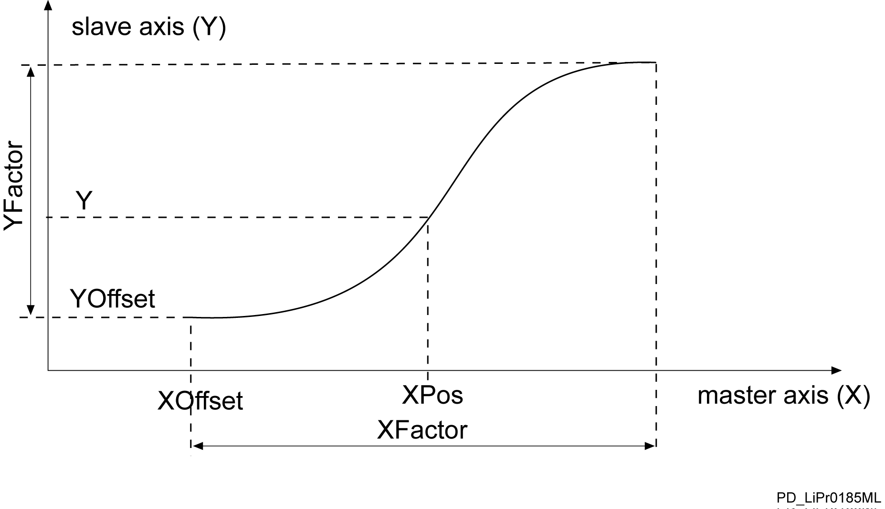

# FC_ProfilePoint

FC\_ProfilePoint

FC\_ProfilePoint - General Information

Overview

|  |  |
| --- | --- |
| Type: | Function |
| Available as of: | V1.0.3.0 |
| Versions: | Current version |

Task

Determine the slave position, slope, and bend of a curve to any desired slave position.

Description

The function FC\_ProfilPoint serves to determine the position, gradient and curvature of a cam at any point. The determination is carried out via three points i\_lrXPos - (i\_lrXFactor / 10000.0), i\_lrXPos and i\_lrXPos + (i\_lrXFactor / 10000.0); gradient and curvature are calculated as the difference of the three points.

i\_lrXPos must be at least (i\_lrXFactor / 10000.0) away from the edge of the cam.

Interface

| Input | Data type | Description |
| --- | --- | --- |
| i\_diProfileId | DINT | Id of the underlying profile |
| i\_lrXPos | LREAL | Master encoder position for which the slave axis position is to be determined |
| i\_lrXFactor | LREAL | Scaling factor of the master encoder |
| i\_lrYFactor | LREAL | Scaling factor of the slave axis |
| i\_lrXOffset | LREAL | Offset of the master encoder position |
| i\_lrYOffset | LREAL | Offset of the slave axis position |

| Output | Data type | Description |
| --- | --- | --- |
| q\_etDiag | [GD.ET\_Diag](../../../../../../api/crossBook?lang=en-US&virtualBookName=PD.Lib.GlobalDiagnostic&topicID=D_SE_0076228_1) | General library-independent statement on the diagnostic.  A value not equal to ET\_Diag.Ok corresponds to an diagnostic message. |
| q\_etDiagExt | [ET\_DiagExt](../Enumerations/Enumerations-5.htm#XREF_D_SE_0087213_1) | POU-specific output on the diagnostic.  q\_etDiag = ET\_Diag.Ok -> Status message  q\_etDiag <> ET\_Diag.Ok -> Diagnostic message |
| q\_lrYPos | LREAL | Position of the slave axis for the master encoder position i\_lrXPos |
| q\_lrM | LREAL | Gradient of the slave axis cam at the master encoder position i\_lrXPos  In order to determine the velocity of the slave axis, multiply this value with the velocity of the master axis. |
| q\_lrK | LREAL | Curvature of the slave axis cam at the master encoder position i\_lrXPos  In order to determine the acceleration of the slave axis, multiply this value with the square of the velocity of the master axis. |

Diagnostic Messages

| q\_etDiag | q\_etDiagExt | Enumeration value | Description |
| --- | --- | --- | --- |
| OK | [Ok](#XREF_D_SE_0087611_7) | 0 | Ok |
| InputParameterInvalid | [ProfileIdInvalid](#XREF_D_SE_0087611_9) | 114 | The ProfileId is invalid. |
| InputParameterInvalid | [XFactorRange](#XREF_D_SE_0087611_11) | 115 | XFactor is outside the valid range. |
| UnexpectedProgramBehavior | [ProfileAlreadyInUse](#XREF_D_SE_0087611_8) | 116 | The profile is already in use. |
| UnexpectedProgramBehavior | [UnexpectedFeedback](#XREF_D_SE_0087611_10) | 1 | An unintended detected error occurred during execution. |

Ok

|  |  |
| --- | --- |
| Enumeration name: | Ok |
| Enumeration value: | 0 |
| Description: | Ok |

The motion data for the slave point have been calculated successfully.

ProfileAlreadyInUse

|  |  |
| --- | --- |
| Enumeration name: | ProfileAlreadyInUse |
| Enumeration value: | 116 |
| Description: | The profile is already in use. |

| Issue | Cause | Solution |
| --- | --- | --- |
| - | The motion profile is already in use. | Verify the motion data. |

ProfileIdInvalid

|  |  |
| --- | --- |
| Enumeration name: | ProfileIdInvalid |
| Enumeration value: | 114 |
| Description: | The ProfileId is invalid. |

| Issue | Cause | Solution |
| --- | --- | --- |
| - | The profile does not exist. | Verify the value at the input i\_diProfileId. |

UnexpectedFeedback

|  |  |
| --- | --- |
| Enumeration name: | UnexpectedFeedback |
| Enumeration value: | 1 |
| Description: | An unintended detected error occurred during execution. |

| Issue | Cause | Solution |
| --- | --- | --- |
| - | An error occurred in the internal execution. | Please inform the support team about this error. |

XFactorRange

|  |  |
| --- | --- |
| Enumeration name: | XFactorRange |
| Enumeration value: | 115 |
| Description: | XFactor is outside the valid range. |

| Issue | Cause | Solution |
| --- | --- | --- |
| - | At the input i\_lrXFactor, a value 0 has been applied. | i\_lrXFactor must not be 0. |

EIO0000002658.00

© 2018 Schneider Electric. All rights reserved.