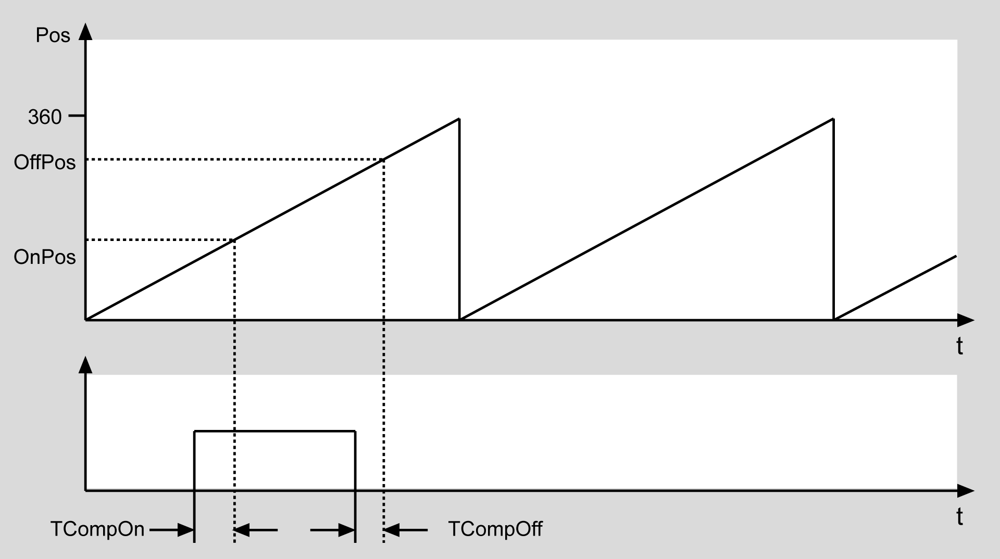
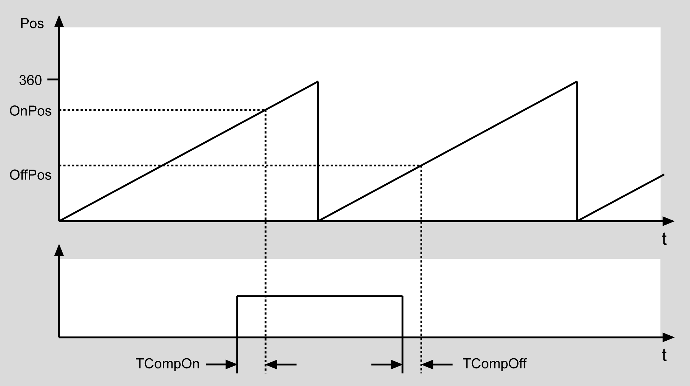

# FC_SwitchCam

FC\_SwitchCam

FC\_SwitchCam - General Information

Overview

|  |  |
| --- | --- |
| Type: | Function |
| Available as of: | V1.0.3.0 |
| Versions: | Current version |

Task

Set the cam position

Description

Issues the function value TRUE as long as the position i\_lrEncoderPos is between the activation point i\_lrOnPos and the deactivation point i\_lrOffPos. A dead time can be entered. That is, the function value is set to TRUE by i\_uiTCompOn earlier and then set to FALSE again by i\_uiTCompOff earlier.

OnPos < OffPos

OnPos > OffPos

Interface

| Input | Data type | Description |
| --- | --- | --- |
| i\_lrEncoderPos | LREAL | Position of the master encoder |
| i\_lrEncoderVel | LREAL | Velocity of the master encoder |
| i\_lrPeriod | LREAL | Master encoder period |
| i\_lrOnPos | LREAL | Activation position |
| i\_uiTCompOn | UINT | Compensation time during activation in ms |
| i\_lrOffPos | LREAL | Deactivation position |
| i\_uiTCompOff | UINT | Compensation time during deactivation in ms |

| Output | Data type | Description |
| --- | --- | --- |
| q\_etDiag | [GD.ET\_Diag](../../../../../../api/crossBook?lang=en-US&virtualBookName=PD.Lib.GlobalDiagnostic&topicID=D_SE_0076228_1) | General library-independent statement on the diagnostic.  A value not equal to ET\_Diag.Ok corresponds to an diagnostic message. |
| q\_etDiagExt | [ET\_DiagExt](../Enumerations/Enumerations-5.htm#XREF_D_SE_0087213_1) | POU-specific output on the diagnostic.  q\_etDiag = ET\_Diag.Ok -> Status message  q\_etDiag <> ET\_Diag.Ok -> Diagnostic message |

Return Value

| Data type | Description |
| --- | --- |
| BOOL | Cam signal |

Diagnostic Messages

| q\_etDiag | q\_etDiagExt | Enumeration value | Description |
| --- | --- | --- | --- |
| OK | [Ok](#XREF_D_SE_0087669_8) | 0 | Ok |

Ok

|  |  |
| --- | --- |
| Enumeration name: | Ok |
| Enumeration value: | 0 |
| Description: | Ok |

The state of the cam position has been determined successfully.

EIO0000002658.00

© 2018 Schneider Electric. All rights reserved.