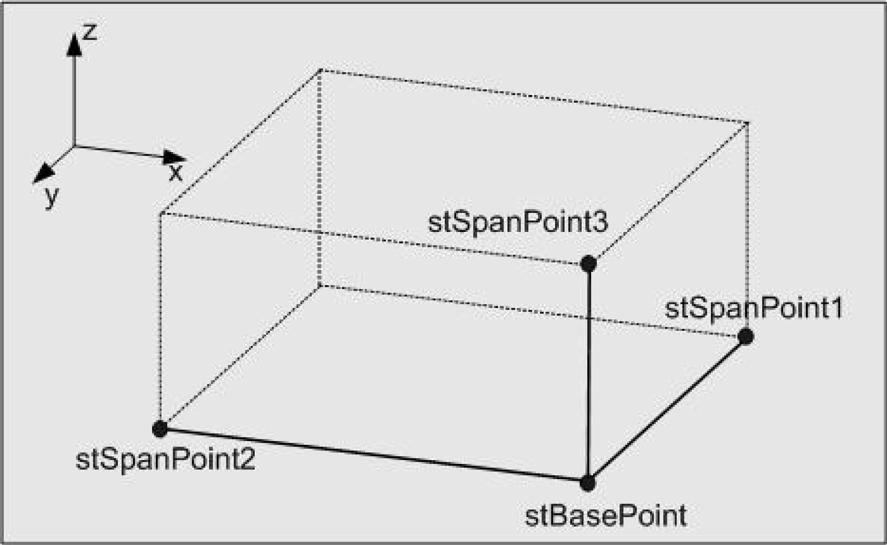

# ST_Box

ST\_Box

ST\_Box - General Information

Overview

|  |  |
| --- | --- |
| Type: | Data structure |
| Available as of: | V1.0.3.0 |
| Inherits from: | - |
| Versions: | Current version |

Description

This data structure defines a cuboid in the 3-dimensional space. To this end, the position vectors of 4 points must be specified that span the cuboid. The meaning of the points is illustrated by the following diagram:

Structure Elements

| Variable | Data type | Description |
| --- | --- | --- |
| stBasePoint | [ST\_Vector3D](Structures-48.htm#XREF_D_SE_0087802_1) | Common point of the edges spanning the cuboid. |
| stSpanPoint1 | [ST\_Vector3D](Structures-48.htm#XREF_D_SE_0087802_1) | Forms the first of the edges spanning the cuboid, together with stBasePoint. |
| stSpanPoint2 | [ST\_Vector3D](Structures-48.htm#XREF_D_SE_0087802_1) | Forms the second of the edges spanning the cuboid, together with stBasePoint. |
| stSpanPoint3 | [ST\_Vector3D](Structures-48.htm#XREF_D_SE_0087802_1) | Forms the third of the edges spanning the cuboid, together with stBasePoint. |

EIO0000002658.00

© 2018 Schneider Electric. All rights reserved.