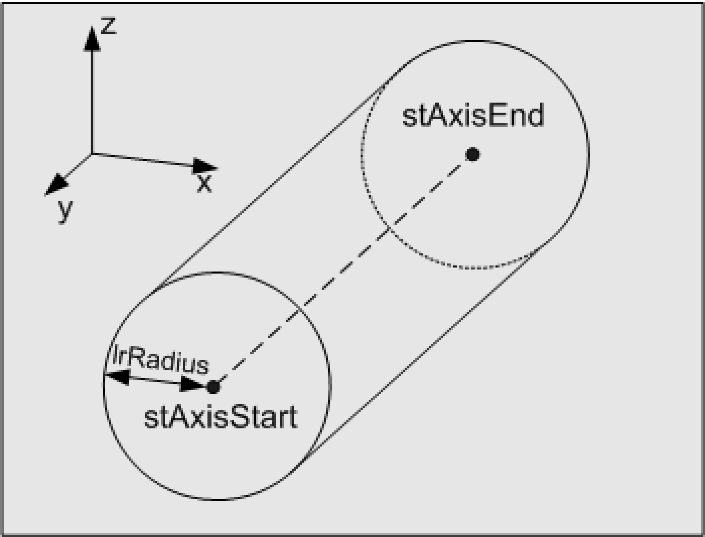

# ST_Cylinder

ST\_Cylinder

ST\_Cylinder - General Information

Overview

|  |  |
| --- | --- |
| Type: | Data structure |
| Available as of: | V1.0.3.0 |
| Inherits from: | - |
| Versions: | Current version |

Description

This data structure defines a cylinder. The cylinder axis is defined by the start point and end point.

Structure Elements

| Variable | Data type | Description |
| --- | --- | --- |
| stAxisStart | [ST\_Vector3D](Structures-48.htm#XREF_D_SE_0087802_1) | Start point of the cylinder axis |
| stAxisEnd | [ST\_Vector3D](Structures-48.htm#XREF_D_SE_0087802_1) | End point of the cylinder axis |
| lrRadius: | LREAL | Radius of the cylinder |

EIO0000002658.00

© 2018 Schneider Electric. All rights reserved.