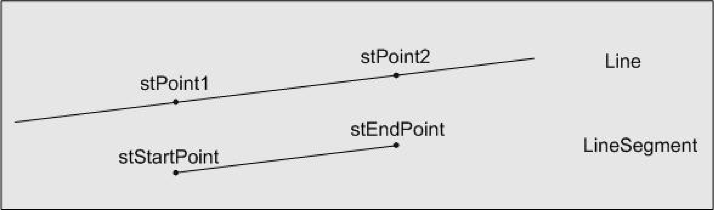

# ST_LineSegment3D

ST\_LineSegment3D

ST\_LineSegment3D - General Information

Overview

|  |  |
| --- | --- |
| Type: | Data structure |
| Available as of: | V1.0.3.0 |
| Inherits from: | - |
| Versions: | Current version |

Description

This data structure defines the line segment in 3-dimensional space which starts with the point stStartPoint and ends with the point stEndPoint.

Note: In contrast to a straight line, a line segment has a finite extension, as it does not go beyond the defining points. The points stStartPoint and stEndPoint may also be equal. In this case the line segment reduces to a point.

The following figure illustrates the difference between a straight line and a line segment:

Structure Elements

| Variable | Data type | Description |
| --- | --- | --- |
| stStartPoint | [ST\_Vector3D](Structures-48.htm#XREF_D_SE_0087802_1) | Start point of the line segment |
| stEndPoint | [ST\_Vector3D](Structures-48.htm#XREF_D_SE_0087802_1) | End point of the line segment |

EIO0000002658.00

© 2018 Schneider Electric. All rights reserved.