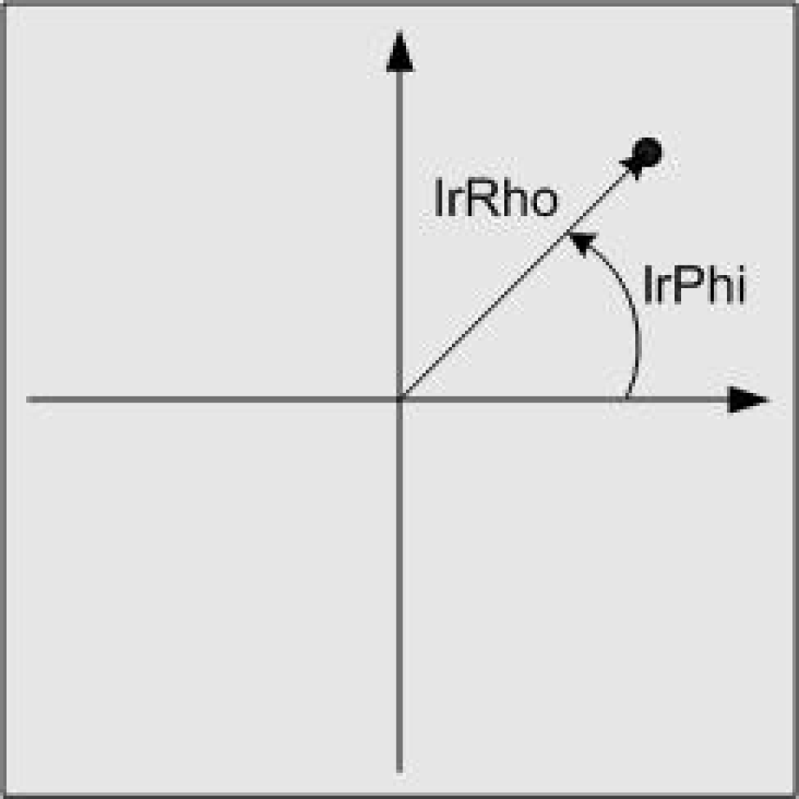

# ST_PlanarPolarCoordinates

ST\_PlanarPolarCoordinates

ST\_PlanarPolarCoordinates - General Information

Overview

|  |  |
| --- | --- |
| Type: | Data structure |
| Available as of: | V1.0.3.0 |
| Inherits from: | - |
| Versions: | Current version |

Description

Structure for describing the position of a point using polar coordinates. The position of the point is described by the distance to the origin of the coordinate system and the angle of the line through origin that passes the point to the horizontal axis of the coordinate system. The angle is indicated in the mathematically positive direction (counterclockwise).

Structure Elements

| Variable | Data type | Description |
| --- | --- | --- |
| lrRho | LREAL | Distance of the point from the origin of the coordinate system |
| lrPhi | LREAL | Angle of the line through origin that passes the point to the horizontal axis of the coordinate system.  The angle is indicated in the mathematically positive direction (counterclockwise). |

EIO0000002658.00

© 2018 Schneider Electric. All rights reserved.