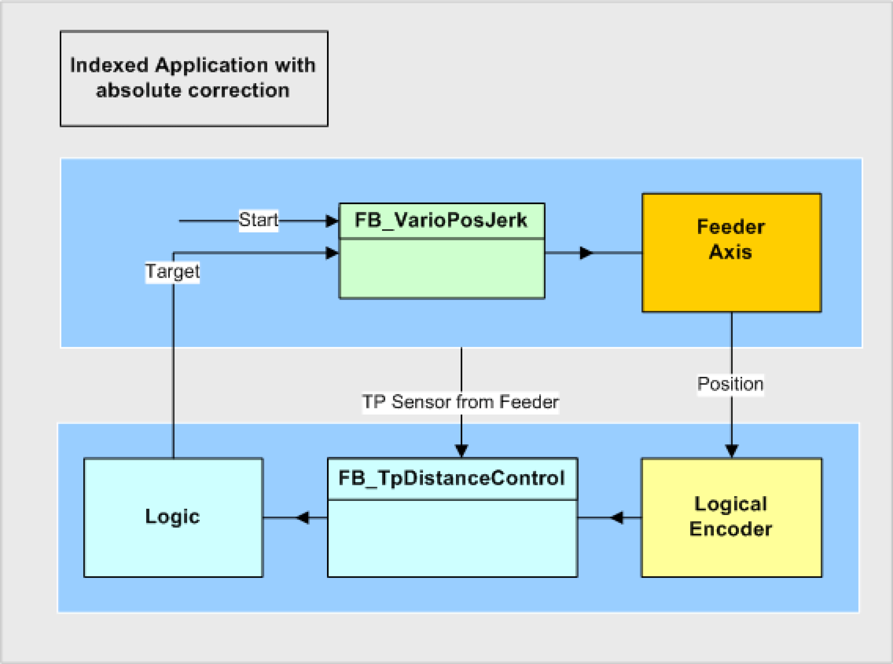
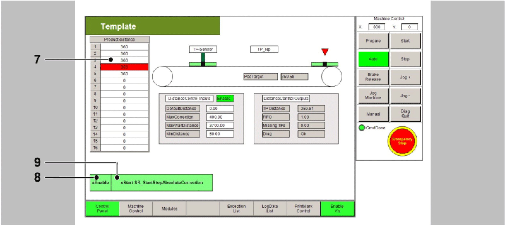

# Indexed Application with Absolute Correction

Indexed Application with Absolute Correction

Description

NOTE: The program described in the following must only be regarded as example and only shows the principal use of the POU [FB\_TpDistanceControl](../Function_Blocks_R_to_Z/Function_Blocks_R_to_Z-29.htm#XREF_D_SE_0087373_1) in combination with other function blocks from the library [PD\_PacDriveLib](../Presentation_of_the_Library/Presentation_of_the_Library-2.htm#XREF_D_SE_0087820_1).

It is not guaranteed that all possible operating situations are covered by all parameter combinations.

Before you attempt to provide a solution (machine or process) for a specific application using the POUs found in the library, you must consider, conduct and complete best practices. These practices include, but are not limited to, risk analysis, functional safety, component compatibility, testing and system validation as they relate to this library.

|  |
| --- |
| Warning_Color.gifWARNING |
| IMPROPER USE OF PROGRAM ORGANIZATION UNITS |
| oPerform a safety-related analysis for the application and the devices installed.  oEnsure that the Program Organization Units (POUs) are compatible with the devices in the system and have no unintended effects on the proper functioning of the system.  oUse appropriate parameters, especially limit values, and observe machine wear and stop behavior.  oVerify that the sensors and actuators are compatible with the selected POUs.  oThoroughly test all functions during verification and commissioning in all operation modes.  oProvide independent methods for critical control functions (emergency stop, conditions for limit values being exceeded, etc.) according to a safety-related analysis, respective rules, and regulations. |
| Failure to follow these instructions can result in death, serious injury, or equipment damage. |

The example program for the application described here can be found in the demo project PrintMarkControlExample in the equipment module SR\_StartStopAbsoluteCorrection.

Objective

The objective of this solution is a precise alignment of products to a processing station (knife), independently of their distance. The distance of the Touchprobe sensor to the intersection can be chosen freely.

In order to achieve an harmonious process, the distance of the Touchprobe sensor to the intersection should be higher than the normal product distance. The positions of up to 16 products are saved in a FiFo ([Gc\_diMaxNumberOfElementsInFiFo](../Global_Elements/Global_Elements-3.htm#XREF_D_SE_0087808_1)). The knife is a simple actuator, which is controlled via a signal.

The principle of the correction consists of defining the collected distances as positioning target:

For the collection of the first part, a positioning with a big distance is started. With the first Touchprobe the target of the running positioning is corrected to the Touchprobe position + distance TpNp. If a further part was recognized after the target position was reached and processing was completed, the measured value is immediately reused as positioning (lrTarget:= fbTpDistanceControl.GetValue()). If no further part is recognized, the same process as for the first part occurs.

Schematic view of the mechanics

A belt conveys products under a processing station. During processing the feed is in standstill. The processing itself is usually a simple actuator, which is controlled via a signal and either delivers a completion notification over a period or via a contact.

The position is collected via a sensor and the POU FB\_TpDistanceControl. The distances can thereby vary heavily. Up to 16 products ([Gc\_diMaxNumberOfElementsInFiFo](../Global_Elements/Global_Elements-3.htm#XREF_D_SE_0087808_1)) can be between the Touchprobe sensor and the processing station. As the products must be under the tools for processing, the feed is executed via a positioning POU.

Logical connection of the axes and logical encoder

To measure the feed position a logical encoder is used. It is only necessary, because the POU [FB\_TpDistanceControl](../Function_Blocks_R_to_Z/Function_Blocks_R_to_Z-29.htm#XREF_D_SE_0087373_1) cannot be directly connected to an axis. The function block connects the LogicalEncoder to the axis during enable of the function block.

Control of the Equipment Module in the Template Visualization

The equipment module PrintMarkControlExample can be controlled in the template visualization under the sub-point Printmark Control.

To do this, connect with the controller via the Logic Builder, transfer the demo project PrintMark­ControlExample to the controller and start.

In the template, first start the mode Prepare, and then the mode Auto as instructed below:

| Step | Action |
| --- | --- |
| 1 | Via the button Enable Vis, activate the visualization (point 1). |
| 2 | Via the button Control Panel, switch to the Control Panel (point 2). |
| 3 | Via the button Prepare, select the mode Prepare (point 3). |
| 4 | Via the button Start, start the mode Prepare (point 4). |
| 5 | Via the button Auto, switch to the mode Auto (point 5). |
| 6 | Via the button Start, start the mode Auto (point 6).  G-SE-0068912.1.gif-high.gif |
| 7 | Next, the distances of the Touchprobe events can be adjusted in the table (point 7).  The distances of the Touchprobe events are required for the Touchprobe simulation. They require a connection between CN2.9 and CN4.9.  Alternatively a sensor at the Touchprobe input can be used. This leads to the products no longer being displayed properly in the visualization. |
| 8 | Thereafter use the button xEnable to activate the equipment module (point 8). |
| 9 | Finally, set a xStart signal via the visualization (point 9). |

NOTE: The Touchprobe simulation requires a connection between CN2.9 and CN4.9.

All variables and POUs relevant to the print mark control are initialized in the action Init\_PrintMark­Correction from the equipment module SR\_StartStopAbsoluteCorrection. Here, the data on the print mark control can be adjusted to the products and the print mark distances. If a real Touchprobe is to be used, this can also be adjusted here.

Command table

In the operation mode Automatic the OpMode Positioning is selected for this module.

Logic of the equipment module

The controller of the print mark control can be found in the action Logic from the equipment module.

The feed is started, as described above, via the BOOL variable xStart or via the button xStart in the visualization in the dialogue PrintMark Control.

State Machine

| Condition | Description |
| --- | --- |
| State 10 | The state of the POUs is queried and - if still inactive - activated. |
| State 20 | If all POUs are active, they are started. |
| State 30 | When the first Touchprobe has been recognized, the position is saved as new positioning target and positioning is started.  Here, the Touchprobe position is read out via fbTpDistanceControl.q\_lrTpCaptureValue or via fbTpDistanceControl.q\_lrTpCaptureDiff, as it is the first Touchprobe. |
| State 40 | If the product has reached the target position, the timer value of the controller is temporarily saved. If the product processing is not time-dependent, this can be removed. |
| State 50 | If the processing time has expired and no further Touchprobe has been recognized, the position is used as target position.  The position is read out via the function fbTpDistanceControl.GetValue(). This function must always be used, if more than one Touchprobe was recognized. In this case, State 40 is jumped to. If the processing time has expired but no further Touchprobe has been recognized, the variable IrMaxPos is used as target position and State 30 is jumped to. |

Traces

The distance TpNp is relatively large with 1000 units, due to this three other products were registered before reaching the first position.

These are now processed in order. The same behavior occurs in the case of a bigger gap.

EIO0000002658.00

© 2018 Schneider Electric. All rights reserved.