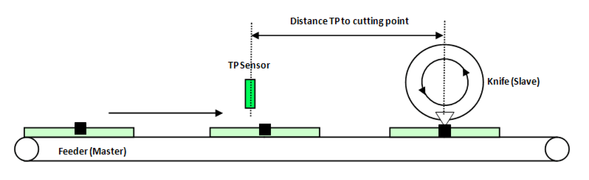
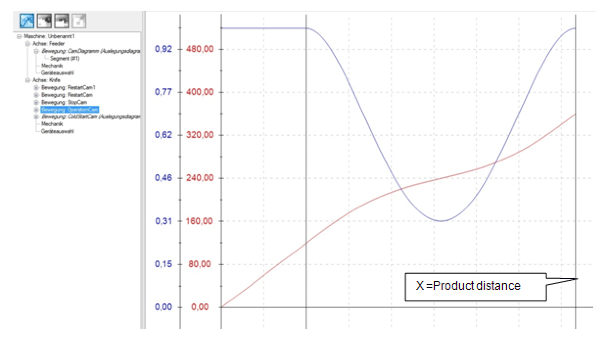

# Synchronous Application with Absolute Correction

Synchronous Application with Absolute Correction

Description

NOTE: The program described in the following must only be regarded as example and only shows the principal use of the POU [FB\_TpDistanceControl](../Function_Blocks_R_to_Z/Function_Blocks_R_to_Z-29.htm#XREF_D_SE_0087373_1) in combination with other function blocks from the library [PD\_PacDriveLib](../Presentation_of_the_Library/Presentation_of_the_Library-2.htm#XREF_D_SE_0087820_1).

It is not guaranteed that all possible operating situations are covered by all parameter combinations.

Before you attempt to provide a solution (machine or process) for a specific application using the POUs found in the library, you must consider, conduct and complete best practices. These practices include, but are not limited to, risk analysis, functional safety, component compatibility, testing and system validation as they relate to this library.

|  |
| --- |
| Warning_Color.gifWARNING |
| IMPROPER USE OF PROGRAM ORGANIZATION UNITS |
| oPerform a safety-related analysis for the application and the devices installed.  oEnsure that the Program Organization Units (POUs) are compatible with the devices in the system and have no unintended effects on the proper functioning of the system.  oUse appropriate parameters, especially limit values, and observe machine wear and stop behavior.  oVerify that the sensors and actuators are compatible with the selected POUs.  oThoroughly test all functions during verification and commissioning in all operation modes.  oProvide independent methods for critical control functions (emergency stop, conditions for limit values being exceeded, etc.) according to a safety-related analysis, respective rules, and regulations. |
| Failure to follow these instructions can result in death, serious injury, or equipment damage. |

The example program for the application described here can be found in the demo project PrintMarkControlExample in the equipment module SR\_SynchronizedAbsoluteCorrection.

Objective

The objective of this solution is a precise alignment of products to a processing station (knife), independently of their distance. The distance between the Touchprobe sensor and the intersection can also be chosen freely.

In order to achieve an harmonious process, the distance of the Touchprobe sensor to the intersection should be higher than the normal product distance. The positions of up to 16 products are saved in a FiFo.

The knife moves synchronously to the product during processing and then performs a compensation motion to the next product, or in the case of larger distances moves to a rest position.

The velocity of the master may vary from standstill up to maximum velocity. The maximum slave velocity is not checked. A backward motion of the master is also possible. The slave also moves backwards - up until the profile limits. A triggering of the Touchprobe sensor in the backward motion is not anticipated by the logic of the example program and leads to an error detection.

The principle of the correction consists of adjusting the cam profile for the knife to the measured product distance. The Y value always remains a rotation, but the master axis is stretched or compressed accordingly. If the product distance is small, a polynomial of the 5th degree is used for the compensation motion. If the product distance is large enough, the rest position is moved to.

NOTE: This example can also applied to a flying shear relatively easily.

Schematic view of the mechanics

Logical connection of the axes and logical encoder

The conveyor belt is the master in this network The velocity and position serve as guide value for the knife and the print mark control.

The knife is connected with the master encoder via a Cam function (MultiCam).

The Touchprobe sensor is installed over the conveyor belt and detects the passing parts. The POU FB\_TpDistanceControl measures the distance of the parts. Up to 16 parts are saved in a FiFo. FB\_TpDistanceControl has its own logic encoder, which is also connected to the master.

The Cam Logic calculates the respective CAM profiles and supplies them to the MultiCam.

Control of the Equipment Module in the Template Visualization

The equipment module PrintMarkControlExample can be controlled in the template visualization under the sub-point Printmark Control.

To do this, connect with the controller via the Logic Builder, transfer the demo project PrintMark­ControlExample to the controller and start.

In the template, first start the mode Prepare, and then the mode Auto as instructed below:

| Step | Action |
| --- | --- |
| 1 | Via the button Enable Vis, activate the visualization (point 1). |
| 2 | Via the button Control Panel, switch to the Control Panel (point 2). |
| 3 | Via the button Prepare, select the mode Prepare (point 3). |
| 4 | Via the button Start, start the mode Prepare (point 4). |
| 5 | Via the button Auto, switch to the mode Auto (point 5). |
| 6 | Via the button Start, start the mode Auto (point 6).  G-SE-0068912.1.gif-high.gif |
| 7 | Next, the distances of the Touchprobe events can be adjusted in the table (point 7).  The distances of the Touchprobe events are required for the Touchprobe simulation. They require a connection between CN2.9 and CN4.9.  Alternatively a sensor at the Touchprobe input can be used. This leads to the products no longer being displayed properly in the visualization. |
| 8 | Thereafter use the button xEnable to activate the equipment module (point 8). |
| 9 | Finally, set a xStart signal via the visualization (point 9). |

NOTE: The Touchprobe simulation requires a connection between CN2.9 and CN4.9.

All variables and POUs relevant to the print mark control are initialized in the action Init\_PrintMark­Correction. Here, the data on the print mark control can be adjusted to the products and the print mark distances. If a real Touchprobe is to be used, this can also be adjusted here.

Command table

In the operation mode Automatic the OpMode CamCS is selected for this module.

The logic of the equipment modules assumes that the knife is in the rest position.

At first, the Touchprobe is waited for. A ColdStartCam is activated in the MultiCam. The Y axis (knife) moves from the rest position (270) up to the cutting position (360). The X axis (Master LEnc) moves from zero up to the distance between Touchprobe sensor and intersection.

Motion ColdStartCam

The MultiCam is started in PDL.ET\_MultiCamCSModeMaster = 2 / SetMasterPositionToMinusIn­finite. This sets the master encoder to a very high negative value. Consequently the ColdstartCam is active in the lower range and the knife is waiting in the rest position. With the first Touchprobe signal, the master encoder position is then set to zero using a SetPos command, which leads to the master encoding position moving into the upper range of the cam and the knife starting to move to the cutting position.

At the end of ColdStartCam, it is checked whether a further product has been recognized at TpDistanceControl. This applies in most cases, if the distance TpNp is large enough.

If a part has been recognized, an OperationCam is loaded in the MultiCam and started. The measured product distance is entered into the OperationCam as end point of the X axis. This is then started with the signal xNewCam.

Motion OperationCam

If no further product has been recognized before the end of the ColdStartCam, a StopCam is connected. It moves the knife to the rest position. If a product is recognized while this StopCam is active, it is interrupted with the signal xInstantNewCam and the RestartCam is started.

This can lead to three cases:

| Step | Action |
| --- | --- |
| 1 | The next product is recognized in the synchronization phase of the StopCam. Then a normal OperationCam follows, as both cams are identical in the synchronization phase. |
| 2 | The next product is recognized outside of the synchronization phase and the measured part distance is larger than the required minimum distance (lrXStartDistance + lrStopDistance + 1.0). Then a RestartCam is started and the rest position is moved to. |
| 3 | The next product is recognized outside of the synchronization phase and the measured part distance is smaller than the required minimum distance (lrXStartDistance + lrStopDistance + 1.0). Then a RestartCam is started without moving to the rest position. |

Motion RestartCam

If no new product is recognized during the entire StopCam, the logic branches back to the start and again waits for the first Touchprobe.

EIO0000002658.00

© 2018 Schneider Electric. All rights reserved.