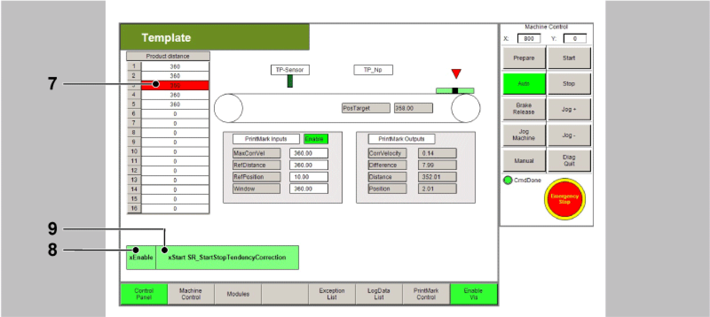
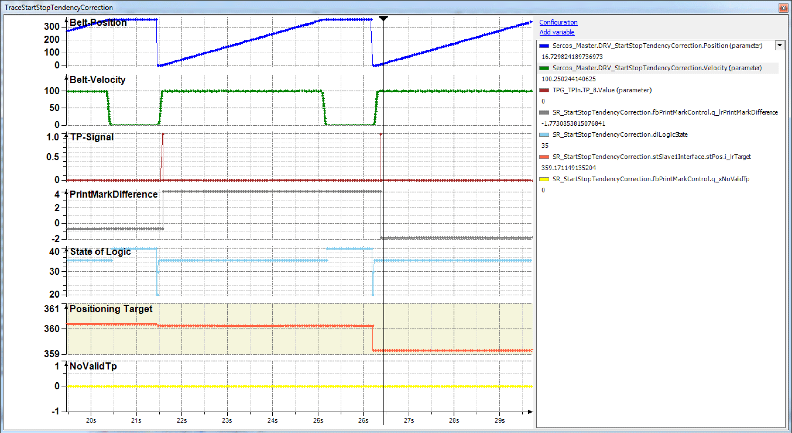

# Indexed Application with Tendentious Correction

Indexed Application with Tendentious Correction

Description

NOTE: The program described in the following must only be regarded as example and only shows the principal use of the POU [FB\_PrintMarkControl](../Function_Blocks_I_to_Q/Function_Blocks_I_to_Q-29.htm#XREF_D_SE_0087332_1) in combination with other function blocks from the library [PD\_PacDriveLib](../Presentation_of_the_Library/Presentation_of_the_Library-2.htm#XREF_D_SE_0087820_1).

It is not guaranteed that all possible operating situations are covered by all parameter combinations.

Before you attempt to provide a solution (machine or process) for a specific application using the POUs found in the library, you must consider, conduct and complete best practices. These practices include, but are not limited to, risk analysis, functional safety, component compatibility, testing and system validation as they relate to this library.

|  |
| --- |
| Warning_Color.gifWARNING |
| IMPROPER USE OF PROGRAM ORGANIZATION UNITS |
| oPerform a safety-related analysis for the application and the devices installed.  oEnsure that the Program Organization Units (POUs) are compatible with the devices in the system and have no unintended effects on the proper functioning of the system.  oUse appropriate parameters, especially limit values, and observe machine wear and stop behavior.  oVerify that the sensors and actuators are compatible with the selected POUs.  oThoroughly test all functions during verification and commissioning in all operation modes.  oProvide independent methods for critical control functions (emergency stop, conditions for limit values being exceeded, etc.) according to a safety-related analysis, respective rules, and regulations. |
| Failure to follow these instructions can result in death, serious injury, or equipment damage. |

The example program for the application described here can be found in the demo project PrintMarkControlExample in the equipment module SR\_StartStopTendencyCorrection.

Objective

The objective of this solution is an alignment, e.g. of print marks on a foil, to a processing station (knife). The print mark position thereby varies only within very narrow boundaries and it only needs to be prevented from drifting away. Larger deviations are compensated in multiple steps.

The principle of the correction consists of adding some of the measured deviations to the next feed.

i\_lrTarget:= lrPartLength - fbPMC.q\_lrPrintMarkDifference \* lrCorrFactor;

Due to the time lag between the print mark recording and the actual correction, it is not advisable to use the entire measured deviation, as this may lead to overshooting. A value lrCporrFactor:= 0.2...0.5 has been proven optimal. A compromise between speed and control performance must be found.

Schematic view of the mechanics

A pair of roller conveys, for example, a foil under the processing station. During processing the feed is in standstill. The processing itself is usually a simple actuator, which is controlled via a signal and either delivers a completion notification over a period or via a contact.

Only the Touchprobe position is compared with a reference position. The reference position must be in the range > 0 and < length of parts. If the reference position is near its value range boundary, a measured value may refer to a period before or after the current period. But this is identified in the function block and it is allocated to the correct period.

Logical connection of the axes and logical encoder

To measure the feed position a logical encoder is used. This is only necessary, as the POU [FB\_PrintMarkControl](../Function_Blocks_I_to_Q/Function_Blocks_I_to_Q-29.htm#XREF_D_SE_0087332_1) cannot be directly connected to an axis.

The Touchprobe sensor is installed over the conveyor belt and detects the passing print marks. FB\_PrintMarkControl compares the position of the logical encoder at the time of the Touchprobe signal with a reference position, and calculates its deviation. If the measured position is outside of a defined window, the output q\_xNoValidTp is set. But the output q\_diNumberOfTps is increased further.

The logic of the example program calculates a new distance, if a valid Touchprobe was recognized. Otherwise the default length is used as distance for the following positioning.

Control of the Equipment Module in the Template Visualization

The equipment module PrintMarkControlExample can be controlled in the template visualization under the sub-point Printmark Control.

To do this, connect with the controller via the Logic Builder, transfer the demo project PrintMark­ControlExample to the controller and start.

In the template, first start the mode Prepare, and then the mode Auto as instructed below:

| Step | Action |
| --- | --- |
| 1 | Via the button Enable Vis, activate the visualization (point 1). |
| 2 | Via the button Control Panel, switch to the Control Panel (point 2). |
| 3 | Via the button Prepare, select the mode Prepare (point 3). |
| 4 | Via the button Start, start the mode Prepare (point 4). |
| 5 | Via the button Auto, switch to the mode Auto (point 5). |
| 6 | Via the button Start, start the mode Auto (point 6).  G-SE-0068912.1.gif-high.gif |
| 7 | Next, the distances of the Touchprobe events can be adjusted in the table (point 7).  The distances of the Touchprobe events are required for the Touchprobe simulation. They require a connection between CN2.9 and CN4.9.  Alternatively a sensor at the Touchprobe input can be used. This leads to the products no longer being displayed properly in the visualization. |
| 8 | Thereafter use the button xEnable to activate the equipment module (point 8). |
| 9 | Finally, set a xStart signal via the visualization (point 9). |

NOTE: The Touchprobe simulation requires a connection between CN2.9 and CN4.9.

All variables and POUs relevant to the print mark control are initialized in the action Init\_PrintMark­Correction. Here, the data on the print mark control can be adjusted to the products and the print mark distances. If a real Touchprobe is to be used, this can also be adjusted here.

Command table

In the operation mode Automatic the OpMode Positioning is selected for this module.

Logic of the equipment module

The controller of the print mark control can be found in the action Logic from the module. The feed is started, as described above, via the BOOL variable xStart or via the button xStart in the visualization in the dialogue PrintMark Control.

State Machine

| Condition | Description |
| --- | --- |
| State 10 | The state of the POUs is queried and - if still inactive - activated. |
| State 20 | Here, the Touchprobe is awaited, this position is multiplied by the factor 0.2 and deducted from the default distance. |
| State 30 | If the axis is in motion, the start of the positioning is set to FALSE. |
| State 35 | If the target is reached, the timer value of the controller is temporarily saved and the processing started. If the processing time is not required, other events can be reacted to here. |
| State 40 | If the processing time has expired and xStart is still active, State 20 is jumped to. If this is not the case, State 10 is jumped to. |
| State 100 | In the case of an error detection, the POUs are deactivated here and the motion is stopped. |

Traces

The following Trace shows a situation where a Touchprobe is outside of the window.

The function block indicates via q\_xNoValidTp that a Touchprobe was identified outside of the window and then uses the default length of 360 units (see cursor position).

The following Trace shows a situation with a relatively large Touchprobe deviation, but still within the window.

The deviation of approx. 5 units can be identified at the cursor position. The correction is only approx. 1 unit, however.

EIO0000002658.00

© 2018 Schneider Electric. All rights reserved.