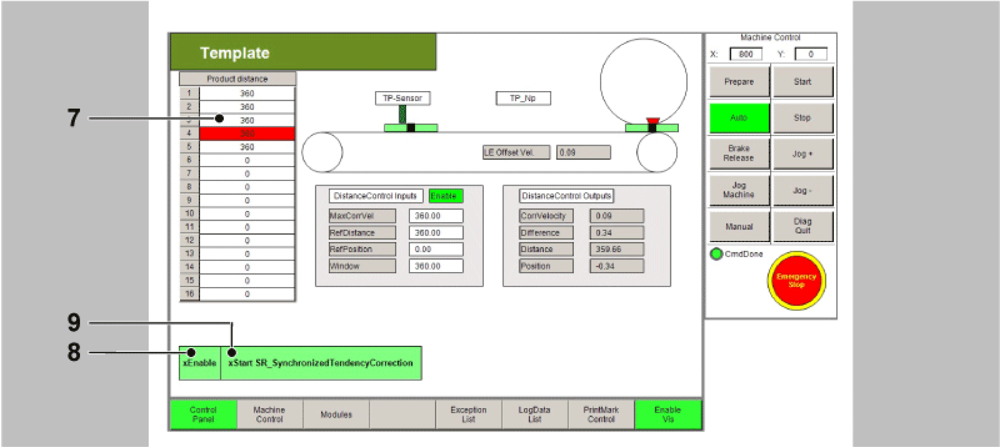

# Synchronized Application with Tendentious Correction

Synchronized Application with Tendentious Correction

Description

NOTE: The program described in the following must only be regarded as example and only shows the principal use of the POU [FB\_PrintMarkControl](../Function_Blocks_I_to_Q/Function_Blocks_I_to_Q-29.htm#XREF_D_SE_0087332_1) in combination with other function blocks from the library [PD\_PacDriveLib](../Presentation_of_the_Library/Presentation_of_the_Library-2.htm#XREF_D_SE_0087820_1).

It is not guaranteed that all possible operating situations are covered by all parameter combinations.

Before you attempt to provide a solution (machine or process) for a specific application using the POUs found in the library, you must consider, conduct and complete best practices. These practices include, but are not limited to, risk analysis, functional safety, component compatibility, testing and system validation as they relate to this library.

|  |
| --- |
| Warning_Color.gifWARNING |
| IMPROPER USE OF PROGRAM ORGANIZATION UNITS |
| oPerform a safety-related analysis for the application and the devices installed.  oEnsure that the Program Organization Units (POUs) are compatible with the devices in the system and have no unintended effects on the proper functioning of the system.  oUse appropriate parameters, especially limit values, and observe machine wear and stop behavior.  oVerify that the sensors and actuators are compatible with the selected POUs.  oThoroughly test all functions during verification and commissioning in all operation modes.  oProvide independent methods for critical control functions (emergency stop, conditions for limit values being exceeded, etc.) according to a safety-related analysis, respective rules, and regulations. |
| Failure to follow these instructions can result in death, serious injury, or equipment damage. |

The example program for the application described here can be found in the demo project PrintMarkControlExample in the equipment module SR\_SynchronizedTendencyCorrection.

Objective

The objective of this solution is an alignment, e.g. of print marks on a foil, to a processing station (knife). The print mark position thereby varies only within very narrow boundaries and it only needs to be prevented from drifting away. Larger deviations are compensated in multiple steps.

The principle of the correction consists of applying a correction velocity to the master encoder of the slave (knife) in proportion to the measured deviation. This creates a phase offset of the physical master position to the master encoder position of the slave. The slave runs a fixed profile which is not influenced either. The correction velocity is set to execute the correction within one part, thus also in the synchronization phase.

Schematic view of the mechanics

Logical connection of the axes and logical encoder

The conveyor belt is the master in this network The velocity and the position serve as master value for the knife.

The knife is connected with the master encoder via a Cam function (MultiCam).

The Touchprobe sensor is installed over the conveyor belt and detects the passing print marks. The POU [FB\_PrintMarkControl](../Function_Blocks_I_to_Q/Function_Blocks_I_to_Q-29.htm#XREF_D_SE_0087332_1) compares the position of the logical encoder of the slave at the time of the Touchprobe signal with a reference position and calculates the correction velocity, which in turn is fed to the logical encoder of the slave as OffsetVelocity.

Control of the Equipment Module in the Template Visualization

The equipment module PrintMarkControlExample can be controlled in the template visualization under the sub-point Printmark Control.

To do this, connect with the controller via the Logic Builder, transfer the demo project PrintMark­ControlExample to the controller and start.

In the template, first start the mode Prepare, and then the mode Auto as instructed below:

| Step | Action |
| --- | --- |
| 1 | Via the button Enable Vis, activate the visualization (point 1). |
| 2 | Via the button Control Panel, switch to the Control Panel (point 2). |
| 3 | Via the button Prepare, select the mode Prepare (point 3). |
| 4 | Via the button Start, start the mode Prepare (point 4). |
| 5 | Via the button Auto, switch to the mode Auto (point 5). |
| 6 | Via the button Start, start the mode Auto (point 6).  G-SE-0068912.1.gif-high.gif |
| 7 | Next, the distances of the Touchprobe events can be adjusted in the table (point 7).  The distances of the Touchprobe events are required for the Touchprobe simulation. They require a connection between CN2.9 and CN4.9.  Alternatively a sensor at the Touchprobe input can be used. This leads to the products no longer being displayed properly in the visualization. |
| 8 | Thereafter use the button xEnable to activate the equipment module (point 8). |
| 9 | Finally, set a xStart signal via the visualization (point 9). |

NOTE: The Touchprobe simulation requires a connection between CN2.9 and CN4.9.

All variables and POUs relevant to the print mark control are initialized in the action Init\_PrintMark­Correction. Here, the data on the print mark control can be adjusted to the products and the print mark distances. If a real Touchprobe is to be used, this can also be adjusted here.

Command table

In the operation mode Automatic the OpMode CamWs is selected for this module.

Logic of the equipment module

The controller of the print mark control can be found in the action Logic from the equipment module.

The feed is started, as described above, via the BOOL variable xStart or via the button xStart in the visualization in the dialogue PrintMark Control.

If the module has started, the correction velocity is directly written on the logical encoder. As the axis in Cam mode directly follows the logical encoder, the velocity of the physical axis also changes.

Trace

The Trace shows the situation with a relatively large Touchprobe deviation within the window.

The OffsetVelocity (light-blue) is visible on the left cursor position. This velocity leads to a velocity change of the physical axis (green). At the right cursor position the position deviation of the print mark is now only 3.5 increments (grey).

EIO0000002658.00

© 2018 Schneider Electric. All rights reserved.