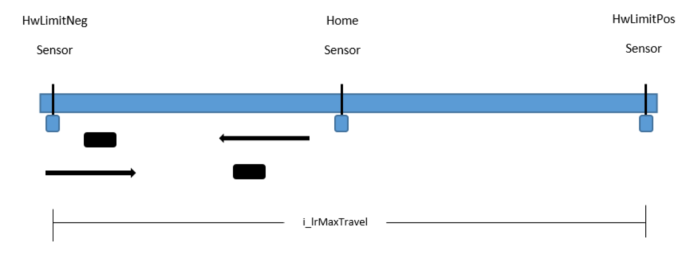

# Example of i_lrMaxTravel

Example of i\_lrMaxTravel

Example of i\_lrMaxTravel

Description

In this example, the homing movement starts on the negative sensor side and moves in the negative direction to the HwLimitNeg switch sensor instead of the Home sensor. Afterwards the homing movement is stopped and a new movement in the positive direction is started to the Home sensor.

Both movements are limited separately by the i\_lrMaxTravel parameter (the negative direction movement to the HwLimitNeg sensor and the positive movement to the Home sensor).

The maximum travel distance is not the sum of both movements.

EIO0000002658.00

© 2018 Schneider Electric. All rights reserved.