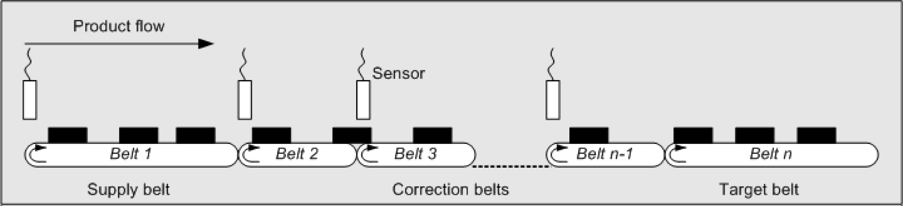

# General Information

General Information

Description

The library "PD\_SmartInfeed" is a technology library for the infeed of products using serial belts.

The library helps you develop a product infeed application for a packaging machine and enables to quickly implement the required infeed. The library provides common functions for applications like this. The focus is on the developer’s main task, developing an algorithm.

Universal applicative solutions are not part of the library because of the wide range of possible infeed scenarios. The library gives the user all necessary information and functionalities, however, to be able to achieve practically any infeed. One application solution is delivered.

You will find practical help for the one application and parameter setting in the library [here](../Using_the_Library/Using_the_Library-2.htm#XREF_D_SE_0080530_1).

The following functions facilitate easy algorithm implementation for the user:

oProduct entry

oProduct management

oProduct transfer

oProduct Tracing

oDiagnosis functions

oFiltering sensor signals

oBelt synchronization

oVelocity adjustments

oCorrection mechanisms

oWarm start

Only Controller OnBoard I/O touch probes and drive touch probes are supported by the function­alities of this library. TM5 module touch probes are not supported.

This library has been designed to cover a general range of use cases. If you need further features for your application, please contact your Schneider Electric representative to find an individual solution.

Licence Points

| Property | Description |
| --- | --- |
| License | 25 licence points are required for each instance. |

Mechanical Data

The mechanical arrangement that can be controlled via the library consists of at least one belt. No more than ten belts can be placed in series. Ideally, each belt should have its own sensor for product recording. In the case of belts without sensors, the product positions are calculated internally.

Mechanical construction:

The length of the shortest belt should not be less than 75% of the product length.

The highest infeed velocity can be influenced by different parameters. These include:

oThe more powerful the controller, the better infeed will perform.

oBelts and products tend to slip.

oDefined parameters for velocity and acceleration

oPerformance of the downstream machine

Namespace of the Library

The default namespace of this library is SI.

The POUs, data structures, enumerations and constants have to be addressed via this namespace.

EIO0000002662.00

© 2018 Schneider Electric. All rights reserved.