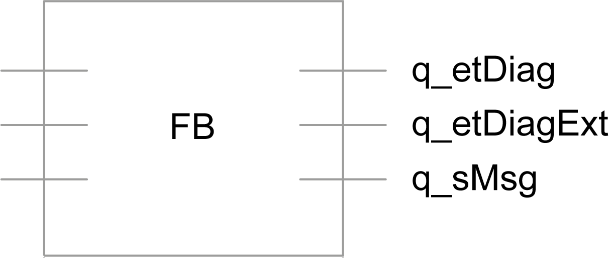

# Diagnostic Concept

Diagnostic Concept

Overview

PacDrive 3 provides a three-layer diagnostic concept for the libraries. This concept is valid for the Technology/Module libraries in the PacDrive 3 system (for example, the library PD\_PacDrive.lib) and uses enumerations for diagnostic coding.

In principle, the diagnostic information has the following layers:

1.General information on the exception. No specific knowledge about the POU functionality is necessary.

2.POU-specific diagnostic and status messages (part 1): Detailed information on the source triggering the diagnostic or status messages.

3.POU-specific diagnostic and status messages (part 2): Detailed and dynamic information on the source triggering the diagnostic or status messages.

This information changes at runtime (for example, information about the condition of the input parameters). This diagnostic output is optional for the POUs.

The diagnostic concept for the PacDrive 3 family of libraries offers the following advantages:

oOnline display of the diagnostic messages

oDetailed precision of diagnostic events via the availability of the diagnostic codes

oOverview on the status or exceptional condition of a POU

oPertinent solutions to correct the causes for exceptional conditions

oEnumerated diagnostic messages to facilitate multi-language support for HMI displays

Structure of the POU-Independent Information

The diagnostic output q\_etDiag of the type GD.ET\_Diag provides a library independent diagnostic information, for example InputParameterInvalid. The information can suggest a solution for the cause of the diagnostic.

Depending on the value of GD.ET\_Diag, it is either a status description or an exception message. A value unequal GD.ET\_Diag.Ok equates to an exception message.

The enumeration GD.ET\_Diag and its elements are contained in the library PD\_GlobalDiag­nostics. It also contains a conversion function for the enumeration GD.ET\_Diag.

The default namespace of the library PD\_GlobalDiagnostics is: GD.The POUs, data structures, enumerations, and constants must be addressed using this namespace.

Structure of the POU-Specific Information

The diagnostic information of POUs is designed such that it can express both an exceptional condition or an internal condition (status) during the normal operation of the POU (for example: WaitForStart). The information (exceptional condition or status) is reported via the same output (q\_etDiagExt). The output q\_etDiag indicates whether a status or an exception is being reported.

Function Blocks

Function blocks have the three outputs q\_etDiag, q\_etDiagExt, and optional q\_sMsg. The outputs are displayed grouped; that is, defined in the POU one after another.

Using schematic POU structure, the following is an example of a function block:

| Output | Data type | Meaning |
| --- | --- | --- |
| q\_etDiag | GD.ET\_Diag | General statement on the diagnostic, for example InputParameterInvalid.  NOTE: If possible, GD.ET\_Diag contains general formulated diagnostic codes (for example: DriveConditionInvalid and InputParameterInvalid). Every enumeration element is not only represented by a name, it is also represented by a value. This value can then be used by the HMI so that the translation effort for a neutral language solution of the enumeration name remains maintainable.  oGD.ET\_Diag.Ok: The status message q\_etDiagExt gives information about the status of the POU.  o<> GD.ET\_Diag.Ok: The diagnostic message q\_etDiagExt gives information about the exception type. |
| q\_etDiagExt | ET\_DiagExt | Extended diagnostic information encoded into a value of the function or service performed within the POU. For example, AccRange (Acceleration is out of range)/ WaitForStart may be output as a diagnostic or as a status.  q\_etDiagExt provides the numeric value that serves as the index of a more detailed indication of the cause of the output and can be further used as an index into a multi-language set of display messages. |
| q\_sMsg | STRING[80] | Event triggered optional message that gives more detailed information on the diagnostic condition (for example, 0 < i\_lrAcc < MaxAcc).  q\_sMsg provides a dynamic string containing variable information about the diagnostic in English.  q\_sMsg is modified during runtime. For example, by the exception VelRange: ActualValue: 5003, MaxValue: 5000.  During the normal operation of the POUs (q\_etDiag=GD.ET\_Diag.Ok), q\_sMsg may provide information concerning the status (for example, the remaining sealing time). |

Diagnostic information example:

Functions

The functions also have the outputs q\_etDiag, q\_etDiagExt, and the optional q\_sMsg.

The result of the function is provided by the direct return value in case of one result. If a function has more than one result, then the direct return value is a structure that contains the results.

Alternatively, the results of the function can be returned via several outputs; in this case the direct return value of the function is a BOOL value with a random value that cannot be interpreted.

Read the value q\_etDiag to ensure that the function was called up successfully. The direct return value of the function does not contain that information.

An exception exists if the return value is <> GD.ET\_Diag.Ok. The functions are processed completely in the call-up task, then their status can be evaluated and they report via q\_etDiag and q\_etDiagExt whether their processing was successful.

EIO0000002662.00

© 2018 Schneider Electric. All rights reserved.