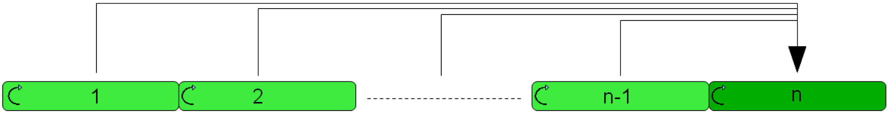
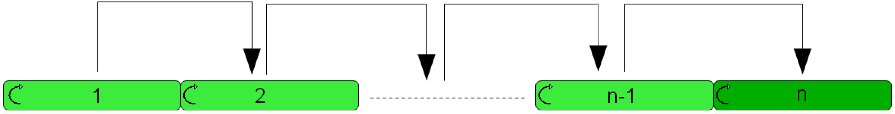

# Master Configuration

Master Configuration

General

The motions of the belts of the [FB\_Infeed](../Function_Blocks/Function_Blocks-3.htm#XREF_D_SE_0080279_1) POU are based on cams. Thus, a cam master has to be specified for each belt that is controlled by [FB\_Infeed](../Function_Blocks/Function_Blocks-3.htm#XREF_D_SE_0080279_1) (belts of type [Series](../Enumerations/Enumerations-2.htm#XREF_D_SE_0080263_1)). You can choose freely which belt is to serve as master for which belt. In practice, two basic configuration variants have developed for the master selection of an infeed distance:

Parallel dependency:

Every belt has the same belt allocated as Cam master. Usually, this belt is of type [Monitoring](../Enumerations/Enumerations-2.htm#XREF_D_SE_0080263_1), which is located either at the beginning or at the end of the infeed distance.

This configuration is used the most. If you are not sure about the configuration of the Cam master of the infeed distance, you should use this configuration for the time being.

Cascaded dependency:

The infeed distance has a belt of type [Monitoring](../Enumerations/Enumerations-2.htm#XREF_D_SE_0080263_1), which is located at the beginning or at the end of the infeed distance. This belt is transferred as Cam master to its directly adjacent correction belt. This correction belt is then transferred as master to the next correction belt, etc. Cascaded configurations should be used if certain dependencies exist between the belts. If, for example, gaps between product groups that are distributed over several belts should be closed, products of this group must carry out the correction, in the case of correction movements.

When using the cascaded configuration, bear in mind that the motion of a belt has an effect on the subsequent belts. This can lead to undesired motion overlays.

Position of the Cam Master

An infeed distance connects two machines. A previous machine, which outputs products in no particular sequence, and a subsequent machine, into which these products must be infed in a particular sequence It has proven to be an advantage to parameterize a belt of type [Monitoring](../Enumerations/Enumerations-2.htm#XREF_D_SE_0080263_1) at the beginning and at the end of the infeed distance for both machines, which is moved by the respective machine. However, an infeed distance usually has only one cam master on which the motion of the belts depend. The cam master is either the [Monitoring](../Enumerations/Enumerations-2.htm#XREF_D_SE_0080263_1) belt of the previous machine or of the subsequent machine. Which is selected as cam master depends on the application. Usually, the subsequent machine is selected as cam master.

EIO0000002662.00

© 2018 Schneider Electric. All rights reserved.