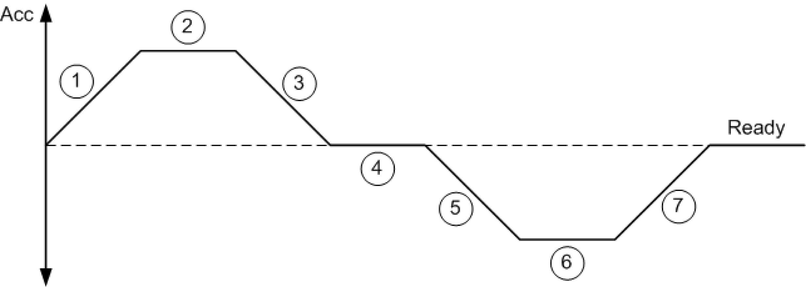

# ET_JobState

ET\_JobState

ET\_JobState - General Information

Overview

|  |  |
| --- | --- |
| Type: | Enumeration type |
| Available as of: | V1.0.0.0 |

Description

List type reflecting the status of a positioning job. A positioning job can consist of up to 7 phases.

Enumeration Elements

| Name | Value | Description |
| --- | --- | --- |
| Default | 0 | The positioning job is not yet active. |
| Phase\_1 | 1 | Acceleration build-up |
| Phase\_2 | 2 | Constant acceleration |
| Phase\_3 | 3 | Acceleration reduction |
| Phase\_4 | 4 | No acceleration |
| Phase\_5 | 5 | Deceleration build-up |
| Phase\_6 | 6 | Constant deceleration |
| Phase\_7 | 7 | Deceleration reduction |
| Ready | 8 | The positioning job is completed. |

EIO0000002666.00

© 2018 Schneider Electric. All rights reserved.