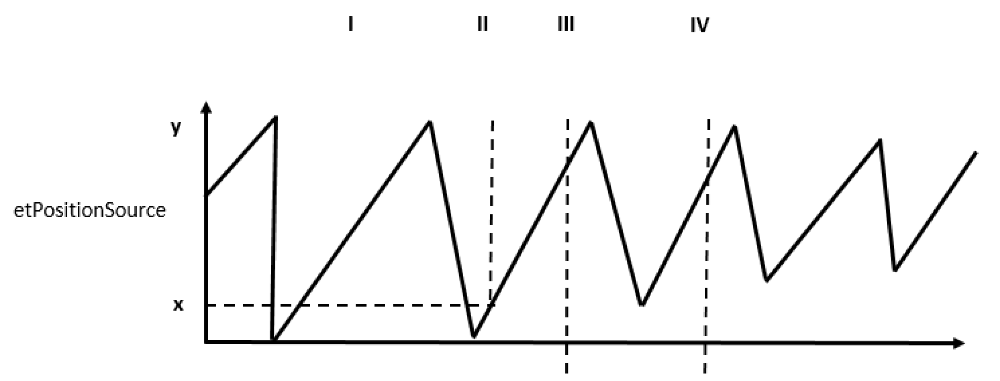
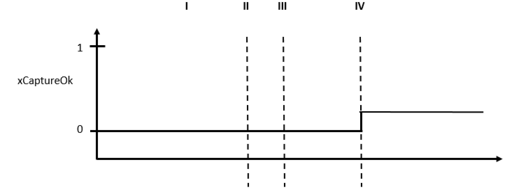

# FB_SoMotionGenerator - General Information

FB\_SoMotionGenerator - General Information

Overview

|  |  |
| --- | --- |
| Type: | Function block |
| Available as of: | V1.0.0.0 |
| Inherits from: | - |
| Implements: | - |

|  |
| --- |
| NOTICE |
| COMPLEX FUNCTION |
| Contact your responsible Schneider Electric contact partner, before using function blocks of this library directly. |
| Failure to follow these instructions can result in equipment damage. |

Other libraries, for example the PD\_SmartInfeed are using the PD\_SoMotionGenerator internally. It is not necessary to contact your responsible Schneider Electric contact partner when using these librariers.

Task

Generation of reference values for a single axis.

Description

The SMG (SoMotionGenerator) is a single axis reference value generator. It provides independent channels. These channels (designated A, B and C) generate individual position reference values whose sum is the resulting reference value which is transferred to the axis.

|  |  |  |
| --- | --- | --- |
| G-SE-0069342.1.gif-high.gif      Reference value channel A | G-SE-0069343.1.gif-high.gif      Reference value channel B | G-SE-0069344.1.gif-high.gif      Resulting reference value |

The SMG can process positioning as well as cam jobs. The motion jobs to be assigned are parameterized within the structure [ST\_MotionJob](../Structures/Structures-6.htm#XREF_D_SE_0089488_1) and directly assigned to the individual channels by the method TakeJob(). Every channel possesses a job queue (FIFO) in which the received motion jobs are buffered until they are executed.

The SMG is executed in a standard user task. However, it is provided with a real-time kernel which is executed in the real-time cycle. This real-time kernel is responsible for generating the reference values and updating the real-time data contained in the iq\_astRealTimeData structure.

NOTE: The system treats the SMG like an independent motion job. For this reason, the AxisState of the SMG axis permanently is on 5. Other motion jobs for this axis must not be assigned during execution, since otherwise the SMG will be removed from job processing and replaced by the new job.

Interface

| Input | Data type | Description |
| --- | --- | --- |
| i\_xEnable | BOOL | A rising edge activates the function block. A falling edge deactivates the function block. In this process, all active motion jobs are deleted and the axis is stopped by means of i\_lrEmergencyDec. |
| i\_xWarmStart | BOOL | Only relevant if the POU has already been activated before and the job processing had already started.  TRUE := The position of the most recent master objects of the channels are evaluated and the logical master positions are set accordingly. The positions of the phase generators remain on the last value they had before the function block was deactivated.  FALSE := The logical master positions and the positions of the phase generators of all channels are set to zero. |
| i\_xDiagQuit | BOOL | Acknowledges error of the function block (not of the axis). |
| i\_ifDrive | SystemInterface.IF\_Motion | Axis that is controlled by the SMG. |

| Output | Data type | Description |
| --- | --- | --- |
| q\_xActive | BOOL | TRUE := The function block is being executed.  FALSE := The function block is deactivated. |
| q\_xReady | BOOL | TRUE := The function block is ready for job processing.  FALSE := Job processing not possible. |
| q\_etDiag | [GD.ET\_Diag](../../../../../../api/crossBook?lang=en-US&virtualBookName=PD.Lib.GlobalDiagnostic&topicID=D_SE_0076228_1) | General library-independent statement on the diagnostic.  A value unequal to GD.ET\_Diag.Ok corresponds to a diagnostic message. |
| q\_etDiagExt | ET\_DiagExt | POU-specific output on the diagnostic.  q\_etDiag = GD.ET\_Diag.Ok -> status message  q\_etDiag <> GD.ET\_Diag.Ok -> diagnostic message |
| q\_sMsg | STRING[80] | Event-triggered message which gives more detailed information on the diagnostic state. |

| Input/Output | Data type | Description |
| --- | --- | --- |
| iq\_astTouchprobe | ARRAY[1..Gc\_diNumOfTouchprobes] OF [ST\_Touchprobe](../Structures/Structures-17.htm#XREF_D_SE_0089510_1) | Array for detecting Touchprobes. |
| iq\_stMasterPhaseGenerator | [ST\_PhaseGenerator](../Structures/Structures-8.htm#XREF_D_SE_0089492_1) | Permits shifting the logical master position to the position of the master object when using cams. This shift can be executed at any time and is realized by a positioning job that overlays the motion of the master object. |
| iq\_stRealTimeData | [ST\_RealtimeData](../Structures/Structures-15.htm#XREF_D_SE_0089506_1) | Real-time data that are updated in the real-time cycle. |
| iq\_stWarmStartData | [ST\_WarmStartData](../Structures/Structures-18.htm#XREF_D_SE_0089512_1) | Warm start data that are updated for the function blocks Enable and i\_xWarmStart = TRUE. |

Using Touchprobes

The SoMotionGenerator offers the possibility to assign position values to one of the channels.

The curves of the certain channels could be defined with a jump of the position. If those jumps are occuring during a short time (a single PLC cycle) in several channels, the possibility to assign the Touchprobe event to a certain position of the slave axis is getting lost.

The following graphic displays this circumstance. This example shows the five possible occurences of the Touchprobe signal (Touchprobe event) on the curve of the slave axis (sum).

The SoMotionGenerator offers the possibility to assign the measured value at a Touchprobe event to a channel. Therefore, it is possible to restore the unambiguous position of the slave axis from the channel position.

NOTE: Internally, an auxiliary position value (ST\_TouchProbe.lrPosition) will be created which follows the assigned channel. The behavior of this position is similiar to a position of a logical encoder.

Examples

The following examples show the use of the Touchprobe in combination with the FB\_SoMotion­Generator. Initially, the diagrams show the timing behavior of the involved signals.

 Afterwards, a detailed description is provided of the certain event times (I-IV) to handle the SoMotionGenerator Touchprobe.

The graphic, etPositionSource, shows the curve of the position adjusted in the ST\_Touchprobe.etPositionSource (usually a channel is used for this kind of application).

The graphic, lrPosition, shows the behavior of the auxiliary position in the ST\_TouchProbe.lrPosition described in the overview.

The graphic, Tp.Value, shows the assumed course of the Touchprobe signal.

The graphic, xArmed, shows the assumed course of the ST\_Touchprobe.xArmed. The signal displays an active Touchprobe.

The graphic, xCaptureOk, shows the valid detection of the Touchprobe signal.

The graphic, lrCapturedPosition, shows the position at the time of the valid detection of the Touchprobe signal.

| Event | Description |
| --- | --- |
| n/a | Before the Touchprobe functionality of the SoMotionGenerator can be used, connect the parameter ST\_Touchprobe.ifTouchProbe to the Touchprobe input where the sensor is connected.  Select the parameter ST\_Touchprobe.etPositionSource to the position of where to execute the Touchprobe. |
| I | After these two parameters are set, the parameter ST\_TouchProbe.lrPosition (of the SoMotionGenerator) will follow the position of the selected position source without corresponding to the set position on the source.  The functionality of lrPosition works identically to the functionality of a logical encoder. |
| II | The Touchprobe is now able to capture the value of the lrPosition parameter at the time of the Touchprobe event. The value of ST\_TouchProbe.lrPosition does not correspond to the machine coordinate system because the parameter ST\_TouchProbe.lrPosition ignores the set position on the source.  Define a set position on lrPosiiton with the parameters ST\_TouchProbe.etSetPosMode and ST\_TouchProbe.lrSetPosValue to home the lrPosition parameter.  Execute the set position by setting the parameter ST\_TouchProbe.xDoSetpos to true. |
| III | Select the edge of the Touchprobe with the parameter ST\_TouchProbe.etEdge to activate the Touchprobe functionality.  Activate the Touchprobe by setting the parameter ST\_TouchProbe.xArm to true. |
| n/a | The SoMotionGenerator sets the parameter ST\_TouchProbe.xArmed to true which signals that the user is waiting for the sensor edge. |
| IV | The SoMotionGenerator signals a found edge with the parameter ST\_TouchProbe.xCaptureOk = TRUE.  At this point, the SoMotionGenerator has updated the parameter ST\_TouchProbe.lrCapturedPosition with the position the parameter ST\_TouchProbe.lrPosition had at the time when the edge was seen on the sensor.  (The SoMotionGenerator interpolates the position change between two cycles to get the accurate position). |
| n/a | The user takes the Touchprobe result from the parameter, ST\_TouchProbe.lrCapturedPosition.  The user can start a new capturing by returning to event two (II) or event three (III), if the user needs to recalibrate the lrPosition value again. |

Diagnostic Messages

| q\_etDiag | q\_etDiagExt | Enumeration value | Description |
| --- | --- | --- | --- |
| OK | [Deactivated](#XREF_D_SE_0089466_10) | 1 | Deactivated |
| OK | [Initilization1](#XREF_D_SE_0089466_14) | 2 | Initialization1 |
| OK | [Initilization2](#XREF_D_SE_0089466_15) | 3 | Initialization2 |
| OK | [JobProcessing](#XREF_D_SE_0089466_46) | 4 | Job in progress |
| OK | [PosStartDelayIgnored](#XREF_D_SE_0089466_55) | 39 | PosStart deceleration has been ignored. |
| OK | [Stopping](#XREF_D_SE_0089466_57) | 5 | Ramp-down |
| ControllerConditionInvalid | [InvalidController](#XREF_D_SE_0089466_16) | 46 | The controller type is not supported. |
| DriveConditionInvalid | [AxisInvalid](#XREF_D_SE_0089466_7) | 6 | Invalid axis |
| DriveConditionInvalid | [AxisNotReady](#XREF_D_SE_0089466_8) | 7 | Axis not ready |
| DriveConditionInvalid | [AxisReadyReEnableNecessary](#XREF_D_SE_0089466_9) | 11 | Function block Re-Enable required |
| ExecutionAborted | [ExtRefGenInvalid](#XREF_D_SE_0089466_11) | 42 | The instance of the external setpoint device is invalid. |
| ExecutionAborted | [ExtRefGenInvalidRefPosition](#XREF_D_SE_0089466_12) | 44 | q\_lrY of the external setpoint generator is invalid. |
| ExecutionAborted | [ExtRefGenReturnValue](#XREF_D_SE_0089466_13) | 43 | Return value of the external setpoint generator |
| ExecutionAborted | [InvalidRefPosition](#XREF_D_SE_0089466_17) | 50 | i\_ifDrive.RefPosition is not a valid LREAL. |
| ExecutionAborted | [InvalidState](#XREF_D_SE_0089466_19) | 12 | Invalid internal state |
| ExecutionAborted | [InvalidTp](#XREF_D_SE_0089466_20) | 47 | iq\_astTouchProbe[].ifTouchProbe is invalid. |
| ExecutionAborted | [InvalidTpEdge](#XREF_D_SE_0089466_21) | 48 | iq\_astTouchProbe[].etEdge is invalid. |
| ExecutionAborted | [InvalidTpSetposMode](#XREF_D_SE_0089466_22) | 49 | iq\_astTouchProbe[].etSetposMode is invalid. |
| ExecutionAborted | [JobBufferOverflow](#XREF_D_SE_0089466_23) | 34 | The job buffer is full. It is not possible to initiate further jobs. |
| ExecutionAborted | [JobParamCamMode](#XREF_D_SE_0089466_24) | 31 | Job parameter stCam.etMode invalid |
| ExecutionAborted | [JobParamCamXStartXEnd](#XREF_D_SE_0089466_25) | 26 | Job parameter stCam.lrXStart >= stCam.lrXEnd |
| ExecutionAborted | [JobParamChannelBundling](#XREF_D_SE_0089466_27) | 29 | Job parameter xChannelBundling only for channel A |
| ExecutionAborted | [JobParamInvalid](#XREF_D_SE_0089466_28) | 52 | Job parameter is invalid |
| ExecutionAborted | [JobParamJobType](#XREF_D_SE_0089466_29) | 14 | Job parameter etJobType is outside the valid range. |
| ExecutionAborted | [JobParamLambda](#XREF_D_SE_0089466_30) | 27 | Job parameter stCam.stDwell.lrLambda is outside the valid range. |
| ExecutionAborted | [JobParamMaster](#XREF_D_SE_0089466_31) | 32 | Job parameter stCam.ifMaster is invalid. |
| ExecutionAborted | [JobParamMasterSetposMode](#XREF_D_SE_0089466_32) | 33 | Job parameter stCam.etMasterSetposMode is invalid. |
| ExecutionAborted | [JobParamPosStartAbsJerk](#XREF_D_SE_0089466_33) | 20 | Job parameter stPosStart.lrAbsJerk is outside the valid range. |
| ExecutionAborted | [JobParamPosStartDelayType](#XREF_D_SE_0089466_34) | 22 | Job parameter stPosStart.etDelayType is outside the valid range. |
| ExecutionAborted | [JobParamPosStartMaxAcceleration](#XREF_D_SE_0089466_35) | 18 | Job parameter stPosStart.lrMaxAcceleration is outside the valid range. |
| ExecutionAborted | [JobParamPosStartMaxDeceleration](#XREF_D_SE_0089466_36) | 19 | Job parameter stPosStart.lrMaxDeceleration  is outside the valid range. |
| ExecutionAborted | [JobParamPosStartPosition](#XREF_D_SE_0089466_37) | 16 | Job parameter stPosStart.lrPosition is outside the valid range. |
| ExecutionAborted | [JobParamPosStartPosMode](#XREF_D_SE_0089466_38) | 21 | Job parameter stPosStart.etPosMode is outside the valid range. |
| ExecutionAborted | [JobParamPosStartVelocity](#XREF_D_SE_0089466_39) | 17 | Job parameter stPosStart.lrVelocity is outside the valid range. |
| ExecutionAborted | [JobParamPosStopAbsJerk](#XREF_D_SE_0089466_40) | 25 | Job parameter stPosStop.lrAbsJerk is outside the valid range. |
| ExecutionAborted | [JobParamPosStopMaxAcceleration](#XREF_D_SE_0089466_41) | 23 | Job parameter stPosStop.lrMaxAcceleration is outside the valid range. |
| ExecutionAborted | [JobParamPosStopMaxDeceleration](#XREF_D_SE_0089466_42) | 24 | Job parameter stPosStop.lrMaxDeceleration is outside the valid range. |
| ExecutionAborted | [JobParamSetposMode](#XREF_D_SE_0089466_43) | 15 | Job parameter etSetposMode is outside the valid range. |
| ExecutionAborted | [JobParamStraight](#XREF_D_SE_0089466_44) | 28 | Job parameter stCam.stDwell.lrStraight is outside the valid range. |
| ExecutionAborted | [JobParamSystemCamProfileID](#XREF_D_SE_0089466_45) | 30 | Job parameter stSystemCam.diProfileID is invalid. |
| ExecutionAborted | [NoJobWhileAxisMoving](#XREF_D_SE_0089466_47) | 45 | The axis is moving although no job is active. |
| ExecutionAborted | [PhaseJobParamAbsJerk](#XREF_D_SE_0089466_49) | 38 | Job parameter lrMasterPhaseAbsJerk of the phase generator is less than zero. |
| ExecutionAborted | [PhaseJobParamMaxAcceleration](#XREF_D_SE_0089466_50) | 36 | Job parameter lrMasterPhaseMaxAcceleration of the phase generator is less than zero. |
| ExecutionAborted | [PhaseJobParamMaxDeceleration](#XREF_D_SE_0089466_51) | 37 | Job parameter lrMasterPhaseMaxDeceleration of the phase parameter is less than zero. |
| ExecutionAborted | [PhaseJobParamVelocity](#XREF_D_SE_0089466_52) | 35 | Job parameter lrMasterPhaseVelocity of the phase generator is zero. |
| ExecutionAborted | [Poly5ComXStartGreaterXEnd](#XREF_D_SE_0089466_53) | 40 | Poly5 stCam.lrXStart is greater than stCam.lrXEnd. |
| ExecutionAborted | [Poly7ComXStartGreaterXEnd](#XREF_D_SE_0089466_54) | 41 | Poly7 stCam.lrXStart is greater than stCam.lrXEnd. |
| ExecutionAborted | [UnknownCamType](#XREF_D_SE_0089466_58) | 72 |  |
| ExecutionAborted | [UserRefGenerator](#XREF_D_SE_0089466_59) | 10 | Return value of the FC\_UserRefGeneratorStart function |
| SercosConditionInvalid | [InvalidSercosItf](#XREF_D_SE_0089466_18) | 51 | Invalid Sercos interface |
| SercosConditionInvalid | [RtbCycleTime](#XREF_D_SE_0089466_56) | 9 | RTB cycle time |

AxisInvalid

|  |  |
| --- | --- |
| Enumeration name: | AxisInvalid |
| Enumeration value: | 6 |
| Description: | Invalid axis |

| Issue | Cause | Solution |
| --- | --- | --- |
| - | No drive has been applied at the i\_ifDrive input. | A valid drive must be transferred to the i\_ifDrive input. |
| - | The connected drive does not support all required functionalities. | The output q\_sMsg shows which functionalities are not supported by the drive.  Use a drive that supports all required functionalities. |

AxisNotReady

|  |  |
| --- | --- |
| Enumeration name: | AxisNotReady |
| Enumeration value: | 7 |
| Description: | Axis not ready |

| Issue | Cause | Solution |
| --- | --- | --- |
| - | The axis is not in position control. | Verify the axis state. |

AxisReadyReEnableNecessary

|  |  |
| --- | --- |
| Enumeration name: | AxisReadyReEnableNecessary |
| Enumeration value: | 11 |
| Description: | Function block Re-Enable required |

| Issue | Cause | Solution |
| --- | --- | --- |
| - | The necessary requirements for the intended use of the drive are not fulfilled. | Obtain more detailed diagnostic information: see output q\_sMsg.  A Re-Enable of the function block is required. |

Deactivated

|  |  |
| --- | --- |
| Enumeration name: | Deactivated |
| Enumeration value: | 1 |
| Description: | Deactivated |

| Issue | Cause | Solution |
| --- | --- | --- |
| - | The function block is not active. | Verify the state of the i\_xEnable input. |

ExtRefGenInvalid

|  |  |
| --- | --- |
| Enumeration name: | ExtRefGenInvalid |
| Enumeration value: | 42 |
| Description: | The instance of the external setpoint device is invalid. |

| Issue | Cause | Solution |
| --- | --- | --- |
| - | The connected external position generator does not support all required functionalities. | Use a position generator that supports all required functionalities.  The interface transferred at the variable ST\_MotionJob.stPositioning.stExternalPos.ifExternalPosGenerator or ST\_MotionJob.stCam.stExternalCam.ifExternalCamGenerator is invalid. |

ExtRefGenInvalidRefPosition

|  |  |
| --- | --- |
| Enumeration name: | ExtRefGenInvalidRefPosition |
| Enumeration value: | 44 |
| Description: | q\_lrY of the external setpoint generator is invalid. |

| Issue | Cause | Solution |
| --- | --- | --- |
| - | The position output q\_lrY of the external reference value generator provides no valid LREAL. | Verify the external reference value generator. |

ExtRefGenReturnValue

|  |  |
| --- | --- |
| Enumeration name: | ExtRefGenReturnValue |
| Enumeration value: | 43 |
| Description: | Return value of the external setpoint generator |

| Issue | Cause | Solution |
| --- | --- | --- |
| - | The q\_etDiag output of the external reference value generator is unequal to [GD.ET\_Diag](../../../../../../api/crossBook?lang=en-US&virtualBookName=PD.Lib.GlobalDiagnostic&topicID=D_SE_0076228_1).Ok. | Verify the external reference value generator. |

Initilization1

|  |  |
| --- | --- |
| Enumeration name: | Initilization1 |
| Enumeration value: | 2 |
| Description: | Initialization1 |

The function block is being initialized and thus is not yet ready to receive commands at its inputs.

Initilization2

|  |  |
| --- | --- |
| Enumeration name: | Initilization2 |
| Enumeration value: | 3 |
| Description: | Initialization2 |

The function block is being initialized and thus is not yet ready to receive commands at its inputs.

InvalidController

|  |  |
| --- | --- |
| Enumeration name: | InvalidController |
| Enumeration value: | 46 |
| Description: | The controller type is not supported. |

| Issue | Cause | Solution |
| --- | --- | --- |
| - | The global controller interface G\_ifController is invalid. | A valid controller must be assigned to the G\_ifController variable. |
| - | The connected controller does not support all required functionalities. | Use a controller that supports all required functionalities. |

InvalidRefPosition

|  |  |
| --- | --- |
| Enumeration name: | InvalidRefPosition |
| Enumeration value: | 50 |
| Description: | i\_ifDrive.RefPosition is not a valid LREAL. |

| Issue | Cause | Solution |
| --- | --- | --- |
| - | The reference value generation failed. | Please inform your Schneider Electric representative about this detected error. |

InvalidSercosItf

|  |  |
| --- | --- |
| Enumeration name: | InvalidSercosItf |
| Enumeration value: | 51 |
| Description: | Invalid Sercos interface |

| Issue | Cause | Solution |
| --- | --- | --- |
| - | The global Sercos interface G\_ifSercosr is invalid. | A valid Sercos slave must be assigned to the G\_ifSercos variable. |
| - | The connected Sercos slave does not support all required functionalities. | Use a Sercos slave that supports all required functionalities. |

InvalidState

|  |  |
| --- | --- |
| Enumeration name: | InvalidState |
| Enumeration value: | 12 |
| Description: | Invalid internal state |

| Issue | Cause | Solution |
| --- | --- | --- |
| - | The POU is in an invalid condition. | Please inform your Schneider Electric representative about this detected error. |

InvalidTp

|  |  |
| --- | --- |
| Enumeration name: | InvalidTp |
| Enumeration value: | 47 |
| Description: | iq\_astTouchProbe[].ifTouchProbe is invalid. |

| Issue | Cause | Solution |
| --- | --- | --- |
| - | The assigned touchprobe is invalid. | Further details can be drawn from the q\_sMsg output. |

InvalidTpEdge

|  |  |
| --- | --- |
| Enumeration name: | InvalidTpEdge |
| Enumeration value: | 48 |
| Description: | iq\_astTouchProbe[].etEdge is invalid. |

| Issue | Cause | Solution |
| --- | --- | --- |
| - | The assigned value of the etEdge variable is invalid. | etEdge must have the value ET\_TpEdge.Rising at rising edge or the value ET\_TpEdge.Falling at falling edge. |

InvalidTpSetposMode

|  |  |
| --- | --- |
| Enumeration name: | InvalidTpSetposMode |
| Enumeration value: | 49 |
| Description: | iq\_astTouchProbe[].etSetposMode is invalid. |

| Issue | Cause | Solution |
| --- | --- | --- |
| - | The assigned value of the etSetposMode variable is invalid. | etSetposMode must have the value ET\_SetposMode.Absolute in the case of an absolute SetPos or the value ET\_SetposMode.Relative in the case of a relative SetPos. |

JobBufferOverflow

|  |  |
| --- | --- |
| Enumeration name: | JobBufferOverflow |
| Enumeration value: | 34 |
| Description: | The job buffer is full. It is not possible to initiate further jobs. |

| Issue | Cause | Solution |
| --- | --- | --- |
| - | A channel has reached the maximum number of storable jobs and thus could not take over an issued job. xReadyForNewJobInTake of the channel is FALSE. | Before issuing a job, verify whether xReadyForNewJobInTake of the channel is TRUE. |

JobParamCamMode

|  |  |
| --- | --- |
| Enumeration name: | JobParamCamMode |
| Enumeration value: | 31 |
| Description: | Job parameter stCam.etMode invalid |

| Issue | Cause | Solution |
| --- | --- | --- |
| - | The assigned value of the stCam.etMode variable is invalid. | stCam.etMode must be assigned with an element from [ET\_CamMode](../Enumerations/Enumerations-2.htm#XREF_D_SE_0089428_1). |

JobParamCamXStartXEnd

|  |  |
| --- | --- |
| Enumeration name: | JobParamCamXStartXEnd |
| Enumeration value: | 26 |
| Description: | Job parameter stCam.lrXStart >= stCam.lrXEnd |

| Issue | Cause | Solution |
| --- | --- | --- |
| - | The assigned value of the stCam.lrXStart is too high. | The value of the stCam.lrXStart variable must be less than the value of the stCam.lrXEnd variable. |

JobParamChannelBundling

|  |  |
| --- | --- |
| Enumeration name: | JobParamChannelBundling |
| Enumeration value: | 29 |
| Description: | Job parameter xChannelBundling only for channel A |

| Issue | Cause | Solution |
| --- | --- | --- |
| - | The parameter stPosStart/stPosStop.xChannelBundling was set to TRUE for channel B or channel C. | Set the parameter stPosStart/stPosStop.xChannelBundling to TRUE only for channel A. |

JobParamInvalid

|  |  |
| --- | --- |
| Enumeration name: | JobParamInvalid |
| Enumeration value: | 52 |
| Description: | Job parameter is invalid |

| Issue | Cause | Solution |
| --- | --- | --- |
| - | No velocity profile could be calculated for a positioning job. | Verify the job parameters of ST\_Positioning.ST\_PosStart. |

JobParamJobType

|  |  |
| --- | --- |
| Enumeration name: | JobParamJobType |
| Enumeration value: | 14 |
| Description: | Job parameter etJobType is outside the valid range. |

| Issue | Cause | Solution |
| --- | --- | --- |
| - | The assigned value of the ST\_MotionJob.etJobType variable is invalid. | ST\_MotionJob.etJobType must be assigned with an element from [ET\_MotionJobType](../Enumerations/Enumerations-7.htm#XREF_D_SE_0089438_1). |

JobParamLambda

|  |  |
| --- | --- |
| Enumeration name: | JobParamLambda |
| Enumeration value: | 27 |
| Description: | Job parameter stCam.stDwell.lrLambda is outside the valid range. |

| Issue | Cause | Solution |
| --- | --- | --- |
| - | The assigned value of the stCam.stDwellDwell.lrLambda variable is invalid. | lrLambda must be >= 0.0 and <= 1.0. |

JobParamMaster

|  |  |
| --- | --- |
| Enumeration name: | JobParamMaster |
| Enumeration value: | 32 |
| Description: | Job parameter stCam.ifMaster is invalid. |

| Issue | Cause | Solution |
| --- | --- | --- |
| - | No valid master has been transferred to the stCam.ifMaster variable. | A valid master must be transferred to the stCam.ifMaster variable. |
| - | The connected master does not support all required functionalities. | The q\_sMsg output shows which functionalities are not supported by the master.  Use a master that supports all required functionalities. |

JobParamMasterSetposMode

|  |  |
| --- | --- |
| Enumeration name: | JobParamMasterSetposMode |
| Enumeration value: | 33 |
| Description: | Job parameter stCam.etMasterSetposMode is invalid. |

| Issue | Cause | Solution |
| --- | --- | --- |
| - | The assigned value of the stCam.etMasterSetposMode variable is invalid. | etMasterSetposMode must be of type ET\_SetposMode. |

JobParamPosStartAbsJerk

|  |  |
| --- | --- |
| Enumeration name: | JobParamPosStartAbsJerk |
| Enumeration value: | 20 |
| Description: | Job parameter stPosStart.lrAbsJerk is outside the valid range. |

| Issue | Cause | Solution |
| --- | --- | --- |
| - | The assigned value of the stPosStart.lrAbsJerk variable is invalid. | stPosStart.lrAbsJerk must be >= 0.001. |

JobParamPosStartDelayType

|  |  |
| --- | --- |
| Enumeration name: | JobParamPosStartDelayType |
| Enumeration value: | 22 |
| Description: | Job parameter stPosStart.etDelayType is outside the valid range. |

| Issue | Cause | Solution |
| --- | --- | --- |
| - | The assigned value of the variable stPosStart.etDelayType is invalid. | stPosStart.etDelayType must be assigned with an element from [ET\_PosStartDelayType](../Enumerations/Enumerations-10.htm#XREF_D_SE_0089444_1). |

JobParamPosStartMaxAcceleration

|  |  |
| --- | --- |
| Enumeration name: | JobParamPosStartMaxAcceleration |
| Enumeration value: | 18 |
| Description: | Job parameter stPosStart.lrMaxAcceleration is outside the valid range. |

| Issue | Cause | Solution |
| --- | --- | --- |
| - | The assigned value of the stPosStart.lrMaxAcceleration variable is invalid. | stPosStart.lrMaxAcceleration must be >= 0.001. |

JobParamPosStartMaxDeceleration

|  |  |
| --- | --- |
| Enumeration name: | JobParamPosStartMaxDeceleration |
| Enumeration value: | 19 |
| Description: | Job parameter stPosStart.lrMaxDeceleration  is outside the valid range. |

| Issue | Cause | Solution |
| --- | --- | --- |
| - | The assigned value of the stPosStart.lrMaxDeceleration variable is invalid. | stPosStart.lrMaxDeceleration must be >= 0.001. |

JobParamPosStartPosition

|  |  |
| --- | --- |
| Enumeration name: | JobParamPosStartPosition |
| Enumeration value: | 16 |
| Description: | Job parameter stPosStart.lrPosition is outside the valid range. |

| Issue | Cause | Solution |
| --- | --- | --- |
| - | The assigned value of the stPosStart.lrPosition variable is invalid. | In the case of a relative positioning (stPosStart.etPosMode = ET\_PosMode.Relative) stPosStart.lrPosition must be >= 0.001. |

JobParamPosStartPosMode

|  |  |
| --- | --- |
| Enumeration name: | JobParamPosStartPosMode |
| Enumeration value: | 21 |
| Description: | Job parameter stPosStart.etPosMode is outside the valid range. |

| Issue | Cause | Solution |
| --- | --- | --- |
| - | The assigned value of the stPosStart.etPosMode variable is invalid. | stPosStart.etPosMode must have the value ET\_PosMode.Absolute in the case of an absolute positioning or the value ET\_PosMode.Relative in the case of a relative positioning. |

JobParamPosStartVelocity

|  |  |
| --- | --- |
| Enumeration name: | JobParamPosStartVelocity |
| Enumeration value: | 17 |
| Description: | Job parameter stPosStart.lrVelocity is outside the valid range. |

| Issue | Cause | Solution |
| --- | --- | --- |
| - | The assigned value of the stPosStart.lrVelocity variable is invalid. | stPosStart.lrVelocity must be >= 0.001. |

JobParamPosStopAbsJerk

|  |  |
| --- | --- |
| Enumeration name: | JobParamPosStopAbsJerk |
| Enumeration value: | 25 |
| Description: | Job parameter stPosStop.lrAbsJerk is outside the valid range. |

| Issue | Cause | Solution |
| --- | --- | --- |
| - | The assigned value of the stPosStop.lrAbsJerk variable is invalid. | stPosStop.lrAbsJerk must be >= 0.001. |

JobParamPosStopMaxAcceleration

|  |  |
| --- | --- |
| Enumeration name: | JobParamPosStopMaxAcceleration |
| Enumeration value: | 23 |
| Description: | Job parameter stPosStop.lrMaxAcceleration is outside the valid range. |

| Issue | Cause | Solution |
| --- | --- | --- |
| - | The assigned value of the stPosStop.lrMaxAcceleration variable is invalid. | stPosStop.lrMaxAcceleration must be >= 0.001. |

JobParamPosStopMaxDeceleration

|  |  |
| --- | --- |
| Enumeration name: | JobParamPosStopMaxDeceleration |
| Enumeration value: | 24 |
| Description: | Job parameter stPosStop.lrMaxDeceleration is outside the valid range. |

| Issue | Cause | Solution |
| --- | --- | --- |
| - | The assigned value of the stPosStop.lrMaxDeceleration variable is invalid. | stPosStop.lrMaxDeceleration must be >= 0.001. |

JobParamSetposMode

|  |  |
| --- | --- |
| Enumeration name: | JobParamSetposMode |
| Enumeration value: | 15 |
| Description: | Job parameter etSetposMode is outside the valid range. |

| Issue | Cause | Solution |
| --- | --- | --- |
| - | The assigned value of the etSetposMode variable is invalid. | etSetposMode must be of type ET\_SetposMode. |

JobParamStraight

|  |  |
| --- | --- |
| Enumeration name: | JobParamStraight |
| Enumeration value: | 28 |
| Description: | Job parameter stCam.stDwell.lrStraight is outside the valid range. |

| Issue | Cause | Solution |
| --- | --- | --- |
| - | The assigned value of the stCam.stDwellDwell.lrStraight variable is invalid. | lrStraight must be >= 0.0 and <= 0.99. |

JobParamSystemCamProfileID

|  |  |
| --- | --- |
| Enumeration name: | JobParamSystemCamProfileID |
| Enumeration value: | 30 |
| Description: | Job parameter stSystemCam.diProfileID is invalid. |

| Issue | Cause | Solution |
| --- | --- | --- |
| - | The assigned value of the stCam.stSystemCam.diProfileID variable is invalid. | Verify diProfileID. |

JobProcessing

|  |  |
| --- | --- |
| Enumeration name: | JobProcessing |
| Enumeration value: | 4 |
| Description: | Job in progress |

| Issue | Cause | Solution |
| --- | --- | --- |
| - | FC\_UserRefGeneratorStart has been executed successfully. |  |

NoJobWhileAxisMoving

|  |  |
| --- | --- |
| Enumeration name: | NoJobWhileAxisMoving |
| Enumeration value: | 45 |
| Description: | The axis is moving although no job is active. |

| Issue | Cause | Solution |
| --- | --- | --- |
| - | The axis is in an invalid condition. | Please inform your Schneider Electric representative about this detected error. |

PhaseJobParamAbsJerk

|  |  |
| --- | --- |
| Enumeration name: | PhaseJobParamAbsJerk |
| Enumeration value: | 38 |
| Description: | Job parameter lrMasterPhaseAbsJerk of the phase generator is less than zero. |

| Issue | Cause | Solution |
| --- | --- | --- |
| - | The assigned value of the lrMasterPhaseAbsJerk variable is invalid. | lrMasterPhaseAbsJerk must be > 0.0. |

PhaseJobParamMaxAcceleration

|  |  |
| --- | --- |
| Enumeration name: | PhaseJobParamMaxAcceleration |
| Enumeration value: | 36 |
| Description: | Job parameter lrMasterPhaseMaxAcceleration of the phase generator is less than zero. |

| Issue | Cause | Solution |
| --- | --- | --- |
| - | The assigned value of the lrMasterPhaseMaxAcceleration variable is invalid. | lrMasterPhaseMaxAcceleration must be > 0.0. |

PhaseJobParamMaxDeceleration

|  |  |
| --- | --- |
| Enumeration name: | PhaseJobParamMaxDeceleration |
| Enumeration value: | 37 |
| Description: | Job parameter lrMasterPhaseMaxDeceleration of the phase parameter is less than zero. |

| Issue | Cause | Solution |
| --- | --- | --- |
| - | The assigned value of the lrMasterPhaseMaxDeceleration variable is invalid. | lrMasterPhaseMaxDeceleration must be > 0.0. |

PhaseJobParamVelocity

|  |  |
| --- | --- |
| Enumeration name: | PhaseJobParamVelocity |
| Enumeration value: | 35 |
| Description: | Job parameter lrMasterPhaseVelocity of the phase generator is zero. |

| Issue | Cause | Solution |
| --- | --- | --- |
| - | The assigned value of the lrMasterPhaseVelocity variable is invalid. | lrMasterPhaseVelocity must be <> 0.0. |

Poly5ComXStartGreaterXEnd

|  |  |
| --- | --- |
| Enumeration name: | Poly5ComXStartGreaterXEnd |
| Enumeration value: | 40 |
| Description: | Poly5 stCam.lrXStart is greater than stCam.lrXEnd. |

| Issue | Cause | Solution |
| --- | --- | --- |
| - | The assigned value of the stCam.lrXStart is too high. | The value of the stCam.lrXStart variable must be less than the value of the stCam.lrXEnd variable. |

Poly7ComXStartGreaterXEnd

|  |  |
| --- | --- |
| Enumeration name: | Poly7ComXStartGreaterXEnd |
| Enumeration value: | 41 |
| Description: | Poly7 stCam.lrXStart is greater than stCam.lrXEnd. |

| Issue | Cause | Solution |
| --- | --- | --- |
| - | The assigned value of the stCam.lrXStart is too high. | The value of the stCam.lrXStart variable must be less than the value of the stCam.lrXEnd variable. |

PosStartDelayIgnored

|  |  |
| --- | --- |
| Enumeration name: | PosStartDelayIgnored |
| Enumeration value: | 39 |
| Description: | PosStart deceleration has been ignored. |

| Issue | Cause | Solution |
| --- | --- | --- |
| - | The stPosStart.etDelayType parameter is invalid. | stPosStart.etDelayType must be equal to ET\_PosStartDelayType.None when a new job is issued to a cancelled job. |

RtbCycleTime

|  |  |
| --- | --- |
| Enumeration name: | RtbCycleTime |
| Enumeration value: | 9 |
| Description: | RTB cycle time |

| Issue | Cause | Solution |
| --- | --- | --- |
| - | The Sercos slave has an invalid cycle time. | The ifSercos.CycleTime parameter must be > 0. |

Stopping

|  |  |
| --- | --- |
| Enumeration name: | Stopping |
| Enumeration value: | 5 |
| Description: | Ramp-down |

| Issue | Cause | Solution |
| --- | --- | --- |
| - | i\_xEnable = FALSE has been set at the FB\_SoMotionGenerator POU and a FC\_ControllerStopSet has been executed. |  |

UnknownCamType

|  |  |
| --- | --- |
| Enumeration name: | UnknownCamType |
| Enumeration value: | 72 |
| Description: |  |

UserRefGenerator

|  |  |
| --- | --- |
| Enumeration name: | UserRefGenerator |
| Enumeration value: | 10 |
| Description: | Return value of the FC\_UserRefGeneratorStart function |

| Issue | Cause | Solution |
| --- | --- | --- |
| - | FC\_UserRefGeneratorStart could not be executed. | Please inform your Schneider Electric representative about this detected error. |

Methods

| Name | Description |
| --- | --- |
| [TakeJob](Function_Blocks-20.htm#XREF_D_SE_0089467_1) | Issuing positioning jobs to the SMG for one channel. |
| [TakeJobAll](Function_Blocks-21.htm#XREF_D_SE_0089468_1) | Issuing position jobs to the SMG for up to three channels. |

EIO0000002666.00

© 2018 Schneider Electric. All rights reserved.