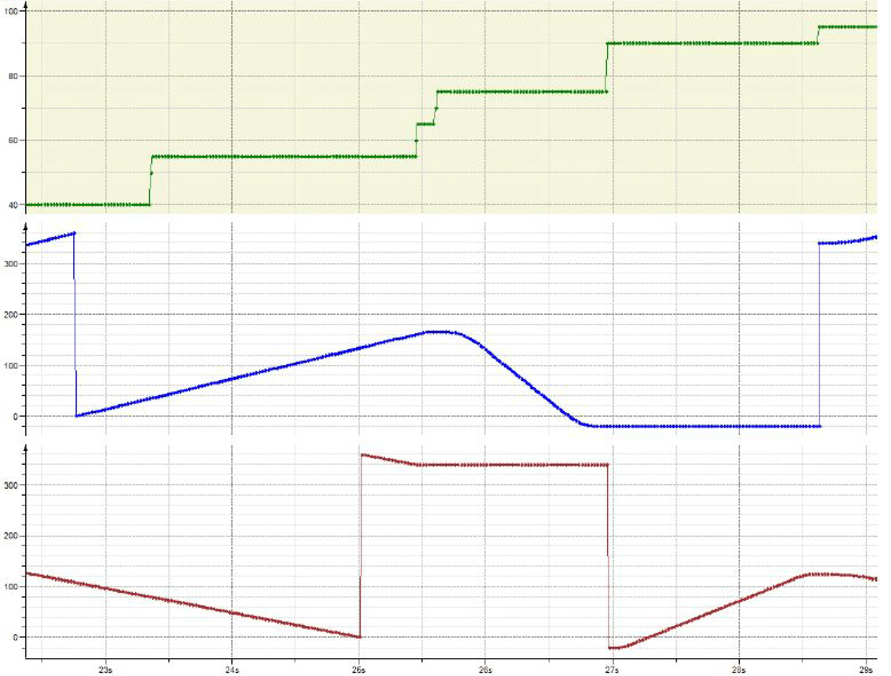

# Using Warm Start

Using Warm Start

Description

The warm start will be explained with the following plot:

The current state (green), the master (blue) and slave (red) position in case of a warm - start.

Assume an SMG running a cam (state 40 – 55) in an endless mode. It gets eventually the stop signal (state 60). Before starting the SMG again the master will be externally moved to another position (state 75). If the correct master - slave mapping is required, the SMG should restart with the warm - start - modus.

Before staring the cam movement, the slave has to be moved to the position that matches to the modified master position. The new master modifies master position - 20 corresponds to 340 (endless feed with interval [0:360]). At the outer left, the running cam maps the master position 340 to a slave position of 123. Thus before starting the master again, the slave has to be moved to the position 123 (state 90). If this position is reached, the master and slave match again and the master can be restarted (state 95).

EIO0000002666.00

© 2018 Schneider Electric. All rights reserved.