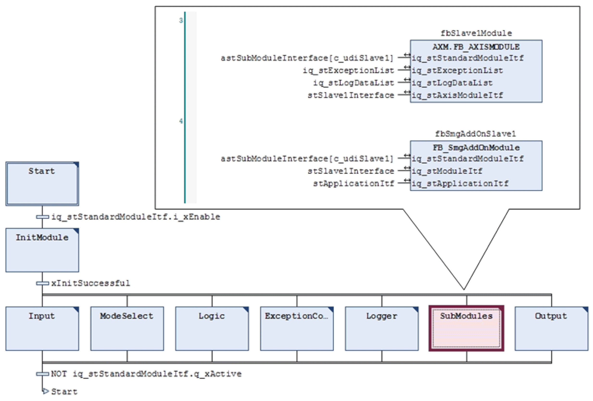
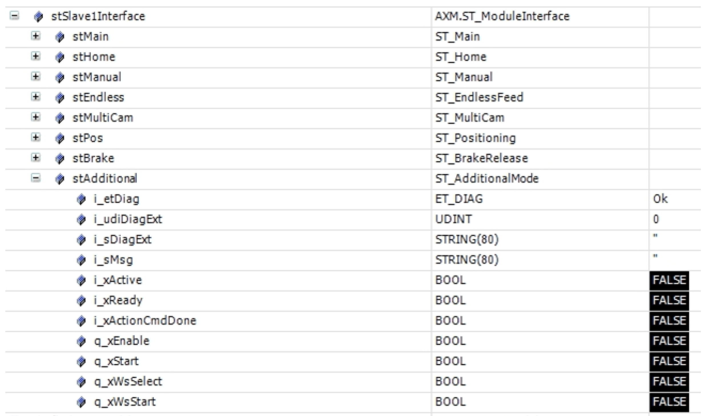
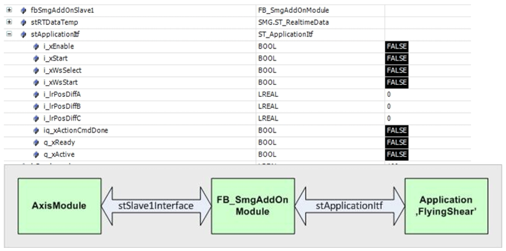
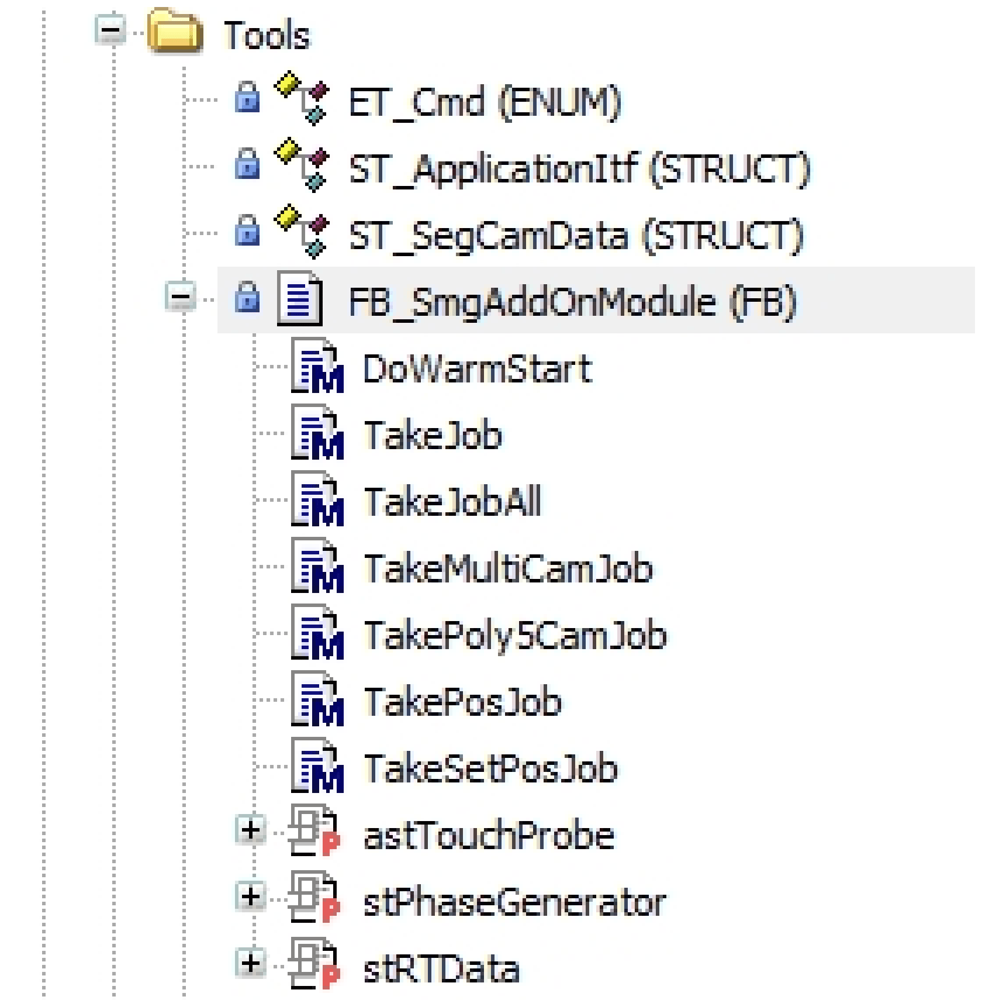

# Demo Project Structure

Demo Project Structure

Calls

Call up of the function block FB\_SmgAddOnModule

The call up of the AxisModule and the FB\_SmgAddOnModule takes place in the action SubModules of the equipment module SR\_SmgAddOnModule.

Call up of the application example

The call up of the application example is performed in the action Logic of the equipment module SR\_SmgAddOnModule.

As example a flying saw was implemented here:

Function Block FB\_SmgAddOnModule

The function block FB\_SmgAddOnModule is called in the AdditionalMode of the AxisModule. It is an application function block that is provided in the demo project SmgAddOnModuleExample.

NOTE: In the present demo project the functional range of the FB\_SmgAddOnModule is designed for the example of a flying saw.

If the functional range for the application is not enough then it can be extended.

Task

The function block FB\_SmgAddOnModule has the following tasks:

oControl and communication between application and AxisModule:

oThe control of the FB\_SmgAddOnModule takes place via the default variable stSlave1In­terface ([AXM.ST\_ModuleInterface](../../../../../../api/crossBook?lang=en-US&virtualBookName=PD.Lib.AxisModule&topicID=D_SE_0077227_1)).

oThe module is brought into the operation mode and started (see action Init\_CmdTables) via the default commands:

stAutoTable[udiStepIndex].sTitle: = "Additional Mode Slave1";

stAutoTable[udiStepIndex].udiModuleName: = c\_udiSlave1;

stAutoTable[udiStepIndex].diStep: = diStep;

stAutoTable[udiStepIndex].diCMD: = AXM.Et\_Cmd.AdditionalWs;

stAutoTable[udiStepIndex].timTimeOut: = T#0MS;

stAutoTable[udiStepIndex].xEndCMD: =FALSE;

oThe control of the application example from the FB\_SmgAddOnModule takes place via the user variable stApplicationItf (ST\_ApplicationItf).

The previous figure shows the ways of communication between the AxisModule, the FB\_SmgAddOnModule and the flying saw application.

oActivating and monitoring the SMG:

With an internal state machine the function block is brought into its readiness for operation and thereby it activates the SMG. In addition, data are saved for a potential warm start and diagnostic messages from the application are monitored.

oProviding methods and properties to command the SMG:

Before calling the original SMG methods, the necessary SMG parameters are set in these methods. They are only containers, that decrease the complexity of the SMG functions and parameters. The application is realized with these methods.

Methods and properties

The following methods and properties of the FB\_SmgAddOnModule are available in the demo project SmgAddOnModuleExample:

Method DoWarmStart

This method performs a positioning on the cam position of the currently interrupted cam. For the cam point calculation the master position (iq\_stModuleItf.stMain.i\_ifMaster) is used and calculated in the application period (i\_lrPeriode).

The warm start is only realized for jobs of the [ET\_MotionJobType](../Enumerations/Enumerations-7.htm#XREF_D_SE_0089438_1).ExternalCam type.

These are jobs that were sent via the method TakeMultiCamJob. Otherwise an absolute positioning is started on the position zero.

If necessary, this method can be extended.

| Input | Data type | Description |
| --- | --- | --- |
| i\_lrPeriode | LREAL | Application period based on the master (part lengths) in units |
| i\_lrVelocity | LREAL | Maximum warm start velocity in units/s |
| i\_lrAcceleration | LREAL | Maximum acceleration in units/s2 |
| i\_lrDeceleration | LREAL | Maximum deceleration in units/s2 |
| i\_lrJerk | LREAL | Maximum jerk in units/s3 |

Method TakeJob

With this method the original method [TakeJob](../Function_Blocks/Function_Blocks-20.htm#XREF_D_SE_0089467_1) is called directly. It is used for jobs where the user requires full access to all the job relevant parameters and functions.

| Input | Data type | Description |
| --- | --- | --- |
| i\_etChannel | [ET\_Channel](../Enumerations/Enumerations-3.htm#XREF_D_SE_0089430_1) | Channel, over which the job is performed. |

| Input/Output | Data type | Description |
| --- | --- | --- |
| iq\_stMotionJob | [ST\_MotionJob](../Structures/Structures-6.htm#XREF_D_SE_0089488_1) | ST\_MotionJob contains all the job relevant data. |

Method TakeJobAll

With this method the original method [TakeJobAll](../Function_Blocks/Function_Blocks-21.htm#XREF_D_SE_0089468_1) is called directly. It is used for jobs where the user requires full access to all the parameters and functions.

| Input/Output | Data type | Description |
| --- | --- | --- |
| iq\_stMotionJobA | [ST\_MotionJob](../Structures/Structures-6.htm#XREF_D_SE_0089488_1) | ST\_MotionJob for the channel A |
| iq\_stMotionJobB | [ST\_MotionJob](../Structures/Structures-6.htm#XREF_D_SE_0089488_1) | ST\_MotionJob for the channel B |
| iq\_stMotionJobC | [ST\_MotionJob](../Structures/Structures-6.htm#XREF_D_SE_0089488_1) | ST\_MotionJob for the channel C |

Method TakeMultiCamJob

This method uses a default MultiCam structure as input, builds a segmented profile out of it ([ET\_MotionJobType](../Enumerations/Enumerations-7.htm#XREF_D_SE_0089438_1).ExternalCam) and passes it on to the SMG as job. Per channel, maximum three such jobs can be buffered. A buffer of two is normally enough to achieve a jerkfree transition between two cams.

| Input | Data type | Description |
| --- | --- | --- |
| i\_etChannel | [ET\_Channel](../Enumerations/Enumerations-3.htm#XREF_D_SE_0089430_1) | Channel, over which the job shall be performed. |
| i\_diJobId | DINT | During the execution this JobId is displayed in the variable stRTDataTemp.stChannel\_x.diCurrentJobId. |
| i\_etCamLimitMode | [ET\_CamMode](../Enumerations/Enumerations-2.htm#XREF_D_SE_0089428_1) | Abort criterion of the cam job, for example ET\_CamMode.Endless |
| i\_etSlaveSetPosMode | [ET\_SetposMode](../Enumerations/Enumerations-11.htm#XREF_D_SE_0089446_1) | SetPos job type, for example ET\_SetposMode.Absolute |
| i\_lrSlaveSetposValue | LREAL | Value on which the slave axis is set to when the job is started. |
| i\_etMasterSetPosMode | [ET\_SetposMode](../Enumerations/Enumerations-11.htm#XREF_D_SE_0089446_1) | SetPos job type, for example ET\_SetposMode.Absolute |
| i\_lrMasterSetposValue | LREAL | Value on which the logical master axis is set to when the job is started. |
| i\_xClearBufferedJobs | BOOL | TRUE = Deletes all the buffered jobs during the start.  FALSE = The new job is put to the very last place in the buffer. |
| i\_xTerminateCurrentJob | BOOL | TRUE = Cancels a possible active job during the start.  FALSE = The new job is buffered when another job is active. |

| Input/Output | Data type | Description |
| --- | --- | --- |
| iq\_stMultiCamData | [PDL.ST\_MultiCam](../../../../../../api/crossBook?lang=en-US&virtualBookName=PD.Lib.PacDriveLib&topicID=D_SE_0087770_1) | MultiCam structure |

Method TakePoly5CamJob

Starts a polynomial of the 5th degree with variable initial- and accumulated values.

| Input | Data type | Description |
| --- | --- | --- |
| i\_etChannel | [ET\_Channel](../Enumerations/Enumerations-3.htm#XREF_D_SE_0089430_1) | Channel, over which the job shall be performed. |
| i\_diJobId | DINT | During the execution this JobId is displayed in the variable stRTDataTemp.stChannel\_x.diCurrentJobId. |
| i\_etCamLimitMode | [ET\_CamMode](../Enumerations/Enumerations-2.htm#XREF_D_SE_0089428_1) | Abort criterion of the cam job, for example ET\_CamMode.Endless |
| i\_etSlaveSetPosMode | [ET\_SetposMode](../Enumerations/Enumerations-11.htm#XREF_D_SE_0089446_1) | SetPos job type, for example ET\_SetposMode.Absolute |
| i\_lrSlaveSetposValue | LREAL | Value on which the slave axis is set to when the job is started. |
| i\_etMasterSetPosMode | [ET\_SetposMode](../Enumerations/Enumerations-11.htm#XREF_D_SE_0089446_1) | SetPos job type, for example ET\_SetposMode.Absolute |
| i\_lrMasterSetposValue | LREAL | Value on which the logical master axis is set to when the job is started. |
| i\_lrXStart | LREAL | X value of the cam at the start point |
| i\_lrYStart | LREAL | Y value of the cam at the start point |
| i\_lrMStart | LREAL | Gradient of the cam at the start point |
| i\_lrKStart | LREAL | Curvature of the cam at the start point |
| i\_lrXEnd | LREAL | X value of the cam at the end point |
| i\_lrYEnd | LREAL | Y value of the cam at the end point |
| i\_lrMEnd | LREAL | Gradient of the cam at the end point |
| i\_lrKEnd | LREAL | Curvature of the cam at the end point |
| i\_xClearBufferedJobs | BOOL | TRUE = Deletes all the buffered jobs during the start.  FALSE = The new job is put to the very last place in the buffer. |
| i\_xTerminateCurrentJob | BOOL | TRUE = Cancels a possible active job during the start.  FALSE = The new job is buffered when another job is active. |

Method TakePosJob

Starts a positioning with the specified parameters.

| Input | Data type | Description |
| --- | --- | --- |
| i\_etChannel | [ET\_Channel](../Enumerations/Enumerations-3.htm#XREF_D_SE_0089430_1) | Channel, over which the job shall be performed. |
| i\_diJobId | DINT | During the execution this JobId is displayed in the variable stRTDataTemp.stChannel\_x.diCurrentJobId. |
| i\_etPosMode | [ET\_PosMode](../Enumerations/Enumerations-9.htm#XREF_D_SE_0089442_1) | Positioning mode, for example ET\_PosMode.Relative |
| i\_lrPosition | LREAL | Target position or distance |
| i\_lrVelocity | LREAL | Maximum velocity in units/s |
| i\_lrAcceleration | LREAL | Maximum acceleration in units/s2 |
| i\_lrDeceleration | LREAL | Maximum deceleration in units/s2 |
| i\_lrJerk | LREAL | Maximum jerk in units/s3 |
| i\_lrDelay | LREAL | Start delay in ms |
| i\_xClearBufferedJobs | BOOL | TRUE = Deletes all the buffered jobs during the start.  FALSE = The new job is put to the very last place in the buffer. |
| i\_xTerminateCurrentJob | BOOL | TRUE = Cancels a possible active job during the start.  FALSE = The new job is buffered when another job is active. |

Method TakeSetPosJob

Changes the position of a channel. The axis position is equivalent again with the sum of all the channels after the Setpos.

| Input | Data type | Description |
| --- | --- | --- |
| i\_etChannel | [ET\_Channel](../Enumerations/Enumerations-3.htm#XREF_D_SE_0089430_1) | Channel, over which the job shall be performed. |
| i\_diJobId | DINT | During the execution this JobId is displayed in the variable stRTDataTemp.stChannel\_x.diCurrentJobId. |
| i\_etPosMode | [ET\_PosMode](../Enumerations/Enumerations-9.htm#XREF_D_SE_0089442_1) | Positioning mode, for example ET\_PosMode.Relative |
| i\_lrValue | LREAL | Value to which the position of a channel is set or value to which the position of a channel is moved to. |

Properties

| Name | Data type | Accessing | Description |
| --- | --- | --- | --- |
| stRTData | [ST\_RealtimeData](../Structures/Structures-15.htm#XREF_D_SE_0089506_1) | Read | In this property feedback values from the SMG are provided (see [ST\_RealtimeData](../Structures/Structures-15.htm#XREF_D_SE_0089506_1) and [ST\_RealtimeChannel](../Structures/Structures-14.htm#XREF_D_SE_0089504_1)). But before they can be used, they have to be copied into a local variable:  stRTDataTemp:=fbSmgAddOnSlave1.strData;  This copying procedure is performed in the application example. |
| astTouchProbe | [ST\_Touchprobe](../Structures/Structures-17.htm#XREF_D_SE_0089510_1) | Read/Write | This property also refers to a SMG variable. But it is not used in the application example flying saw. (See also [ST\_Touchprobe](../Structures/Structures-17.htm#XREF_D_SE_0089510_1)). |
| stPhaseGenerator | [ST\_PhaseGenerator](../Structures/Structures-8.htm#XREF_D_SE_0089492_1) | Read/Write | This property also refers to a SMG variable. But it is not used in the application example flying saw. (See also [ST\_PhaseGenerator](../Structures/Structures-8.htm#XREF_D_SE_0089492_1)). |

EIO0000002666.00

© 2018 Schneider Electric. All rights reserved.