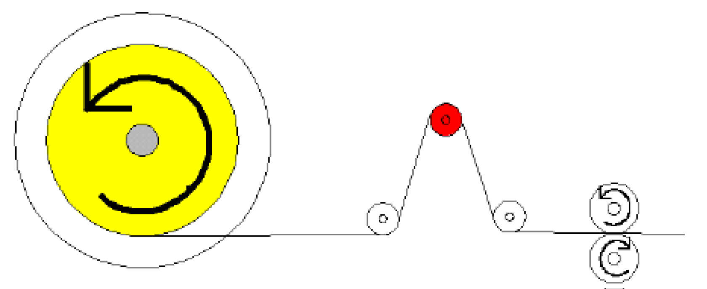

# Mechanic Without a Dancer

Mechanic Without a Dancer

Overview

Mechanic without a dancer

The unwinder can also be operated without a dancer. In this case, a sensor is required to measure the foil tension. The unwinder controls the bobbin, to keep the tension constant. Radius calculations, splicing and masterless operations are not supported with mechanics that have no dancer.

Start Movement

[Torque](../Structures/Structures-5.htm#XREF_D_SE_0077367_1)

This mode is for mechanics without a dancer. The unwinder moves backwards to increase the tension of the foil. As soon as the user-defined threshold (ST\_StartMovement­Torque.i\_lrStartThreshold) is reached, the automatic mode starts.

To use the torque mode, some parameters of the drive have to be modified.

oPos\_P\_Gain: 0.0

oVel\_P\_Gain: 0.0

oVel\_I\_Gain: 0.0

oVelFilter: 0.0

oCurrRefFilter: 0.0

oAdditionalIDNListMDT: P-0-1069.0.0

EIO0000002287.00

© 2018 Schneider Electric. All rights reserved.