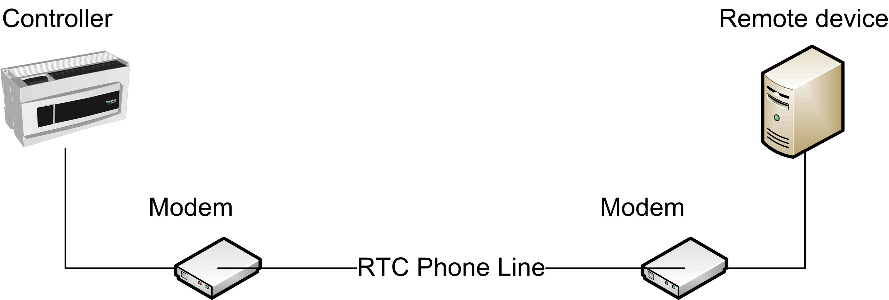
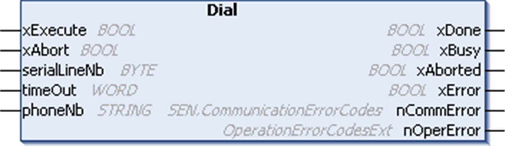
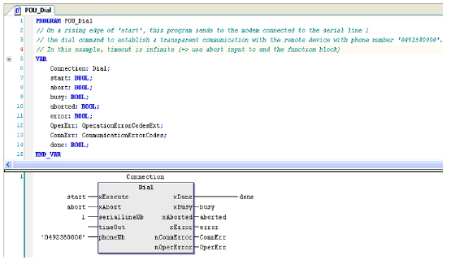

# Dial: Open Transparent Communications

Dial: Open Transparent Communications

Introduction

The controller can establish communications through a modem to a remote device with the Dial function block:

NOTE: Transparent communications are also possible using a GSM modem.

The Dial function block executes the Dial command to establish transparent communication between modems. Once xDone is TRUE, communication can start with the configured protocol (Modbus, EcoStruxure Machine Expert, or ASCII).

Graphical Representation

I/O Variables Description

| Input | Type | Description |
| --- | --- | --- |
| phoneNb | STRING | The phoneNb input contains the phone number of the modem being called. |

NOTE: [The input and output parameters that are common to all modem library function blocks are described elsewhere](../SoMachine_modem_FB_Comm._Principles/SoMachine_modem_FB_Comm_Principles-3.htm#XREF_D_SE_0003334_6).

Example

This figure shows the declaration and use of the Dial function:

EIO0000000552.05

© 2019 Schneider Electric. All rights reserved.