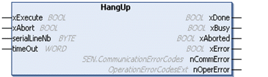

# HangUp: Close Transparent Communications

HangUp: Close Transparent Communications

Introduction

The HangUp function allows a controller to close a previously opened connection.

Graphical Representation

I/O Variables Description

The input and output parameters in the HangUp function block are those that are common to all modem library function blocks. [They are described elsewhere](../SoMachine_modem_FB_Comm._Principles/SoMachine_modem_FB_Comm_Principles-3.htm#XREF_D_SE_0003334_6).

EIO0000000552.05

© 2019 Schneider Electric. All rights reserved.