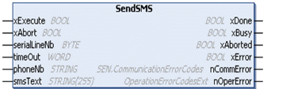
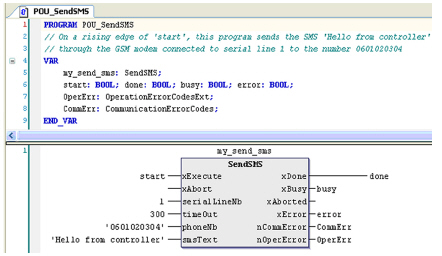

# SendSMS: Send SMS

SendSMS: Send SMS

Introduction

The SendSMS function block is used to establish a connection with a GSM modem and send an SMS to a specified receiver. For example, the controller can send [SMS](../glossary/glossary.htm#XREF_D_SE_0024697_386) when a trigger is raised to transmit an alarm to a specified cell phone:

NOTE:

Be sure to have your GSM modem properly configured as follows:

oMake sure the SIM card in the modem is unlocked.

oMake sure the telephone number of the SMS center is valid.

You can use the ConfigSim function block to properly set these parameters from your application program.

Graphical Representation

I/O Variables Description

| Input | Type | Description |
| --- | --- | --- |
| phoneNb | STRING | The phoneNb input contains the phone number of the receiver. |
| smsText | STRING(255) | The smsText input contains the body of the text message (255-character maximum). |

[The input and output parameters that are common to all modem library function blocks are described elsewhere](../SoMachine_modem_FB_Comm._Principles/SoMachine_modem_FB_Comm_Principles-3.htm#XREF_D_SE_0003334_6).

Example

This figure shows the declaration and use of the ReceiveSMS function:

EIO0000000552.05

© 2019 Schneider Electric. All rights reserved.