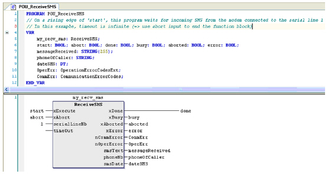

# ReceiveSMS: Receive SMS

ReceiveSMS: Receive SMS

Introduction

The ReceiveSMS function block is used to wait for [SMS](../glossary/glossary.htm#XREF_D_SE_0024697_386) received by a GSM Modem. For example, the controller can handle a command received in SMS from a specified cell phone.

NOTE:

Be sure to have your GSM modem properly configured as follows:

oMake sure the SIM card in the modem is unlocked.

oMake sure the telephone number of the SMS center is valid.

You can use the ConfigSim function block to properly set these parameters from your application program.

Graphical Representation

I/O Variables Description

| Output | Type | Description |
| --- | --- | --- |
| smsText | STRING(255) | The smsText output contains the body of the text message. |
| phoneNb | STRING | The phoneNb output contains the number of the phone that sent the SMS. |
| smsDate | DATE\_AND\_TIME | The smsDate output contains the date of the communication. |

[The input and output parameters that are common to all modem library function blocks are described elsewhere](../SoMachine_modem_FB_Comm._Principles/SoMachine_modem_FB_Comm_Principles-3.htm#XREF_D_SE_0003334_6).

Example

This figure shows the declaration and use of the ReceiveSMS function

EIO0000000552.05

© 2019 Schneider Electric. All rights reserved.