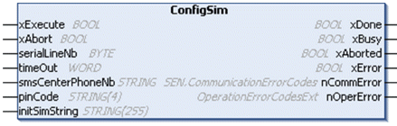

# GSM Modem SIM Card Services

GSM Modem SIM Card Services

ConfigSim

Introduction

Before using any other function block in the MODEM library, use the ConfigSim function block only when your GSM modem’s SIM card requires one of these:

oEnter the PIN code.

oConfigure the SMS center phone number.

oSend an initialization command.

You can then directly use one of the dedicated SMS function blocks.

Different commands are sent to the GSM Modem according to this flowchart:

|  |
| --- |
| Warning_Color.gifWARNING |
| UNINTENDED EQUIPMENT OPERATION |
| If an SR2MOD03 modem with a SIM card protected by a PIN code is used, the default initialization string must be modified in the Modem configuration editor. Replace the value of the Hayes Reset Command with this:  'AT&F;E0;S0=2;Q0;V1;+WIND=0;+CBST=0,0,1;&W'  and use the ConfigSim function block to send an additional initialization command with this:  InitSimString input = 'AT+CMGF=1;+CNMI=0,2,0,0,0;+CSAS'. |
| Failure to follow these instructions can result in death, serious injury, or equipment damage. |

Graphical Representation

I/O Variables Description

| Input | Type | Description |
| --- | --- | --- |
| smsCenterPhoneNb | STRING | The smsCenterPhoneNb input contains the phone number of the SMS center to be configured in the SIM card. When empty, the SMS center phone number is not sent and the modem uses the actual number. |
| pinCode | STRING(4) | The pinCode input represents the SIM card’s PIN code to be sent to unlock the SIM card. When pinCode is empty, no PIN code is sent. |
| initSimString | STRING(255) | The initSimString input represents the initialization string of the SIM card that is sent after the PIN and service center phone number have been sent.  NOTE: For SR2MOD03, use this:  'AT+CMGF=1;+CNMI=0,2,0,0,0;+CSAS' |

[The input and output parameters that are common to all modem library function blocks are described elsewhere](../SoMachine_modem_FB_Comm._Principles/SoMachine_modem_FB_Comm_Principles-3.htm#XREF_D_SE_0003334_6).

Example

This figure shows the declaration and use of the ConfigSim function:

EIO0000000552.05

© 2019 Schneider Electric. All rights reserved.