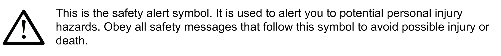

# Important Information

Important Information

NOTICE

Read these instructions carefully, and look at the equipment to become familiar with the device before trying to install, operate, service, or maintain it. The following special messages may appear throughout this documentation or on the equipment to warn of potential hazards or to call attention to information that clarifies or simplifies a procedure.

PLEASE NOTE

Electrical equipment should be installed, operated, serviced, and maintained only by qualified personnel. No responsibility is assumed by Schneider Electric for any consequences arising out of the use of this material.

A qualified person is one who has skills and knowledge related to the construction and operation of electrical equipment and its installation, and has received safety training to recognize and avoid the hazards involved.

QUALIFICATION OF PERSONNEL

A qualified person is one who has the following qualifications:

oSkills and knowledge related to the construction and operation of electrical equipment and the installation.

oKnowledge and experience in industrial control programming.

oReceived safety-related training to recognize and avoid the hazards involved.

The qualified person must be able to detect possible hazards that may arise from parameterization, modifying parameter values and generally from mechanical, electrical, or electronic equipment. The qualified person must be familiar with the standards, provisions, and regulations for the prevention of industrial accidents, which they must observe when designing and implementing the system.

PROPER USE

This product is a library to be used together with the control systems and servo amplifiers intended solely for the purposes as described in the present documentation as applied in the industrial sector.

Always observe the applicable safety-related instructions, the specified conditions, and the technical data.

Perform a risk evaluation concerning the specific use before using the product. Take protective measures according to the result.

Since the product is used as a part of an overall system, you must ensure the safety of the personnel by means of the design of this overall system (for example, machine design).

Any other use is not intended and may be hazardous.

EIO0000002974.01

© 2020 Schneider Electric. All rights reserved.