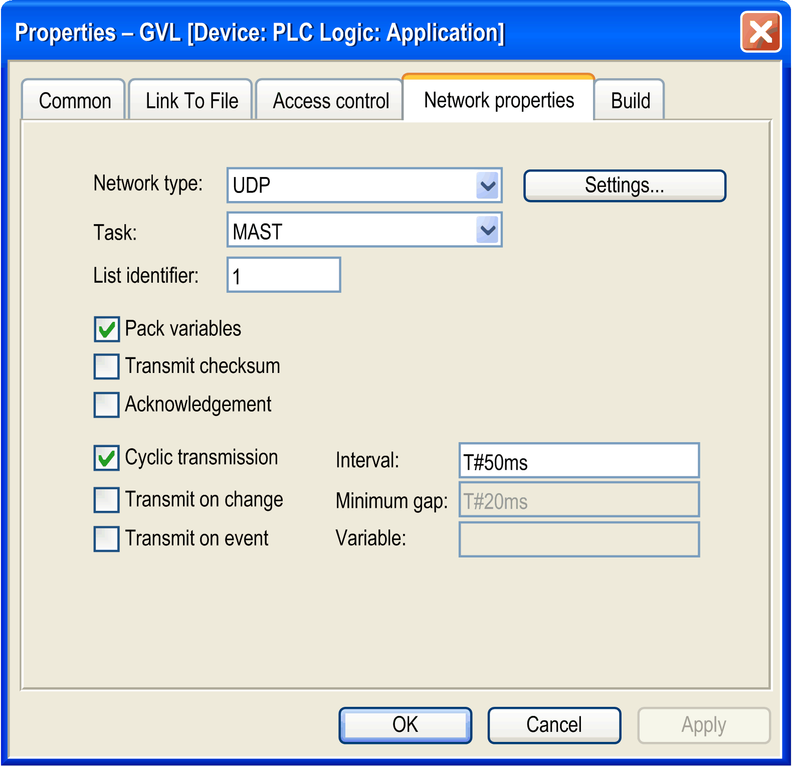
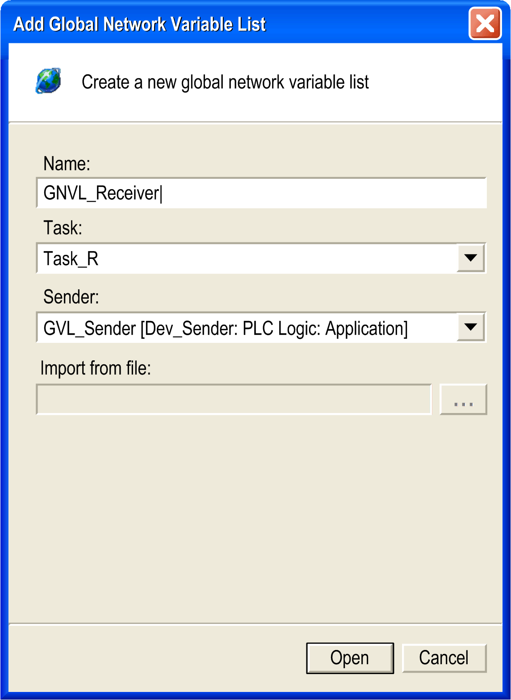

# Configuring the Network Variables Exchange

Configuring the Network Variables Exchange

Overview

To exchange network variables between a sender and a receiver, one sender and one receiver controller must be available in the EcoStruxure Machine Expert Devices tree. These are the controllers that are assigned the network properties described below.

Proceed as follows to configure the network variables list:

| Step | Action |
| --- | --- |
| 1 | Create a sender and a receiver controller in the Devices tree. |
| 2 | Create a program (POU) for the sender and receiver controller. |
| 3 | Add a task for the sender and receiver controller.  NOTE: In order to maintain performance transparency, you should set the task priority of the dedicated NVL task to something greater than 25, and regulate communications to avoid saturating the network unnecessarily. |
| 4 | Define the global variables list (GVL) for the sender. |
| 5 | Define the global network variables list (GNVL) for the receiver. |

An example with further information is provided in the [Appendix](../NVLlib_Appendix_Examples/NVLlib_Appendix_Examples.htm#XREF_D_SE_0083535_1).

Global Variables List

To create the GVL for the sender, define the following network properties in the GVL > Properties > Network properties dialog box:

Description of parameters

| Parameter | Default Value | Description |
| --- | --- | --- |
| Network type | UDP | Only the standard network type UDP is available.  To change the Broadcast Address and the Port, click the Settings... button. |
| Task | MAST | Select the task you configured below the Task Configuration item for executing NVL code.  To help maintain performance transparency, we recommend to configure a cycle time Interval ≥50 ms for this task.  NOTE: In order to maintain performance transparency, you should set the task priority of the dedicated NVL task to something greater than 25, and regulate communications to avoid saturating the network unnecessarily. |
| List identifier | 1 | Enter a unique number for each GVL on the network. It is used by the receivers for identifying the [variables list](Network_Variables_List_-_NVL-4.htm#XREF_D_SE_0083533_4). |
| Pack variables | activated | With this option activated, the variables are bundled in packets (datagrams) for transmission.  If this option is deactivated, one packet per variable is transmitted. |
| Transmit checksum | deactivated | Activate this option to add a checksum to each packet of variables during transmission.  Receivers will then check the checksum of each packet they receive and will reject those with a non-matching checksum. A notification will be issued with the NetVarError\_CHECKSUM [parameter](Network_Variables_List_-_NVL-6.htm#XREF_D_SE_0020072_6). |
| Acknowledgement | deactivated | Activate this option to prompt the receiver to send an acknowledgement message for each data packet it receives.  A notification will be issued with the NetVarError\_ACKNOWLEDGE [parameter](Network_Variables_List_-_NVL-6.htm#XREF_D_SE_0020072_6) if the sender does not receive this acknowledgement message from the receiver before it sends the next data packet. |
| Cyclic transmission  oInterval | activated | Select this option for cyclic data transmission at the defined Interval.  This Interval should be a multiple of the cycle time you defined in the task for executing NVL code to achieve a precise transmission time of the network variables. |
| Transmit on change  oMinimum gap | deactivated  oT#20ms | Select this option to transmit variables whenever their values have changed.  NOTE: After the first download or using of Reset Cold or Reset Warm command in Online Mode the receiver controllers are not updated and keep their last value, whereas the sender controller value becomes 0 (zero).  The Minimum gap parameter defines a minimum time span that has to elapse between the data transfer. |
| Transmit on event  oVariable | deactivated  o– | Select this option to transmit variables as long as the specified Variable equals TRUE. The variable is checked with every cycle of the task for executing NVL code. |

Description of the button Settings...

| Parameter | Default Value | Description |
| --- | --- | --- |
| Port | 1202 | Enter a unique port number (≥ 1202) for each GVL sender. |
| Broadcast Address | 255.255.255.255 | Enter a specific broadcast IP address for your application. |

Global Network Variables List (GNVL)

A global network variables list can only be added in the Devices tree. It defines variables, which are specified as network variables in another controller within the network.

Thus, a GNVL object can only be added to an application if a global variables list (GVL) with network properties (network variables list) has already been created in one of the other network controllers. These controllers may be in the same or different projects.

To create the GNVL, define the following parameters in the Add Object > Global Network Variable List dialog box:

Description of parameters

| Parameter | Default Value | Description |
| --- | --- | --- |
| Name | NVL | Enter a name for the GNVL. |
| Task | task defined in the Task Configuration node of this Application | Select a task from the list of tasks which will receive the frames from the sender that are available under the Task Configuration node of the receiver controller. |
| Sender | 1 of the GVLs currently available in the project | Select the sender’s GVL from the list of all sender GVLs with network properties currently available in the project.  Select the entry Import from file from the list to use a GVL from another project. This activates the Import from file: parameter below. |
| Import from file: | – | This parameter is only available after you selected the option Import from file for the parameter Sender.  The ... opens a standard Windows Explorer window that allows you to browse to the export file \*.gvl you created from a GVL in another project.  For further information refer to the How to Add a GNVL From a Different Project paragraph below. |

How to Add a GNVL in the Same Project

When you add a GNVL via the Add Object dialog box, all appropriate GVLs that are found within the current project for the current network are provided for selection in the Sender list box. GVLs from other projects must be imported (see the How to Add a GNVL From a Different Project paragraph below).

Due to this selection, each GNVL in the current controller (sender) is linked to 1 specific GVL in another controller (receiver).

Additionally, you have to define a name and a task, that is responsible for handling the network variables, when adding the GNVL.

How to Add a GNVL From a Different Project

Alternatively to directly choosing a sender GVL from another controller, you can also specify a GVL export file you had generated previously from the GVL by using the Link to file properties. This allows you to use a GVL that is defined in another project.

To achieve this, select the option Import from file for the Sender: parameter and specify the path in the Import from file: parameter.

You can modify the settings later on via the Properties - GVL dialog box.

GNVL Properties

If you double-click a GNVL item in the Devices tree, its content will be displayed on the right-hand side in an editor. But the content of the GNVL cannot be edited, because it is only a reference to the content of the corresponding GVL. The exact name and the path of the sender that contains the corresponding GVL is indicated at the top of the editor pane together with the type of network protocol used. If the corresponding GVL is changed, the content of the GNVL is updated accordingly.

EIO0000002974.01

© 2020 Schneider Electric. All rights reserved.