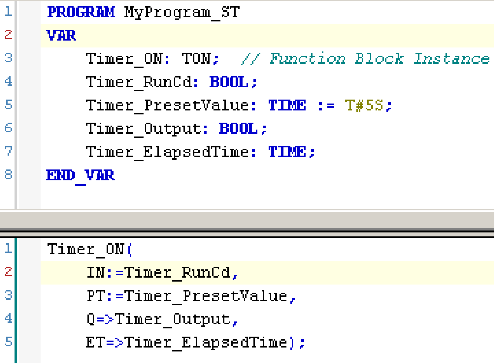

# Differences Between a Function and a Function Block

Differences Between a Function and a Function Block

Function

A function:

ois a POU (Program Organization Unit) that returns one immediate result.

ois directly called with its name (not through an instance).

ohas no persistent state from one call to the other.

ocan be used as an operand in other expressions.

Examples: boolean operators (AND), calculations, conversion ([BYTE](../glossary/glossary.htm#XREF_D_SE_0024697_646)\_TO\_[INT](../glossary/glossary.htm#XREF_D_SE_0024697_142))

Function Block

A function block:

ois a POU (Program Organization Unit) that returns one or more outputs.

oneeds to be called by an instance (function block copy with dedicated name and [variables](../glossary/glossary.htm#XREF_D_SE_0024697_600)).

oeach instance has a persistent state (outputs and internal variables) from one call to the other from a function block or a program.

Examples: timers, counters

In the example, Timer\_ON is an instance of the function block TON:

EIO0000002791.00

© 2019 Schneider Electric. All rights reserved.