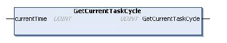

# GetCurrentTaskCycle: Gets the Current Cyclic Task Interval

GetCurrentTaskCycle: Gets the Current Cyclic Task Interval

Function Description

This function returns an operation diagnostic and the current interval of the task attached Cyclic Task in microseconds (μs).

Graphical Representation

IL and ST Representation

To see the general representation in IL or ST language, refer to the chapter[Function and Function Block Representation](../Function_and_Function_Block_Representation/Function_and_Function_Block_Representation-1.htm#XREF_D_SE_0002384_1).

I/O Variables Description

The following table describes the output variable:

| Output | Type | Description |
| --- | --- | --- |
| GetCurrentTaskCycle | UDINT | Function operation diagnostic:  0 = No error detected or Non Cyclic Task  2 = Invalid parameter detected  12 = Function not implemented in the controller |

The following table describes the input/output variable:

| Input/Output | Type | Description |
| --- | --- | --- |
| currentTime | UDINT | Current interval of the POU attached Task in microseconds (μs).  NOTE: Returns 0 if an error has been detected. |

NOTE: If this function is called in POU attached to a non Cyclic Task, the function returns 0 and currentTime is set to 0.

Example

The following example describes how to get the current interval of the Cyclic Task attached to a POU GetTaskInterval in ST language. If a function operation error is detected, a diagnostic flag is set to TRUE and the error code is stored.

If no error detected, the diagnostic flag is set to FALSE and the valid task interval is stored.

Variable declaration:

PROGRAM GetTaskInterval

VAR

  // Last Task interval

  TaskInterval: UDINT := 0;

  // Last valid Task interval

  TaskInterval\_Memo: UDINT := 0;

  // GetCurrentTaskCycle function operation diagnostic

  GetTaskCycle\_Diag: UDINT := 0;

  // Memorisation of last GetCurrentTaskCycle detected error

  code

  GetTaskCycle\_Diag\_Memo: UDINT := 0;

  // GetCurrentTaskCycle error detected flag

  GetTaskCycle\_Err: BOOL := FALSE;

END\_VAR

Program:

// Get the last Cyclic Task interval

GetTaskCycle\_Diag:=GetCurrentTaskCycle(TaskInterval);

// Check diagnostic

IF TaskInterval=0 OR GetTaskCycle\_Diag<>0

  THEN // Error detected

  GetTaskCycle\_Diag\_Memo:=GetTaskCycle\_Diag;

  GetTaskCycle\_Err:=TRUE;

  ELSE // Valid Task interval

  TaskInterval\_Memo:=TaskInterval;

  GetTaskCycle\_Err:=FALSE;

END\_IF;

EIO0000000946.03

© 2020 Schneider Electric. All rights reserved.