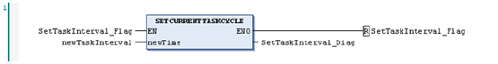
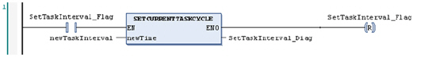

# SetCurrentTaskCycle: Sets the Cyclic Task Interval

SetCurrentTaskCycle: Sets the Cyclic Task Interval

Function Description

This function sets the Cyclic Task interval with the input parameter value in microseconds (μs) and returns an operation diagnostic. If the operation has been executed successfully, the new interval is valid at the start of the next iteration of the Cyclic Task (no effect on the current execution).

NOTE: The value passed to the function must be a multiple of a thousand. If not, an error code will be returned.

If you define an interval for a Cyclic Task that is too short (shorter than the effective duration of the task and any other processing required by the application), it will repeat immediately after the write of the outputs without executing other lower priority tasks or any system processing. This will affect the execution of all tasks and cause the controller to exceed the system watchdog limits, generating a system watchdog exception and stopping your controller.

|  |
| --- |
| NOTICE |
| UNINTENDED INTERRUPTION OF PROGRAM EXECUTION |
| Test your new Cyclic Task interval time to validate that is appropriate to prevent a system watchdog exception before calling the SetCurrentTaskCycle function. |
| Failure to follow these instructions can result in equipment damage. |

NOTE: You must test the possible range of values prior to commissioning your application, and be sure your code validates the new interval to those test conditions.

Graphical Representation

IL and ST Representation

To see the general representation in IL or ST language, refer to the chapter[Function and Function Block Representation](../Function_and_Function_Block_Representation/Function_and_Function_Block_Representation-1.htm#XREF_D_SE_0002384_1).

I/O Variables Description

The following table describes the input variable:

| Input | Type | Description |
| --- | --- | --- |
| newTime | UDINT | New value of the POU attached Task interval in microseconds (μs).  NOTE: If valid, the new value is operational at next cycle. |

The following table describes the output variable:

| Output | Type | Description |
| --- | --- | --- |
| SetCurrentTaskCycle | UDINT | Function operation diagnostic:  0 = No error detected  1 = General (internal) error detected  2 = Invalid parameter detected (out of range value)  12 = Function not implemented in the controller  24 = Functionality not supported (for example non Cyclic Task) |

NOTE: This function changes the current Cyclic Task interval. It does not override the Cyclic Task interval parameter value set in the task configuration. Initial configuration parameters are restored on Reset, Reboot or Download command.

Refer to your controller programming guide for more information about your controller states and behaviors.

NOTE: Do not use the SetCurrentTaskCycle function in the same task defined as the CANopen managers bus cycle task. Changing the cycle time of this task will affect the heartbeat or the nodeguarding, possibly causing the CANopen devices to detect an error and pass into a fallback state.

|  |
| --- |
| Caution_Color.gifCAUTION |
| UNINTENDED INTERRUPTION OF PROGRAM EXECUTION |
| Do not use the SetCurrentTaskCycle function in any task defined as a bus cycle task. |
| Failure to follow these instructions can result in injury or equipment damage. |

Example

The following example describes how to set the current interval of the Cyclic Task attached to a POU SetTaskInterval in CFC, FBD or LD language.

The function SetCurrentTaskCycle is executed when the flag SetTaskInterval\_Flag is TRUE (this flag is automatically reset to FALSE after execution) and the function operation diagnostic is stored in the SetTaskInterval\_Diag variable.

NOTE:

The function enabling input/output (EN/ENO) is activated:

oIn CFC: right click on the function and select the EN/ENO command.

oIn FBD: add the function with the command Insert Box with EN/ENO of the FBD/LD/IL menu.

oIn LD: switch to FBD view with the View command of the FBD/LD/IL menu, insert the function as described above and switch back to LD view.

Variables declaration:

PROGRAM SetTaskInterval

VAR

  // Set a new Task Interval command flag

  SetTaskInterval\_Flag: BOOL := FALSE;

  // Value of the new Cyclic Task interval value (μs)

  newTaskInterval: UDINT;

  //SetCurrentTaskCycle function operation diagnostic

  SetTaskInterval\_Diag: UDINT := 0;

END\_VAR

Program in CFC language:

Program in FBD language:

Program in LD language:

EIO0000000946.03

© 2020 Schneider Electric. All rights reserved.