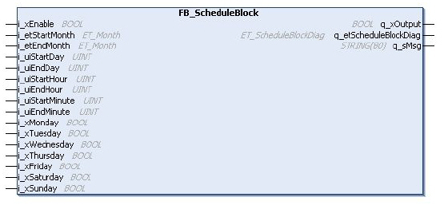
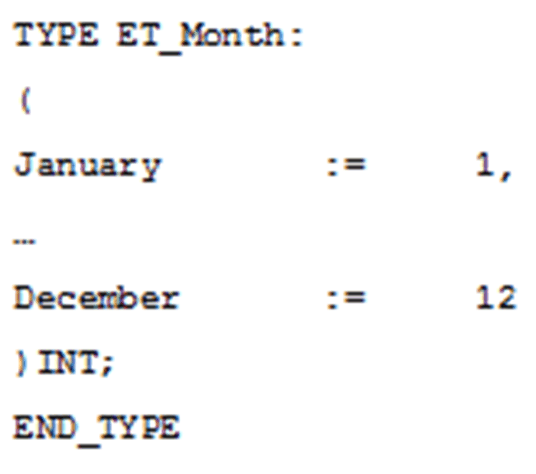
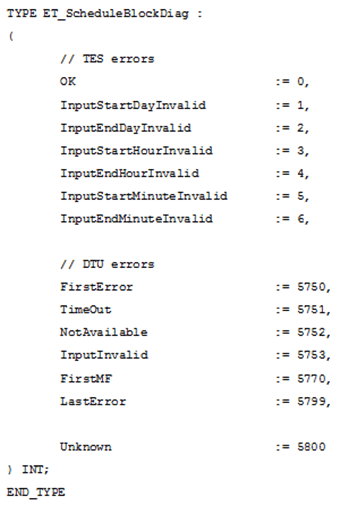

# FB_ScheduleBlock: Schedule Block

FB\_ScheduleBlock: Schedule Block

Overview

The function block FB\_ScheduleBlock is used to control actions at a defined month, day, and time.

The following graphic shows the pin diagram of the function block FB\_ScheduleBlock:

I/O Variables Description

The table describes the input variables of the function block in the TwidoEmulationSupport library:

| Input | Data Type | Description |
| --- | --- | --- |
| i\_xEnable | BOOL | Enable the function block FB\_ScheduleBlock. |
| i\_etStartMonth | ET\_Month | The month to set the output. (January to December). |
| i\_etEndMonth | ET\_Month | The month to reset the output. (January to December). |
| i\_uiStartDay | UINT | [1..31] Activation start day |
| i\_uiEndDay | UINT | [1..31] Activation end day |
| i\_uiStartHour | UINT | [0..23] Activation start hour |
| i\_uiEndHour | UINT | [0..23] Activation end hour |
| i\_uiStartMinute | UINT | [0..59] Activation start minute |
| i\_uiEndMinute | UINT | [0..59] Activation end minute |
| i\_xMonday | BOOL | Run activity on Monday |
| i\_xTuesday | BOOL | Run activity on Tuesday |
| i\_xWednesday | BOOL | Run activity on Wednesday |
| i\_xThursday | BOOL | Run activity on Thursday |
| i\_xFriday | BOOL | Run activity on Friday |
| i\_xSaturday | BOOL | Run activity on Saturday |
| i\_xSunday | BOOL | Run activity on Sunday |

The table describes the output variables of the function block in the TwidoEmulationSupport library:

| Output | Data Type | Description |
| --- | --- | --- |
| q\_xOutput | BOOL | This output is set to 1 when the present date and time are between the setting of the start of the active period and the setting of the end of the active period. |
| q\_etScheduleBlockDiag | ET\_ScheduleBlockDiag | Diagnostic code ET\_ScheduleBlockDiag. |
| q\_sMsg | String | Diagnostic message |

The data structure DTU.ERROR (ENUM) describes errors which occur when using the functions of the CAA\_DtUtility library. Error code range 5750-5799 is reserved for this library in the prefix registration for libraries. For more information, refer to CAA libraries/CAA\_DTUtil.library/Data types/Enumerations/DTU.ERROR (ENUM).

EIO0000002956.00

© 2019 Schneider Electric. All rights reserved.