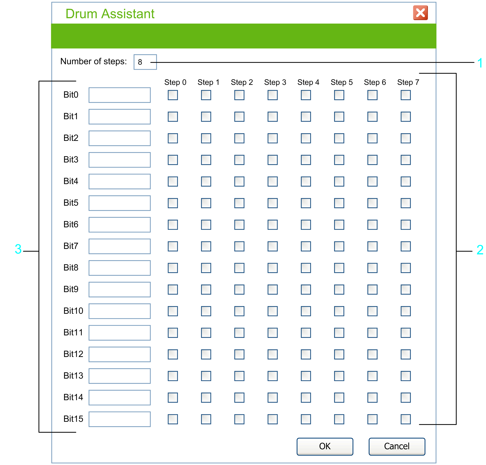
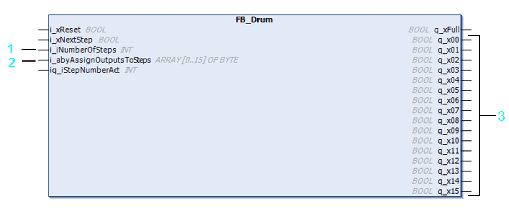

# FB_Drum: Drum Controller

FB\_Drum: Drum Controller

Overview

The drum controller operates on a principle similar to an electromechanical drum controller. The drum can provide up to 8 states which are engaged cyclically. While a rising edge at the input i\_xNextStep turns the drum further, the actual step number can also be set by the software.

Each drum state activates a pattern of up to 16 control bits so that the drum controller represents a kind of state machine.

The following graphic shows the pin diagram of the function block FB\_Drum:

I/O Variables Description

The table describes the input / output variables of the function block in the TwidoEmulationSupport library:

| Input / Output | Data Type | Description |
| --- | --- | --- |
| iq\_iStepNumberAct | INT | Current step number which can be read and written. When written, the effect takes place on the next execution of the function block. |

The table describes the input variables of the function block in the TwidoEmulationSupport library:

| Input | Data Type | Description |
| --- | --- | --- |
| i\_xReset | BOOL | The Reset input sets the drum controller to step 0. |
| i\_xNextStep | BOOL | A rising edge at this input causes the drum controller to advance by one step and updates the control bits. |
| i\_iNumberOfSteps | INT | 1-8 (number of steps) |
| i\_abyAssignOutputsToSteps | ARRAY OF BYTE | Assignment of outputs 0..15 to steps 0..7 |

The table describes the output variables of the function block in the TwidoEmulationSupport library:

| Output | Data Type | Description |
| --- | --- | --- |
| q\_xFull | BOOL | Full output indicates that the current step equals the last step defined. |
| q\_x00 - q\_x15 | BOOL | Outputs or internal bits associated with the step (16 control bits) and defined in the EcoStruxure Machine Expert - Basic Configuration Editor. |

The configuration of FB\_Drum is not a configuration but an entry array of the function block. The following graphic shows the Drum Assistant in EcoStruxure Machine Expert - Basic:

1   Number of steps available in the drum controller (up to 8).

2   A 8x16 bitmask to assign states to all bit outputs (ARRAY [0..15] OF BYTE represents this bitmask).

3   16 bit outputs

New function block in the TwidoEmulationSupport library:

EIO0000002956.00

© 2019 Schneider Electric. All rights reserved.