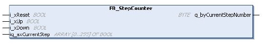

# FB_StepCounter: Step Counter

FB\_StepCounter: Step Counter

Overview

The function block FB\_StepCounter provides a series of steps to which actions can be assigned. Moving from one step to another depends on external or internal events.

The following graphic shows the pin diagram of the function block FB\_StepCounter:

I/O Variables Description

The table describes the input / output variables of the function block in the TwidoEmulationSupport library:

| Input / Output | Data Type | Description |
| --- | --- | --- |
| iq\_axCurrentStep | ARRAY OF BOOL | Step counter bits 0 to 255. |

The table describes the input variables of the function block in the TwidoEmulationSupport library:

| Input | Data Type | Description |
| --- | --- | --- |
| i\_xReset | BOOL | Resets the step counter. |
| i\_xUp | BOOL | Shift to left input increments the step counter by one step, on a rising edge. |
| i\_xDown | BOOL | Shift to right input decrements the step counter by one step, on a rising edge. |

The table describes the output variables of the function block in the TwidoEmulationSupport library:

| Output | Data Type | Description |
| --- | --- | --- |
| q\_byCurrentStepNumber | BYTE | Step counter bits 0 to 255. |

Each time a step is active, the associated bit is set to 1. The step counter can control output bits (memory bits). Only one step of a step counter can be active at a time. If one bit in iq\_axCur­rentStep is set externally, all other bits are reset and q\_byCurrentStepNumber is set accordingly.

EIO0000002956.00

© 2019 Schneider Electric. All rights reserved.