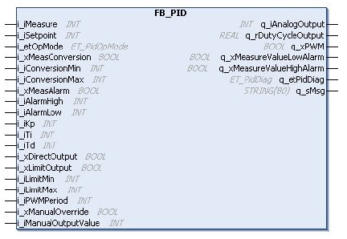
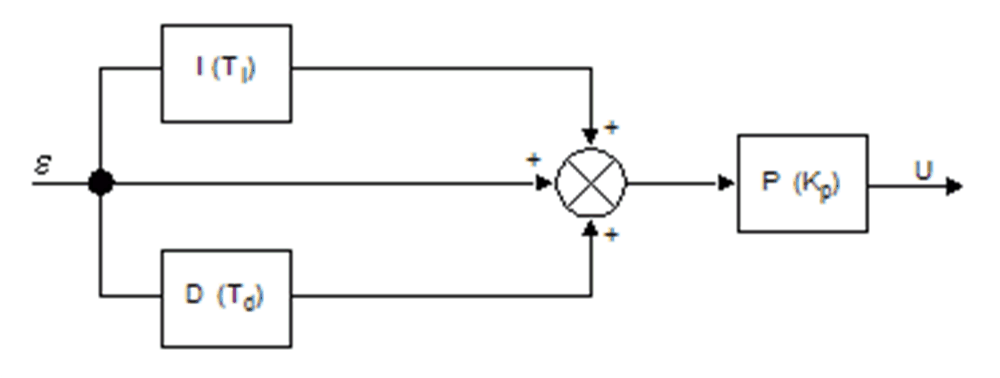
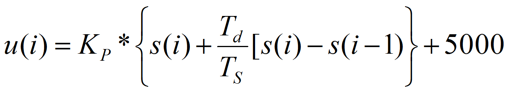
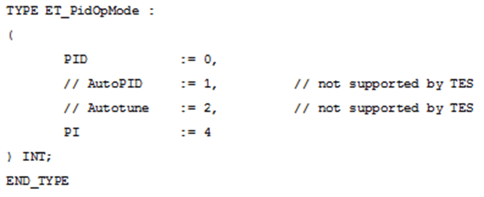
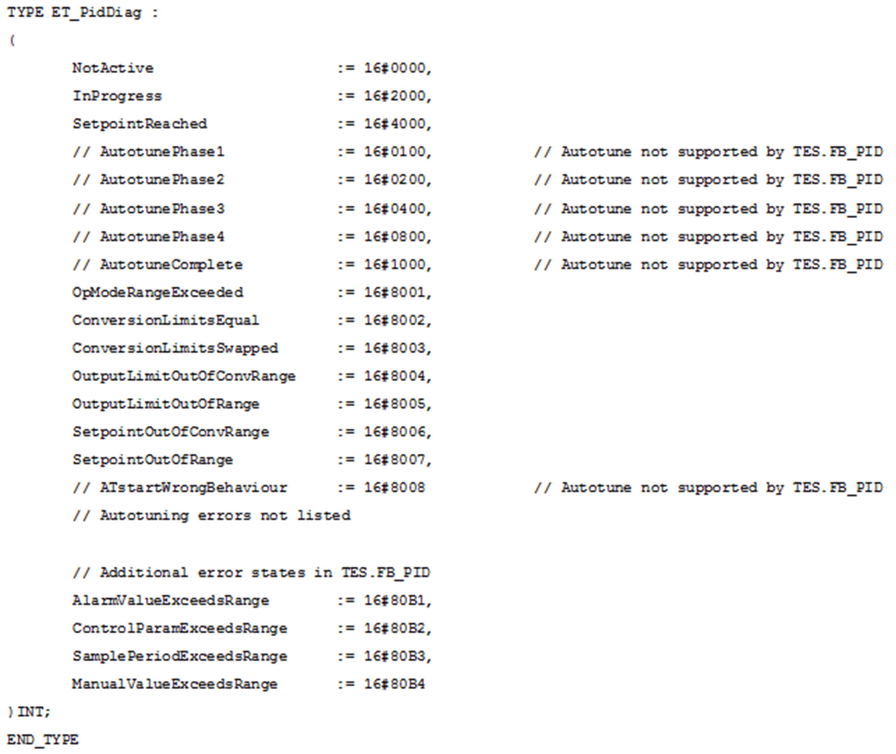

# FB_PID: PID Function Block

FB\_PID: PID Function Block

Overview

The function block FB\_PID provides a [PID](../glossary/glossary.htm#XREF_D_SE_0024697_347) controller.

The following graphic shows a pin diagram of the function block FB\_PID:

The main algorithm is represented by the following flow chart:

The main algorithm is calculated as:

While a derivative time constant of Td=0 will disable the derivative branch of the PID controller, a proportional gain Kp of 0 is prohibited. This would result in a gain of 100%.

Setting the integral time constant Ti=0 will switch to an alternate calculation rule:

This would center the analog output signal which is in a range [0..10000].

The measured value can be converted into a parametrized range. This new range will then be applied to the setpoint as well as to the measure alarm levels.

In each case, the output is in a range [0..10000] but can be limited.

I/O Variables Description

The table describes the input variables of the function block in the TwidoEmulationSupport library:

| Input | Data Type | Description |
| --- | --- | --- |
| i\_iMeasure | INT | Control variable [1..10000] |
| i\_iSetpoint | INT | Controller setpoint [1..10000] or [configured min..configured max] |
| i\_etOpMode | ET\_PidOpMode | PID / PI - in case of PID it can be overwritten by etCorrectorType for compatibility purposes. |
| i\_xMeasConversion | BOOL | Activates the conversion of measured values to the given bounds from [0..10000] to [i\_iConversionMin..i\_iConversionMax]. |
| i\_iConversionMin | INT | Conversion of the minimum value. |
| i\_iConversionMax | INT | Conversion of the maximum value. |
| i\_xMeasAlarm | BOOL | Activates the measured value range alarms. |
| i\_iAlarmHigh | INT | High alarm threshold value for q\_iAnalogOutput. |
| i\_iAlarmLow | INT | Low alarm threshold value for q\_iAnalogOutput. |
| i\_iKp | INT | Proportional gain factor |
| i\_iTi | INT | Integral time constant |
| i\_iTd | INT | Derivative time constant (is ignored in case of PI) |
| i\_xDirectOutput | BOOL | TRUE: direct action  FALSE: reverse action |
| i\_xLimitOutput | BOOL | Activates the output limitation. |
| i\_iLimitMin | INT | Output lower limit |
| i\_iLimitMax | INT | Output upper limit |
| i\_iPWMPeriod | INT | [PWM](../glossary/glossary.htm#XREF_D_SE_0024697_503) signal |

The table describes the output variables of the function block in the TwidoEmulationSupport library:

| Output | Data Type | Description |
| --- | --- | --- |
| q\_iAnalogOutput | INT | Controller output to be digital to analog converted [1..10000] |
| q\_rDutyCycleOutput | REAL | Reduced to a value [0..1] which can be assigned to a [PWM](../glossary/glossary.htm#XREF_D_SE_0024697_503) module manually. |
| q\_xPWM | BOOL | Software generated [PWM](../glossary/glossary.htm#XREF_D_SE_0024697_503) output |
| q\_xMeasureValueLowAlarm | BOOL | Monitoring of the control variable.  Is set to 1, if the low alarm level is underrun. |
| q\_xMeasureValueHighAlarm | BOOL | Monitoring of the control variable.  Is set to 1, if the high alarm level is exceeded. |
| q\_etPidDiag | ET\_PidDiag | Diagnostic code from the [PID](../glossary/glossary.htm#XREF_D_SE_0024697_347) controller |
| q\_sMsg | STRING | Diagnostic message |

The [PID](../glossary/glossary.htm#XREF_D_SE_0024697_347) block configuration in EcoStruxure Machine Expert - Basic provides the additional parameter sampling period (in the PID tab of the PID Assistant). The sampling period is the cycle time of the task which executes the [PID](../glossary/glossary.htm#XREF_D_SE_0024697_347) block. To help ensure that the signal at q\_xPWM is generated properly, the configured i\_iPWMPeriod must be a multiple of the sample time. A [PWM](../glossary/glossary.htm#XREF_D_SE_0024697_503) period of 0 deactivates the signal generation.

The i\_etOpMode input is of the type:

The i\_etPidDiag output is of the type:

EIO0000002956.00

© 2019 Schneider Electric. All rights reserved.