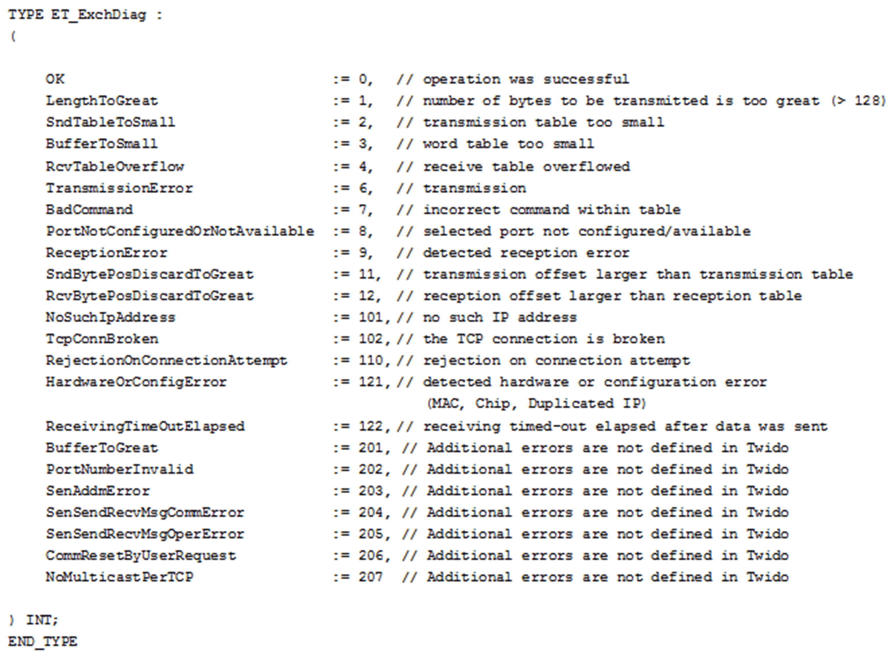

# FB_EXCH: Exchange Function Block

FB\_EXCH: Exchange Function Block

Overview

The following graphic shows the pin diagram of the function block FB\_EXCH:

The M221 controller can communicate with a Modbus slave device or can send/receive messages in character mode (ASCII).

Twido and EcoStruxure Machine Expert - Basic provide the following functions for communication:

oEXCH instruction to transmit/receive messages

oExchange control function block (MSG) to control the data exchanges

The TwidoEmulationSupport library handles the communication with the function block FB\_EXCH. This function block uses the function block SEN.SEND\_RECV\_MSG of the PLCCommunication library. This has the functionality to send and receive user-defined messages and waits for a response.

I/O Variables Description

The table describes the input variables of the function block in the TwidoEmulationSupport library:

| Input | Data Type | Description |
| --- | --- | --- |
| i\_xExecute | BOOL | The functionality starts on rising edge. |
| i\_xReset | BOOL | The current message transmission stops on rising edge and the communication reinitializes. |
| i\_byPort | BYTE | [1..3] communication port  1 = Serial port 1  2 = Serial port 2  3 = Ethernet |
| i\_pbyBuffer | POINTER TO BYTE | Pointer to send and/or receive buffer. The first 2 words are control words.  First 2 words: 4 control bytes:  1.Control byte length: The length byte contains the length of the transmission table in bytes (250 maximum), which is overwritten by the number of characters received at the end of the reception (if reception is requested).  2.Control byte command: [0..2]  0 = Transmission only  1 = Send/receive  2 = Reception only  3.Control byte SndBytePosDiscard: Byte position is not sent.  4.Control byte RcvBytePosDiscard: Received byte position is discarded. |
| i\_uiLengthInByte | UINT | Length of send/receive buffer + 2 control words |
| i\_xAsciiMode | BOOL | TRUE = ASCII mode configured.  FALSE = Modbus TCP configured. |

The table describes the output variables of the function block in the TwidoEmulationSupport library:

| Output | Data Type | Description |
| --- | --- | --- |
| q\_xBusy | BOOL | q\_xBusy is set to TRUE while the function is ongoing. |
| q\_xDone | BOOL | q\_xDone is set to TRUE when the function is completed successfully. |
| q\_xError | BOOL | q\_xError is set to TRUE when the function stops because of a detected error. |
| q\_etExchDiag | ET\_ExchDiag | Diagnostic code. |
| q\_sMsg | STRING [80] | Diagnostic message. |

The function block FB\_EXCH has the following error codes:

EIO0000002956.00

© 2019 Schneider Electric. All rights reserved.