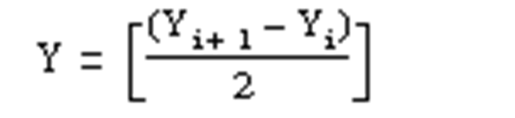

# Twido Functions

Twido Functions

Twido Functions

Overview

The following list provides an overview of the Twido [functions](../glossary/glossary.htm#XREF_D_SE_0024697_714):

o[FC\_AsciiCharToInt](#XREF_D_SE_0036886_45)

o[FC\_AsciiToInt](#XREF_D_SE_0036886_6)

o[FC\_AsciiToReal](#XREF_D_SE_0036886_8)

o[FC\_ConcatOfInt](#XREF_D_SE_0036886_12)

o[FC\_CopyArrDint](#XREF_D_SE_0036886_40)

o[FC\_CopyArrInt](#XREF_D_SE_0036886_39)

o[FC\_CopyArrReal](#XREF_D_SE_0036886_41)

o[FC\_CopyBitString](#XREF_D_SE_0036886_42)

o[FC\_CopyPackedBitString](#XREF_D_SE_0036886_44)

o[FC\_DegToRad](#XREF_D_SE_0036886_3)

o[FC\_EqualArrDint](#XREF_D_SE_0036886_15)

o[FC\_EqualArrReal](#XREF_D_SE_0036886_16)

o[FC\_FindEqDint](#XREF_D_SE_0036886_17)

o[FC\_FindEqReal](#XREF_D_SE_0036886_18)

o[FC\_FindGtDint](#XREF_D_SE_0036886_19)

o[FC\_FindGtReal](#XREF_D_SE_0036886_20)

o[FC\_FindLtDint](#XREF_D_SE_0036886_21)

o[FC\_FindLtReal](#XREF_D_SE_0036886_22)

o[FC\_HiOfDint](#XREF_D_SE_0036886_11)

o[FC\_IntToAscii](#XREF_D_SE_0036886_7)

o[FC\_Lkup](#XREF_D_SE_0036886_43)

o[FC\_LoOfDint](#XREF_D_SE_0036886_10)

o[FC\_MaxArrDint](#XREF_D_SE_0036886_23)

o[FC\_MaxArrReal](#XREF_D_SE_0036886_24)

o[FC\_MeanArrReal](#XREF_D_SE_0036886_35)

o[FC\_MinArrDint](#XREF_D_SE_0036886_25)

o[FC\_MinArrReal](#XREF_D_SE_0036886_26)

o[FC\_MoveArrDint](#XREF_D_SE_0036886_37)

o[FC\_MoveArrInt](#XREF_D_SE_0036886_36)

o[FC\_MoveArrReal](#XREF_D_SE_0036886_38)

o[FC\_OccurArrDint](#XREF_D_SE_0036886_27)

o[FC\_OccurArrReal](#XREF_D_SE_0036886_28)

o[FC\_RadToDeg](#XREF_D_SE_0036886_4)

o[FC\_RealToAscii](#XREF_D_SE_0036886_9)

o[FC\_RolArrDint](#XREF_D_SE_0036886_29)

o[FC\_RolArrReal](#XREF_D_SE_0036886_30)

o[FC\_RorArrDint](#XREF_D_SE_0036886_31)

o[FC\_RorArrReal](#XREF_D_SE_0036886_32)

o[FC\_Round](#XREF_D_SE_0036886_5)

o[FC\_SortArrDint](#XREF_D_SE_0036886_33)

o[FC\_SortArrReal](#XREF_D_SE_0036886_34)

o[FC\_SumArrDint](#XREF_D_SE_0036886_13)

o[FC\_SumArrReal](#XREF_D_SE_0036886_14)

FC\_AsciiCharToInt

This function returns the 2 characters as an integer value.

|  |  |
| --- | --- |
| Input values | i\_sChar: STRING with 2 characters. |
| Return values | Returns characters as integer value. |

If the string is invalid, the global variable G\_xSystemBitS18 is set to TRUE.

FC\_AsciiToInt

The ASCII to integer conversion function executes the conversion of an ASCII string value to its equivalent integer value.

|  |  |
| --- | --- |
| Name in EcoStruxure Machine Expert - Basic / Twido | ASCII\_TO\_INT |
| Input values | i\_psStartAddr: POINTER TO STRING; |
| Return values | ASCII\_TO\_INT: INT |

The ASCII to integer instruction rules are as follows:

oThe ASCII value must be included between -32768 to 32767.

oThe function always reads the most significant byte first.

oAny ASCII character that is not in the interval [0...9] ([30 hex - 39 hex]) is considered to be an end character, except for a minus sign '-' (2D hex) when it is placed as the first character.

oIn case of an overflow (>32767 or <-32768), the global variable G\_xSystemBitS18 (arithmetic overflow or detected error) is set to 1 and the value 32767 or -32768 is returned.

oIf the first character of the operand is an "end" character, the value 0 is returned and the global variable G\_xSystemBitS18 is set to TRUE.

FC\_AsciiToReal

The ASCII to REAL function executes the conversion of the ASCII string value to its equivalent REAL value.

|  |  |
| --- | --- |
| Name in EcoStruxure Machine Expert - Basic / Twido | ASCII\_TO\_FLOAT |
| Input values | i\_psStartAddr: POINTER TO STRING |
| Return values | FC\_AsciiToReal : REAL |

ASCII to REAL conversion rules are as follows:

oThe function reads the most significant byte first.

oAny ASCII character that is not in the interval [0...9] ([30 hex - 39 hex]) is considered to be "end" character, except for:

odecimal point '.' (2E hex)

ominus '-' (2D hex)

oplus '+' (2B hex)

oexponent 'e' or 'E' (65 hex or 45 hex)

oThe ASCII string format can be in exponential notation (that is "-2.34567e+13") or in decimal notation (that is 9826.3457).

oIn case of an overflow (calculation result is > 3.402824E+38 or < -3.402824E+38):

oThe global variable G\_xSystemBitS18 (arithmetic overflow or detected error) is set to TRUE.

oThe value +/- 1.#INF (+ or - infinite value) is returned.

oIf the calculation result is between -1.175494E-38 and 1.175494E-38, then the result is rounded to 0.0.

oIf the operand is not a number, the value 1.#QNAN is returned and the global variable G\_xSystemBitS18 is set to TRUE.

FC\_ConcatOfInt

This function concatenates two integers into a double integer.

|  |  |
| --- | --- |
| Name in EcoStruxure Machine Expert - Basic / Twido | CONCATW |
| Input values | i\_iLowVal: INT  i\_iHighVal: INT |
| Return values | FC\_ConcatOfInt : DINT |

FC\_CopyArrDint

The function copies an array of DINT values to another given memory address.

|  |  |
| --- | --- |
| Name in EcoStruxure Machine Expert - Basic / Twido | COPY\_ARR\_DINT |
| Input values | i\_pdiSource : POINTER TO DINT  i\_pdiDestination : POINTER TO DINT  i\_bySize : BYTE |
| Return values | FC\_CopyArrDint : BOOL |

FC\_CopyArrInt

The function copies an array of INT values to another given memory address.

|  |  |
| --- | --- |
| Name in EcoStruxure Machine Expert - Basic / Twido | COPY\_ARR\_INT |
| Input values | i\_piSource : POINTER TO INT  i\_piDestination: POINTER TO INT  i\_bySize : BYTE |
| Return values | FC\_CopyArrInt : BOOL |

FC\_CopyArrReal

The function copies an array of REAL values to another given memory address.

|  |  |
| --- | --- |
| Name in EcoStruxure Machine Expert - Basic / Twido | COPY\_ARR\_REAL |
| Input values | i\_prSource : POINTER TO REAL  i\_prDestination : POINTER TO REAL  i\_bySize : BYTE |
| Return values | FC\_CopyArrReal : BOOL |

FC\_CopyBitString

The function copies an array of BOOL values to another given memory address.

|  |  |
| --- | --- |
| Name in EcoStruxure Machine Expert - Basic / Twido | COPY\_ARR\_BOOL |
| Input values | i\_pxSource : POINTER TO BOOL  i\_pxDestination : POINTER TO BOOL  i\_bySize : BYTE |
| Return values | FC\_CopyBitString : BOOL |

FC\_CopyPackedBitString

The function copies a packed BitString of the length of i\_bySize bits to another memory location.

|  |  |
| --- | --- |
| Name in EcoStruxure Machine Expert - Basic / Twido | FC\_CopyPackedBitString |
| Input values | i\_pbySource : POINTER TO BYTE  i\_pbyDestination: POINTER TO BYTE  i\_bySize : BYTE - limited to SIZE OF (DINT) |
| Return values | FC\_CopyPackedBitString : DINT |

FC\_DegToRad

The function FC\_DegToRad executes the conversion of an angle expressed in degree to radian.

|  |  |
| --- | --- |
| Name in EcoStruxure Machine Expert - Basic / Twido | DEG\_TO\_RAD |
| Input values | i\_rDeg : REAL; |
| Return values | FC\_DegToRad: REAL |
| Formula | Radian = Degrees \* (Pi / 180)  Where,  Pi = 3.1415926535 |

Rules of use:

The angle to be converted must be between -737280.0 and +737280.0.

For values outside these ranges, the displayed result is + 1.#QNAN and the global variable G\_xSystemBitS18 is set to TRUE.

FC\_EqualArrDint

The function FC\_EqualArrDint compares 2 defined size tables, element by element. If there is a difference, the rank of the first dissimilar element is returned in the form of an integer. If there is no difference, the value"-1" is returned.

|  |  |
| --- | --- |
| Name in EcoStruxure Machine Expert - Basic / Twido | EQUAL\_ARR |
| Input values | i\_pdiFirstArrStartValue: POINTER TO DINT  i\_pdiSecondArrStartValue: POINTER TO DINT  i\_bySize: BYTE |
| Return values | FC\_EqualArrDint: INT |

The start addresses of the 2 arrays to be compared are provided at the 2 pointer inputs.

The number of elements to be compared must be defined at the input i\_bySize.

FC\_EqualArrReal

The function FC\_EqualArrReal compares 2 defined size tables, element by element. If there is a difference shown, the rank of the first dissimilar element is returned in the form of an integer. If there is no difference, then the value -1 is returned.

|  |  |
| --- | --- |
| Name in EcoStruxure Machine Expert - Basic / Twido | EQUAL\_ARR |
| Input values | i\_pdiFirstArrStartValue: POINTER TO REAL  i\_pdiSecondArrStartValue: POINTER TO REAL  i\_bySize: BYTE |
| Return values | FC\_EqualArrReal : INT |

The start addresses of the 2 arrays to be compared are provided at the 2 pointer inputs.

The number of elements to be compared must be defined at the input i\_bySize.

FC\_FindEqDint

The function FC\_FindEqDint searches in a set of given DINT values for the position of the first array element, which is equal to a given value.

|  |  |
| --- | --- |
| Name in EcoStruxure Machine Expert - Basic / Twido | FIND\_EQR |
| Input values | i\_diValue: DINT  i\_pdiStartAddr: POINTER TO DINT  i\_bySize : BYTE |
| Return values | FC\_FindEqDint : INT |

If the given value is not contained in the array, -1 is returned.

FC\_FindEqReal

The function FC\_FindEqReal searches in a set of given REAL values for the position of the first array element which is equal to a given value defined by the user.

|  |  |
| --- | --- |
| Name in EcoStruxure Machine Expert - Basic / Twido | FIND\_EQR |
| Input values | i\_rValue: REAL  i\_prStartAddr: POINTER TO REAL  i\_bySize : BYTE |
| Return values | FC\_FindEqReal : INT |

If the given value is not contained in the array, -1 is returned.

FC\_FindGtDint

The function FC\_FindGtDint search in a set of given DINT values for the position of the first array element which is greater than a given value defined by the user.

|  |  |
| --- | --- |
| Name in EcoStruxure Machine Expert - Basic / Twido | FIND\_GTR |
| Input values | i\_diValue: DINT  i\_pdiStartAddr: POINTER TO DINT  i\_bySize : BYTE |
| Return values | FC\_FindGtDint : INT |

If no element in the array is greater than the given value, -1 is returned.

FC\_FindGtReal

The function FC\_FindGtReal searches in a set of given REAL values for the position of the first array element which is greater than a given value defined by the user.

|  |  |
| --- | --- |
| Name in EcoStruxure Machine Expert - Basic / Twido | FIND\_GTR |
| Input values | i\_rValue: REAL  i\_prStartAddr: POINTER TO REAL  i\_bySize : BYTE |
| Return values | FC\_FindGtReal : INT |

If no element in the array is greater than the given value, -1 is returned.

FC\_FindLtDint

The function FC\_FindLtDint searches in a set of given DINT values for the position of the first array element which is smaller than a given value defined by the user.

|  |  |
| --- | --- |
| Name in EcoStruxure Machine Expert - Basic / Twido | FIND\_LTR |
| Input values | i\_diValue: DINT  i\_pdiStartAddr: POINTER TO DINT  i\_bySize : BYTE |
| Return values | FC\_FindLtDint : INT |

If no element in the array is greater than the given value, -1 is returned.

FC\_FindLtReal

The function FC\_FindLtReal searches in a set of given REAL values for the position of the first array element which is smaller than a given value defined by the user.

|  |  |
| --- | --- |
| Name in EcoStruxure Machine Expert - Basic / Twido | FIND\_LTR |
| Input values | i\_rValue: REAL  i\_prStartAddr: POINTER TO REAL  i\_bySize : BYTE |
| Return values | FC\_FindLtReal : INT |

If no element in the array is greater than the given value, -1 is returned.

FC\_HiOfDint

This function extracts most significant bits ([MSB](../glossary/glossary.htm#XREF_D_SE_0024697_602)) of a double integer to an integer.

|  |  |
| --- | --- |
| Name in EcoStruxure Machine Expert - Basic / Twido | HW |
| Input values | i\_diVal: DINT |
| Return values | FC\_LoOfDint : INT |

FC\_IntToAscii

The integer to ASCII function executes the conversion of an integer value to its equivalent ASCII string value.

|  |  |
| --- | --- |
| Name in EcoStruxure Machine Expert - Basic / Twido | INT\_TO\_ASCII |
| Input values | i\_iVal: INT |
| Return values | INT\_TO\_ASCII : ARRAY [1..4] OF INT |

The integer to ASCII conversion rules are as follows:

oThe integer value must be included between -32768 to 32767.

oThe function always writes the most significant byte first.

oThe end character is "Carriage return" (ASCII 13).

oThe function automatically determines how many [%MW](../glossary/glossary.htm#XREF_D_SE_0024697_614)s should be filled with ASCII values (from 1 to 4)

FC\_Lkup

The function FC\_Lkup is used to interpolate a set of X versus Y floating point data for a given X value.

|  |  |
| --- | --- |
| Name in EcoStruxure Machine Expert - Basic / Twido | LKUP |
| Input values | i\_prStartAddr : POINTER TO REAL  i\_bySize : BYTE |
| Return values | FC\_Lkup : INT |

The following conditions apply for the input value i\_prSartAddr:

oeven number of values

ominimum of 6 values

ofirst element is x value to be found

osecond element is set by the function: interpolation result

oall following elements are interpolation supporting points by pairs of X and Y

Interpolation rules:

The LKUP function uses the linear interpolation rule, as defined in the following equation:

For Xi  ≤ X  ≤  Xi + 1, where i = 1 … (m-1)

Assuming Xi values are ranked in ascending order: X1 ≤ X2 ≤ ...X...≤ Xm-1 ≤ Xm

If any of 2 consecutive Xi values are equal (Xi=Xi+1=X), the equation 1 results in an invalid exception. To handle this exception, the following algorithm is used in place of equation 1:

For Xi = Xi+1 = X, where i = 1…(m-1).

Result value:

The result value shows if the interpolation was successful or not.

0: Successful interpolation

1: Interpolation error: incorrect array, Xm < Xm-1

2: Interpolation error: i\_rXValue out of range, X < X1

4: Interpolation error: i\_rXValue out of range, X > Xm

8: Invalid size of data array: i\_prYValue is set as an odd number, or i\_prYValue < 6

The result value does not contain the computed interpolation value (Y). For a given (X) value, the result of the interpolation (Y) is contained in i\_prYValue.

i\_rXValue is the floating point variable that contains the user-defined (X) value for which to compute the interpolated (Y) value.

The valid range for i\_rXValue is:

X1 ≤  i\_rXValue  ≤ Xm

FC\_LoOfDint

This function extracts least significant bits ([LSB](../glossary/glossary.htm#XREF_D_SE_0024697_80)) of a double integer to an integer.

|  |  |
| --- | --- |
| Name in EcoStruxure Machine Expert - Basic / Twido | LW |
| Input values | i\_diVal: DINT |
| Return values | FC\_LoOfDint : INT |

FC\_MaxArrDint

In a set of given DINT values, this function searches the maximum value. The search is carried out only on the defined length of the table.

|  |  |
| --- | --- |
| Name in EcoStruxure Machine Expert - Basic / Twido | MAX\_ARR |
| Input values | i\_pdiStartAddr: POINTER TO DINT  i\_bySize : BYTE |
| Return values | FC\_MaxArrDint : DINT |

FC\_MaxArrReal

In a set of given REAL values, this function searches the maximum value. The search is only carried out within the defined table length.

|  |  |
| --- | --- |
| Name in EcoStruxure Machine Expert - Basic / Twido | MAX\_ARR |
| Input values | i\_prStartAddr: POINTER TO REAL  i\_bySize : BYTE |
| Return values | FC\_MaxArrReal : REAL |

FC\_MeanArrReal

In a set of given REAL values, this function is used to calculate the mean average in the required length of REAL values table.

|  |  |
| --- | --- |
| Name in EcoStruxure Machine Expert - Basic / Twido | MEAN |
| Input values | i\_prStartAddr: POINTER TO REAL  i\_bySize : BYTE |
| Return values | FC\_MeanArrReal : REAL |

FC\_MinArrDint

In a set of given DINT values, this function searches the minimum value. The search is carried out only on the defined length of the table.

|  |  |
| --- | --- |
| Name in EcoStruxure Machine Expert - Basic / Twido | MIN\_ARR |
| Input values | i\_pdiStartAddr: POINTER TO DINT  i\_bySize : BYTE |
| Return values | FC\_MinArrDint : DINT |

FC\_MinArrReal

In a set of given REAL values, this function searches the minimum value. The search is carried out only on the defined length of the table.

|  |  |
| --- | --- |
| Name in EcoStruxure Machine Expert - Basic / Twido | MAX\_ARR |
| Input values | i\_prStartAddr: POINTER TO REAL  i\_bySize : BYTE |
| Return values | FC\_MinArrReal : REAL |

FC\_MoveArrDint

The function moves the input value in the DINT value tables for a number of elements equal to a given value.

|  |  |
| --- | --- |
| Name in EcoStruxure Machine Expert - Basic / Twido | MOVE\_ARR\_DINT |
| Input values | i\_diValue : DINT  i\_pdiStartAddr: POINTER TO DINT  i\_bySize : BYTE |
| Return values | FC\_MoveArrDint : BOOL |

FC\_MoveArrInt

The function moves the input value in the INT values table for a number of elements equal to a given value.

|  |  |
| --- | --- |
| Name in EcoStruxure Machine Expert - Basic / Twido | MOVE\_ARR\_INT |
| Input values | i\_iValue : INT  i\_piStartAddr: POINTER TO INT  i\_bySize : BYTE |
| Return values | FC\_MoveArrInt : BOOL |

FC\_MoveArrReal

The function moves the input value in the REAL value tables for a number of elements equal to a given value.

|  |  |
| --- | --- |
| Name in EcoStruxure Machine Expert - Basic / Twido | MOVE\_ARR\_REAL |
| Input values | i\_rValue : REAL  i\_prStartAddr: POINTER TO REAL  i\_bySize : BYTE |
| Return values | FC\_MoveArrReal : BOOL |

FC\_OccurArrDint

In a set of given DINT values, this function searches the number of elements equal to a given value.

|  |  |
| --- | --- |
| Name in EcoStruxure Machine Expert - Basic / Twido | OCCUR\_ARR |
| Input values | i\_diValue: DINT  i\_pdiStartAddr: POINTER TO DINT  i\_bySize : BYTE |
| Return values | FC\_OccurArrDint : INT |

FC\_OccurArrReal

In a set of given REAL values, this function searches the number of elements equal to a given value.

|  |  |
| --- | --- |
| Name in EcoStruxure Machine Expert - Basic / Twido | OCCUR\_ARR |
| Input values | i\_rValue: REAL  i\_prStartAddr: POINTER TO REAL  i\_bySize : BYTE |
| Return values | FC\_OccurArrReal : INT |

FC\_RadToDeg

This function FC\_RadToDeg executes the conversion of an angle expressed in radian to degree.

|  |  |
| --- | --- |
| Name in EcoStruxure Machine Expert - Basic / Twido | RAD\_TO\_DEG |
| Input values | i\_rRad : REAL; |
| Return values | FC\_RadToDeg: REAL |
| Formula | Degree = Radian \* (180 / Pi)  Where,  Pi = 3.1415926535 |

Rules of use:

The angle to be converted must be between -4096Pi and 4096Pi.

For values outside these ranges, the displayed result is + 1.#QNAN and G\_xSystemBitS18 is set to TRUE.

FC\_RealToAscii

The REAL to ASCII function executes the conversion of REAL value to its equivalent ASCII string value.

|  |  |
| --- | --- |
| Name in EcoStruxure Machine Expert - Basic / Twido | FLOAT\_TO\_ASCII |
| Input values | i\_rVal: REAL |
| Return values | FC\_RealToAscii : ARRAY [1..7] OF INT |

The REAL to ASCII conversion rules are as follows:

oThe function always writes the most significant byte ([MSB](../glossary/glossary.htm#XREF_D_SE_0024697_602)) first.

oThe representation is made using conventional exponential notation.

o"Infinite" or "Not a number" results return the string "NAN".

oThe end character is "Carriage return" (ASCII 13).

oThe conversion precision is 6 figures.

FC\_RolArrDint

In a given DINT array this function shifts every element n position(s) towards the start address of the list. The first n elements are moved to the end of the list.

|  |  |
| --- | --- |
| Name in EcoStruxure Machine Expert - Basic / Twido | ROL\_ARR |
| Input values | i\_iShiftPosNumber: INT  i\_pdiStartAddr: POINTER TO DINT  i\_bySize : BYTE |
| Return values | FC\_RolArrDint : BOOL |

If the value of i\_iShiftPosNumber is negative or 0, no shift is performed.

FC\_RolArrReal

In a set of given REAL values, this function performs a rotate shift of n position(s) from top to bottom of the elements.

|  |  |
| --- | --- |
| Name in EcoStruxure Machine Expert - Basic / Twido | ROL\_ARR |
| Input values | i\_iShiftPosNumber: INT  i\_prStartAddr: POINTER TO REAL  i\_bySize : BYTE |
| Return values | FC\_RolArrReal : BOOL |

If the value of i\_iShiftPosNumber is negative or 0, no shift is performed.

FC\_RorArrDint

In a given DINT array this function shifts every element n position(s) towards the list’s end address. The last n elements are moved to the begin of the list.

|  |  |
| --- | --- |
| Name in EcoStruxure Machine Expert - Basic / Twido | ROR\_ARR |
| Input values | i\_iShiftPosNumber: INT  i\_pdiStartAddr: POINTER TO DINT  i\_bySize : BYTE |
| Return values | FC\_RorArrDint : BOOL |

If the value of i\_iShiftPosNumber is negative or 0, no shift is performed.

FC\_RorArrReal

In a set of given REAL values, this function performs a rotate shift of n position(s) from bottom to top of the elements.

|  |  |
| --- | --- |
| Name in EcoStruxure Machine Expert - Basic / Twido | ROL\_ARR |
| Input values | i\_iShiftPosNumber: INT  i\_prStartAddr: POINTER TO REAL  i\_bySize : BYTE |
| Return values | FC\_RorArrReal : BOOL |

If the value of i\_iShiftPosNumber is negative or 0, no shift is performed.

FC\_Round

The function FC\_Round rounds a floating point representation that is stored in an ASCII string.

|  |  |
| --- | --- |
| Name in EcoStruxure Machine Expert - Basic / Twido | ROUND |
| Input values | i\_psStartAddr: POINTER TO STRING;  i\_byRoundNumber: BYTE; |
| Return values | FC\_Round: ARRAY[1..7] of INT |

The ROUND instruction rules are as follows:

oThe operand is always rounded down.

oThe end character of the operand string is used as an end character for the result string.

oThe end character can be any ASCII character that is in the interval [0...9] ([30 hex - 39 hex]), except:

odot '.' (2E hex),

ominus '-' (2D hex),

oplus '+' (2B hex),

oExp 'e' or 'E' (65 hex or 45 hex).

oThe result and operand must not be longer than 13 bytes: Maximum size of an ASCII string is 13 bytes.

FC\_SortArrDint

The function sorts the elements of a DINT values table in ascending or descending order and stores the result in the same table.

|  |  |
| --- | --- |
| Name in EcoStruxure Machine Expert - Basic / Twido | SORT\_ARR |
| Input values | i\_iSortDirection: INT  i\_pdiStartAddr: POINTER TO DINT  i\_bySize: BYTE |
| Return values | FC\_SortArrDint: BOOL |

The direction parameter i\_iSortDirection indicates the sort sequence:

odirection > 0, sorting in ascending order.

odirection < 0, sorting in descending order.

odirection = 0, no sorting is performed.

FC\_SortArrReal

The function sorts the elements of a DINT values table in ascending or descending order and stores the result in the same table.

|  |  |
| --- | --- |
| Name in EcoStruxure Machine Expert - Basic / Twido | SORT\_ARR |
| Input values | i\_iSortDirection: INT  i\_prStartAddr: POINTER TO REAL  i\_bySize : BYTE |
| Return values | FC\_SortArrReal : BOOL |

The direction parameter i\_iSortDirection gives the order of the sort:

odirection > 0, sorting in ascending order.

odirection < 0, sorting in descending order.

odirection = 0, no sorting is performed.

FC\_SumArrDint

The function FC\_SumArrDint is used to perform the addition of a defined number of array elements whose address is defined at the input i\_pdiStartAddr. This means that the function sums up all the elements of an object table.

|  |  |
| --- | --- |
| Name in EcoStruxure Machine Expert - Basic / Twido | SUM\_ARR |
| Input values | i\_pdiStartAddr: POINTER TO DINT  i\_bySize: BYTE |
| Return values | FC\_SumArrDint : DINT |

When the result is not within the valid double word format range according to the table operand, the global variable G\_xSystemBitS18 is set to TRUE.

FC\_SumArrReal

The function FC\_SumArrReal is used to perform the addition of a defined number of array elements whose address is defined at the input i\_pdiStartAddr. This means that the function sums up all the elements of an object table.

|  |  |
| --- | --- |
| Name in EcoStruxure Machine Expert - Basic / Twido | SUM\_ARR |
| Input values | i\_pdiStartAddr: POINTER TO DINT  i\_bySize: BYTE |
| Return values | FC\_SumArrReal : REAL |

When the result is not within the valid double word format range according to the table operand, the global variable G\_xSystemBitS18 is set to TRUE.

EIO0000002956.00

© 2019 Schneider Electric. All rights reserved.