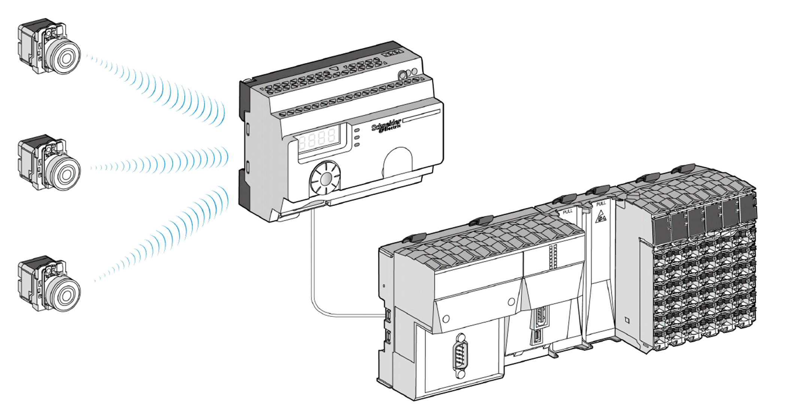
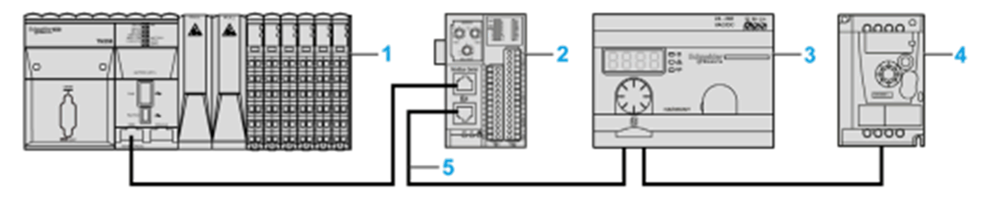

# System Requirements

System Requirements

System Requirements

Overview

The Harmony XB5R push-buttons are both wireless and batteryless. They are used with ZBRN access points allowing more flexibility and simplicity in the installation. The access point converts radio frequency inputs from the Harmony XB5R push-buttons into various communication protocols that can then be sent to a controller.

The following graphic shows the ZBRN module connected to a controller:

This document helps you to configure and use the ZBRN module in your application based on either:

oModbus Serial Line (ZBRN2)

oModbus TCP (ZBRN1)

NOTE: For the configuration of your ZBRN, refer to the ZBRN documentation.

Hardware Architecture

The following graphic shows an example, where the access point is part of a Modbus serial network, with the controller as a master and other devices as slaves:

1   Controller as master

2   Modbus Advantys OTB network interface module

3   ZBRN access point

4   ATV12 drive

5   Modbus serial line

EIO0000002890.00

© 2019 Schneider Electric. All rights reserved.