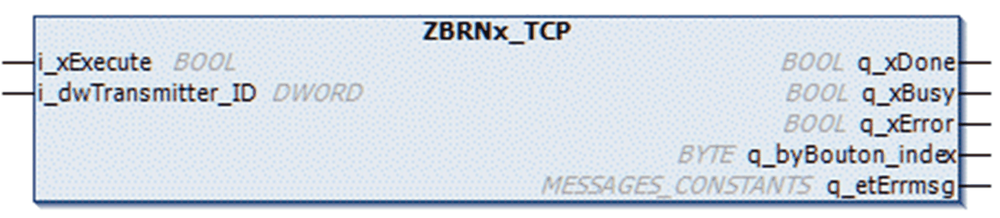
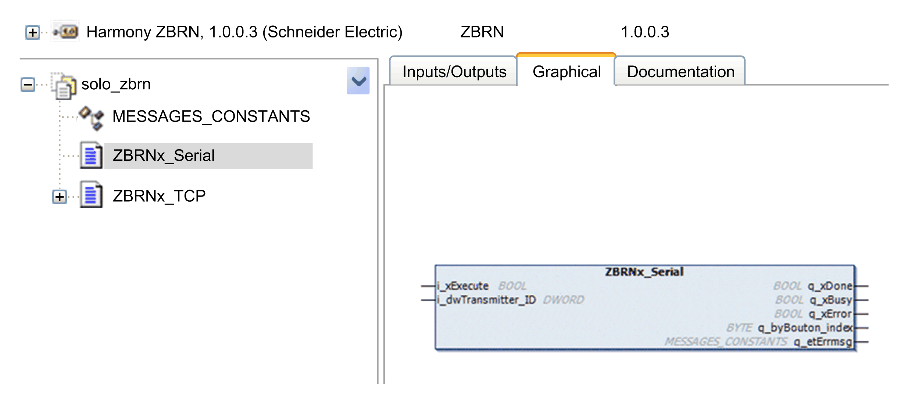

# Identifying Buttons Linked to ZBRN Module

Identifying Buttons Linked to ZBRN Module

Function Block Description

The function blocks ZBRNx\_Serial and ZBRNx\_TCP get information to identify buttons linked to the ZBRN module. Therefore, a [MAST](../glossary/glossary.htm#XREF_D_SE_0024697_150) task must include a [POU](../glossary/glossary.htm#XREF_D_SE_0024697_158) (Program Organization Unit) that instantiates the required function block.

For Modbus serial:

For Modbus TCP:

The following graphic shows the function block from library repository:

The graphic shows the devices in use with instances of each type:

I/O Variable Description

The table describes the input variables of the function blocks:

| Input | Data Type | Description |
| --- | --- | --- |
| i\_xExecute | BOOL | Starts the buttons ID scan process. |
| i\_dwTransmitter\_ID | DWORD | Decimal value of the push-button ID to find. |

The table describes the output variables of the function blocks:

| Output | Data Type | Description |
| --- | --- | --- |
| q\_xDone | BOOL | TRUE when scan process is achieved. |
| q\_xBusy | BOOL | TRUE while processing: no request is accepted. |
| q\_xError | BOOL | Indicates an error is detected.  When TRUE: refer to q\_etErrmsg for more details. |
| q\_byBouton\_index | BYTE | Index of the push-button. Starts at 0. |
| q\_etErrmsg | MESSAGES\_CONSTANTS | Type of error detected |

EIO0000002890.00

© 2019 Schneider Electric. All rights reserved.